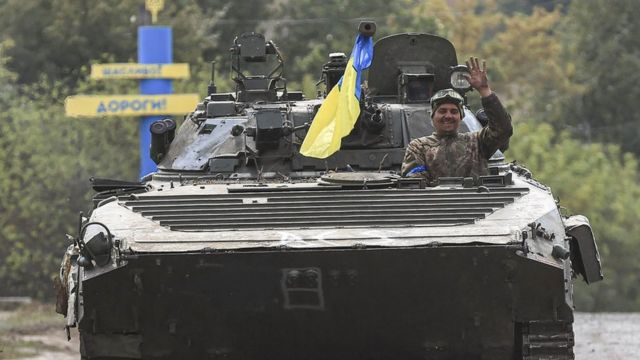
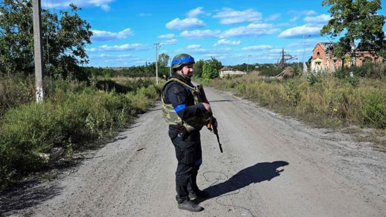
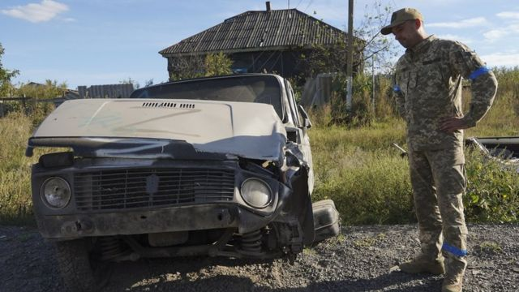

# 乌克兰大反攻：俄军被赶出三大乌东战略重镇

#  乌克兰大反攻：俄军被赶出三大乌东战略重镇

> 图像来源，  Getty Images
>
> 图像加注文字，随着乌克兰的快速反击取得进一步进展，俄罗斯军队已经从乌克兰东部主要城镇撤出。

**随着乌克兰的快速反击取得进一步进展，俄罗斯军队已经从乌克兰东部主要城镇撤出。**

乌克兰官员称，军队周六（9月10日）进入俄罗斯军队在东部的重要补给中心库皮扬斯克（Kupiansk）。

俄罗斯国防部随后表示，军队已从附近的伊久姆（Izyum）附近撤退，以“重新部署”。

俄罗斯国防部还证实从第三个关键镇巴拉克列亚（Balaklyia）撤军，以加强在顿涅茨克前线的战斗。

乌军的成果如果保持住，将是4月来俄罗斯从基辅附近地区撤出以来最重要的一次胜利。

在周六晚间的视频讲话中，乌克兰总统泽连斯基（Volodymyr Zelensky）称，自本月早些时候开始新一轮反攻以来，乌克兰已经从俄军手中解放了2000平方公里的领土。

他的话显示，仅在过去48小时内，该地区的一半就已被夺回，这是泽连斯基周四晚间讲话时所说已被解放领土面积的两倍。

俄罗斯承认从伊久姆撤军意义重大，因为这里是俄军的主要军事中心。

“我们进行了为期三天的行动，减少伊久姆-巴拉克利亚的部队并有组织地转移到顿涅茨克人民共和国境内。”俄罗斯在声明中说。

“为了防止俄军受到伤害，我们对敌人进行了猛烈的火力打击。"

俄罗斯官方塔斯社报道，不久后，俄罗斯控制的哈尔科夫地区的行政长官建议居民撤离到俄罗斯来“挽救生命”。

邻近的俄罗斯别尔哥罗德州长表示，排队跨境的人们可以获得流动餐饮、供暖和医疗援助。

> 图像来源，  Getty Images
>
> 图像加注文字，自本月早些时候开始新一轮反攻以来，乌克兰已经从俄军手中解放了2000平方公里的领土。

这些进展将被视为乌克兰军队有能力重新夺回俄罗斯占领的领土的一个信号。在基辅继续向其处境艰难的西方盟友寻求军事支持的时候，这一点非常重要。

乌克兰外交部长库列巴（Dmytro Kuleba）表示，最新事态表明，乌克兰部队能够击败俄罗斯军队，并可以使用更多的西方武器更快地结束战争。

早些时候，英国国防部官员表示，乌克兰已经推进了50公里，进入此前俄罗斯占领的领土。

”俄罗斯军队可能很意外，“英国国防部说，”该地区只被轻度控制，乌克兰部队已经占领或包围了几个城镇。“

本周早些时候，乌克兰在该国东部发动了反攻，而国际社会的注意力集中在南部城市赫尔松附近预期中的进攻上。

分析人士认为，俄罗斯重新调动了一些经验最丰富的军队来保卫这座城市。

但一名官员表示，除了在东部取得进展，乌克兰在南部也取得了进展。

乌克兰军队南部司令部发言人古门约克（Nataliya Gumenyuk）表示，他们沿着这条战线推进了”二到几十公里“。

但在南线作战的俄罗斯军队据称已经深入防御阵地，乌克兰军队自进攻开始一直面临着顽强的抵抗。

当地官员称，周六，在哈尔科夫，俄罗斯的火箭弹袭击了这座城市，导致一人死亡，数座房屋被毁。

乌克兰官员在社交媒体上分享了一张照片，似乎显示乌克兰军队在库皮扬斯克市政厅前举着乌克兰国旗，脚下放着俄罗斯国旗。

> 图像来源，  EPA
>
> 图像加注文字，周五，在哈尔科夫，一名乌克兰士兵站在一辆俄罗斯车辆旁

总统泽连斯基周五表示，他的部队正在”逐步控制新的定居点“，并”放回乌克兰国旗，保护我们所有的人民“。

他还表示，国家警察部队正在返回被解放的定居点，并敦促平民向他们报告俄罗斯涉嫌的战争罪行。

此前，联合国在乌克兰的一个监测团队报告称，他们记录了俄罗斯军队对战俘的一系列侵害行为。

该报告同时也指控乌克兰军队存在”对战俘实施酷刑和虐待的案例“。

##  来自基辅和盟友的鼓舞

**BBC记者** **奥拉·格林（Orla Guerin） 发自乌克兰中部**

反攻的速度不仅让俄罗斯措手不及，甚至一些乌克兰人都感到惊讶。这里的人们一直在努力了解最新的进展消息。

俄罗斯人现在已经失去了两个关键的物流中心：伊久姆和库皮扬斯克两个铁路城市。这是一次军事挫折，也是对总统普京的公开羞辱。

我们无法到达前线。记者被拒绝进入。乌克兰决心控制信息战。但社交媒体上出现的大量画面显示，乌克兰军队在新解放的地区升起国旗。

所有这些对乌克兰来说都是一种情感宣泄，对其西方支持者来说也是一种宽慰。

俄罗斯人仍然控制着大约五分之一乌克兰国土，很少有人认为战争会很快结束。但乌克兰人现在已经证明，他们能在战斗中击败俄罗斯人，而不仅是一时得逞。一名军事专家称，这是自二战以来第一次俄罗斯军队成建制全部覆灭。

