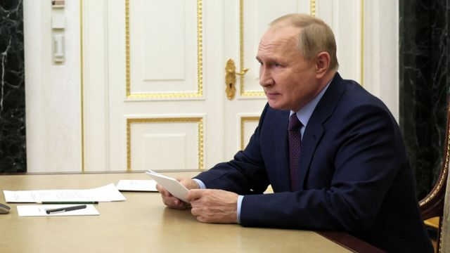
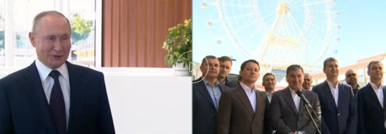

# 乌克兰击退俄军会让普京付出代价吗

#  乌克兰大反攻：俄军败退会让普京付出代价吗

  * 史蒂夫·罗森伯格（Steve Rosenberg） 
  * BBC俄罗斯编辑 莫斯科报道 

> 图像来源，  Reuters
>
> 图像加注文字，普京挥军攻打乌克兰半年后，这位俄罗斯总统接下来意欲何为，仍是未知之数。

**通常来说，俄罗斯国营电视台的旗舰节目每周新闻吹捧克里姆林宫的胜利，可谓意料之中。**

但星期天（9月11日）的节目开场却做出了一个罕有的承认。主播德米特里·基谢列夫（Dmitry Kiselev）神色凝重地说：“在（乌克兰）特别军事行动前线，过去一周是迄今最艰难的一周。”

“在哈尔科夫（Kharkiv）前线的情况尤其艰苦。在敌对部队猛攻，我方寡不敌众之下，（俄罗斯）部队被迫撤离一些此前被解放的城镇。”

他们所说的“解放”，我们解读成“攻占”便可。俄军几个月前就占领了那些地方。但经过乌军一轮闪电反攻之后，俄军在乌克兰东北部丢失了不少土地。

尽管如此，俄罗斯国营媒体多半装作若无其事。哈尔科夫所发生的事情并未被官方称作“撤退”。

最新出版的俄罗斯政府机关报《俄罗斯报》（Rossiyskaya Gazeta）声称：“俄罗斯国防部否认俄军部队从巴拉克利亚（ Balakliya ）、库皮扬斯克（Kupiansk）与伊久姆（Izyum）仓惶逃跑的谣传。他们没有逃跑，这都是早已计划好的重新集结。”

在小报《莫斯科共青团报》（Moskovsky Komsomolets）上，一位军事分析员提出了不同看法：“我们显然低估了敌军，（俄军）花了太长时间来反应，崩溃最终来临……结果我们受到挫败，尝试撤军以将损失最小化，避免投降。”

这次“战败”在亲俄社交媒体平台与俄罗斯”爱国“博客之间引发众怒，他们纷纷指责军方犯错。

就连权倾朝野的车臣（Chechnya）领导人拉姆赞·卡德罗夫（Ramzan Kadyrov）也不例外。

卡德罗夫警告说：“要是今天或者是明天不调整策略，我将被迫与国防部以至于国家领导层说明地面的真实情况。这是很有意思的情况。惊人的情况。”

普京（Vladimir Putin）下令全面入侵乌克兰至今已超过六个月。我还记得俄罗斯众多政客、评论员和分析员在紧接的日子里，纷纷在电视节目上预测克里姆林宫所称的“特别军事行动”将在几天之内结束，纷纷预测乌克兰人民将欢迎解放他们的俄军，预测乌克兰政府将像纸牌一样垮台。

这全都没有发生。

反之，六个多月之后，俄军正在节节败退。

关键问题来了：普京会因此承受政治后果吗？

毕竟，过去20多年来，普京在俄罗斯权贵之间享有胜利者的美誉，他总能从最狼狈的境地中脱困。简而言之，他是无敌的。

我向来把他视为俄罗斯版本的脱逃术师哈利·胡迪尼（Harry Houdini），无论你用什么样的锁头还是铁链把他五花大绑，普京总能逃之夭夭。

2月24日以后，一切都变了。

过去的六个月说明，普京总统决定入侵乌克兰是个严重的误判。俄罗斯没能速战速决，而是在漫长而血腥的攻坚中泥足深陷，接连承受了尴尬的挫败。

当独裁者的不败光环变得黯淡，上述领导人将遇到麻烦。普京将学习到俄国历史——过去的俄罗斯领导人只要打败仗，都没有好下场。

沙俄被日本击败，导致了1905年首次俄国革命。一战的军事失利引发了1917年革命，终结了沙皇统治。

然而，普京总统无意公开地成为失败者。

他的发言人佩斯科夫（ Dmitry Peskov ）星期一（12日）对记者说：“（俄罗斯的）特别军事行动仍在继续，也将会继续，直到完成最初定下的一切任务。”

这就把我们带到另一道关键问题：普京下一步要做什么？

你会难以找到任何人能知悉普京在想什么，计划着什么。这很大程度上取决于他从军方与情报部门首长处接收到的信息有多准确。

但我们知道两点：俄罗斯总统甚少承认犯错，他也甚少逆转其决定。

> 图像来源，  Kremln.ru
>
> 图像加注文字，普京周末给莫斯科一座摩天轮揭幕，他看起来神情轻松。

从国营媒体所言来看，我们已经看到把战场上的失利归咎于西方支持乌克兰的迹象。

俄罗斯国营电视台宣称：“在北约支持下，基辅策动了反攻。”

还有一个更让人坐立不安的问题已经潜藏多时：要是无法在使用常规武器下获胜，普京总统会否动用核武器？

才不过几天前，乌克兰军方首长瓦列里·扎卢日内（Valeriy Zaluzhnyi）警告说：“俄军在特定情况下使用战略核武器的直接威胁是存在的。”

目前来说，克里姆林宫显得不慌不忙，国营电视台更显得很正面，把俄方以导弹轰击乌克兰能源基础设施形容为“特别行动的转捩点”。

至于克里姆林宫的那位领导人，正当上星期六（10日）传出俄罗斯失地连连的消息之际，满脸从容的普京在莫斯科为一座新的摩天轮揭幕——欧洲最高的摩天轮。

俄罗斯总统似乎依然相信，就像这座大摩天轮一样，他的“特别行动”终将如他所愿。

