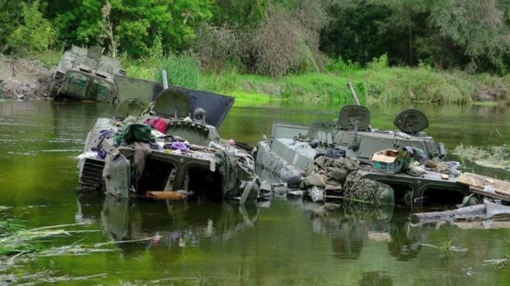
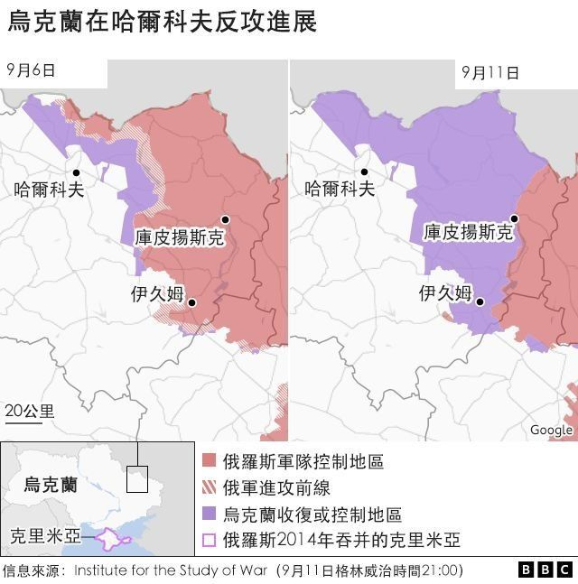
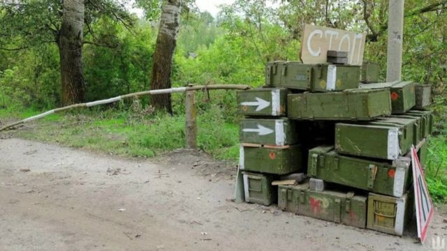

# 乌克兰反击俄罗斯：胜利出人意料 危险仍然四伏

#  乌克兰反击俄罗斯 BBC记者分析：胜利出人意料危险仍然四伏

> 图像来源，  Reuters
>
> 图像加注文字，乌克兰军方公布的照片似乎显示被俄军遗弃在河中的装甲车。

**乌克兰表示，在反攻俄罗斯入侵的战争中取得了重大进展。**

最近几天乌克兰军队已经从俄罗斯军队手中夺回了数千平方公里的被占领土。

英国广播公司BBC国防事务记者乔纳森·比厄(JonathanBeale)分析乌克兰反攻如此成功的原因，预测乌克兰军要赢得这场反攻战仍然面临哪些可能的障碍。

今年初夏，当俄罗斯正在顿巴斯地区持续取得进展之时，一位美国高级军官告诉我：“不要低估乌克兰人攻其不备的能力。”

乌克兰的这种突击能力已经成为这场战争的标志：自俄罗斯军队从基辅撤退，到最近在克里米亚的攻击。现在，在乌克兰东部又制造了另一个惊喜。

在此之前，在这里取得进展的主要是俄罗斯军队，尽管进展缓慢而且艰难，还让俄军付出惨重代价。现在取得进展的是乌克兰，在短短几天内收复了数千平方公里的领土。

乌克兰最大的收获是在东部哈尔科夫市周边地区。英国最新的国防情报报告称，乌克兰现在已经解放了一个面积为伦敦两倍大的地区，不过由于记者远离前线，还很难确定乌克兰反攻的进展和战事在多大程度上持续。

乌克兰表示，已经占领了具有战略意义的城市伊久姆和库皮扬斯克。这两个城市是俄罗斯用来补给在顿巴斯部队的军事枢纽。但仅此损失就将是对俄罗斯军队的重大打击。

##  奇兵

出其不意一直是乌克兰取得进展的关键。除此之外还有对西方武器包括美国和英国的远程多管火箭炮的巧妙使用，摧毁了俄罗斯的供应线、弹药库和指挥所。上周，美国国防部长劳埃德·奥斯汀说，夏季期间，乌克兰使用远程火炮已经击中了400多个俄罗斯的关键目标。

在乌克兰得到这些武器之前，俄罗斯在火炮方面一直有数量上的优势。但现在，战局似乎发生了逆转。美国情报官员称，俄罗斯不得不向朝鲜求助提供数百万枚炮弹，这表明俄罗斯的炮弹库存在六个月的战斗中已经严重匮乏。

这些西方武器的威力，加上乌克兰夺回领土的决心，迫使俄罗斯军队及其盟军势力看似在一片混乱中撤退。社交媒体上的图片显示，坦克、装甲车、武器和弹药在匆忙撤退中被丢弃。

有趣的是，乌克兰在东部的反攻速度比在南部向赫尔松市发起的著名反攻快得多。乌克兰在南部发动攻势之前早就发出了电文公告，而对其在东部的反攻则秘而不宣。现在看来，这一切都是反攻计划的一部分：如果不是为了声东击西，也是要制造烟幕弹掩盖乌克兰在东部的反攻准备。

很明显，它成功地转移了俄罗斯的视线，令其阵脚大乱。在过去几个月里，俄罗斯一直从乌克兰东部调兵加强其在乌克兰南部的防御。现在俄罗斯在乌克兰东、南两条战线上都非常脆弱。

##  乌克兰南部战线

> 图像来源，  Reuters
>
> 图像加注文字，俄军从哈尔科夫前线迅速撤退时留在路边的设备。

但乌克兰发现在南部更难取得进展，因为他们在那里更容易暴露在敌军攻势之下，不得不在基本空旷的农村地区作战。部队向前推进时要战胜俄罗斯的防守部队需要更大的兵力和火力。

乌克兰现在面临的危险可能与俄罗斯在战争早期阶段面临的危险相似。同时在多条战线上推进将会面对供应、装备和部队等多方面的很高代价：收复的失地越大，补给线就越长，也就更容易成为俄军的攻击目标。

还有一个风险是，那些向敌方推进最深入的部队，在防线上势必造成凸起，可能被敌军切断后路包围。

尽管局势乐观，但乌克兰国防部长奥列克西·雷兹尼科夫警告说，乌克兰在东部的部队现在可能更容易受到俄罗斯的反击。仅仅夺回领土还远远不够，还需要一支军队守住领土。如果能得到当地居民的支持，防守可能更为容易。

乌克兰在东、南双管齐下的反攻仍然是有风险的，仍然很容易再遇挫折。

乌克兰正在向世界发出信号，相信自己能够赢得这场战争。乌克兰已经在利用这些战果来争取更多西方武器。而这次反攻的时间点选在冬季之前极为关键，因为冬季作战更为艰难，西方支持乌克兰的意志也面临考验。

战争虽远未结束，但乌克兰再次向世界展示了它令人惊讶的抵抗能力和克服困难的能力。

