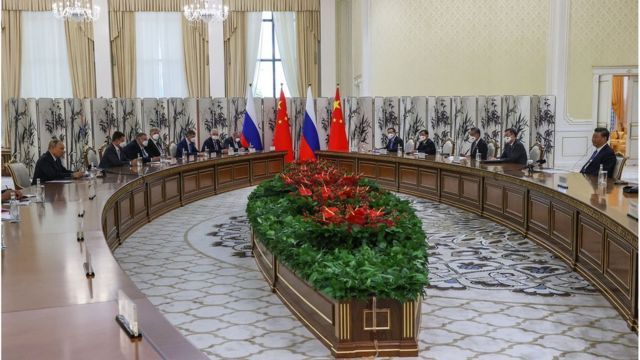
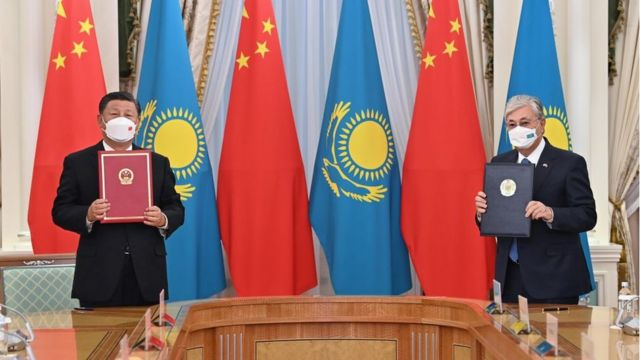
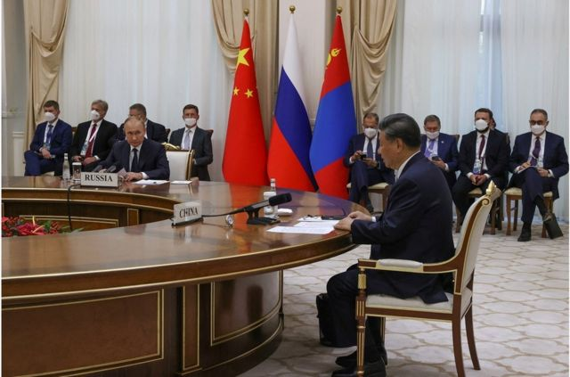
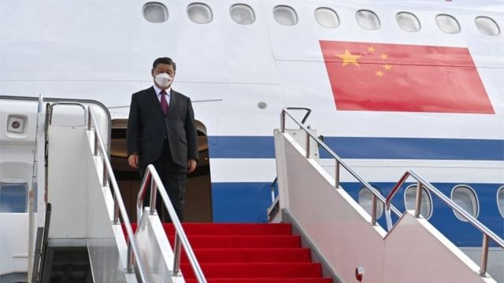
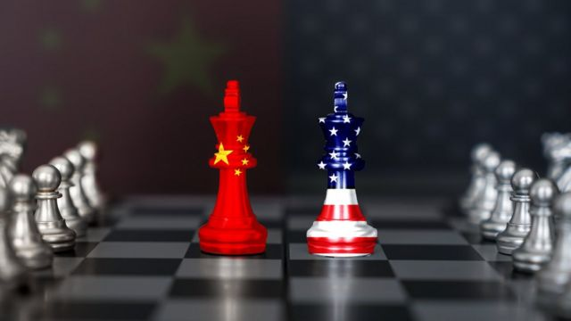
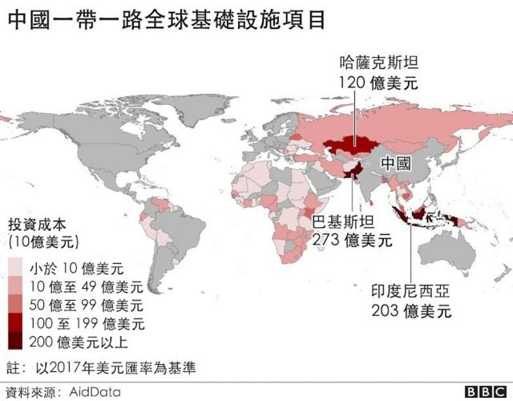
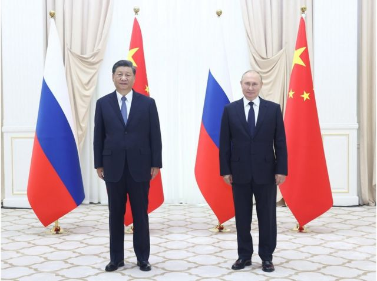

# 习近平疫情后首次外访并与普京会面 为第三任期传递外交信号

#  习近平疫情后首次外访并与普京会面 为第三任期传递哪些外交信号

  * 斯影 
  * BBC中文 

**10年前，中国国家主席习近平甫一上任，便出访哈萨克斯坦，提出一项新经济倡议，后来发展为雄心勃勃的“一带一路”。10年后的今天，他在即将进入第三届任期之时，再次出访哈萨克斯坦，并将其设为疫情三年后的外访首站。**

观察者们惊呼，重新出发的意味再明显不过了。

更重要的是，他本次出访还出席了由俄罗斯与中国的欧亚邻国组成的多边集团——上海合作组织峰会，并会见了中亚地区的势力领袖、俄罗斯总统普京（Vladimir Putin）。

分析认为，这一系列举动为习的下一任期传递出强烈的外交信号。加上在乌克兰战争的背景下，中俄元首会面更具象征意义，为接下来中国的外交政策垫下主基调。

周四（9月15日）上合峰会一开场，普京便表示，理解中国对乌克兰局势的疑问和担忧，他还赞扬中国在乌克兰问题上的“平衡立场”。

> 图像来源，  EPA
>
> 图像加注文字，9月15日，在乌兹别克斯坦撒马尔罕举行的上海合作组织成员国元首理事会第22次峰会期间，俄罗斯总统普京（左）与中国国家主席习近平举行了会晤。

不过，根据中国官媒新华社，习近平并没有在公开讲话中提到乌克兰，他表示：“中方愿同俄方在涉及彼此核心利益问题上相互有力支持”，并且，“双方要加强在上海合作组织、亚信、金砖国家等多边框架内的协调和配合”。

美国巴克内尔大学（Bucknell University）国际关係系教授朱志群认为，“这说明中国不完全支持俄罗斯，特别是侵犯一个主权国家，中国是不支持的。但同时，由于中国与美西方关系紧张，中俄关系对中国很重要，所以要维持和加强。”

“中俄都对美国主导的国际体系不满，所以会积极推动他们倡导的多级世界，强调美西方不能代表整个国际社会”，朱志群说，“未来上合组织将是一个重要平台。”

> 图像来源，  PRESIDENCY OF AZERBAIJAN/ HANDOUT
>
> 图像加注文字，9月14日，哈萨克斯坦总统托卡耶夫（右）和中国国家主席习近平（左）签署联合声明。

##  二十大结果“尘埃落定” ？

> 图像来源，  Reuters
>
> 图像加注文字，9月15日，在乌兹别克斯坦撒马尔罕举行的上海合作组织（SCO）峰会期间，中国国家主席习近平、俄罗斯总统普京和蒙古国总统呼日勒苏赫出席了中俄蒙元首第六次会晤。

据新华社报道，中俄元首在周四会面时，普京总统预祝中共二十大圆满成功，“相信在习近平主席领导下，中国经济社会发展将不断取得新成就。”

此前，当外界还沉浸在预测中共二十大有没有可能出现领导人权力交替之时，习近平主席出乎意料地宣佈疫情以来的首场外访。分析认为，这对于下月二十大即将上演的场景定下剧本。

“这表明习在国内的地位是安全的，他在二十大上第三次担任党总书记是完全可以保证的，所以他现在可以自信地出国了”，美国巴克内尔大学（Bucknell University）国际关係系教授朱志群对BBC中文说。

华盛顿智库史汀生研究中心（Stimson Center）中国项目主任孙韵也对BBC中文说，“疫情尚未结束，但是二十大已经尘埃落定，习的首访首先表现的是对国内政治的信心。”

习本次所到之处都是与中国友好的国家，包括哈萨克斯坦和乌兹别克斯坦，他在这些地方不太可能面对有关新疆、香港或一般人权有关的问题，也加强了他对中国地位的信心。

> 图像来源，  Reuters
>
> 图像加注文字，这是习近平自从2020年初疫情爆发以来首次出访

新南威尔士大学政治与国际关系高级讲师科罗廖夫（Alexander Korolev）这样总结习的议程：“这是一个对中国相当友好，或者至少不愿与中国直接对抗、有兴趣与北京发展经济合作的国家的聚会。”

目前正值中国与西方大国，尤其是美国的关系紧张之际，拜登政府着力联合盟友抗衡中国。在亚洲地区，澳大利亚近两年来持续与中国交恶；日本也逐渐向美国靠拢，在对中国最重要的台湾问题上越来越感到担忧。

习近平此行向西方大国发出强烈信息，“他们并不代表整个国际社会，中国在发展中国家和非西方世界有很多朋友”，朱志群说。

> 图像来源，  Getty Images

##  上合组织——未来“外交政策的重点”

对北京来说，实现抗衡西方力量的关键是上海合作组织。该组织是中国在欧亚大陆培养经济和地缘政治影响力的关键平台。

创始国是中国、俄罗斯、哈萨克斯坦、吉尔吉斯斯坦、塔吉克斯坦和乌兹别克斯坦，去年启动对伊朗的接收程序。印度和巴基斯坦在2017年加入成员国。

通过这个组织，北京不仅可以与俄罗斯等大国进行交流，还能与许多小国对话。该组织的对话伙伴就有9个，包括阿塞拜疆、亚美尼亚、柬埔寨、尼泊尔、土耳其、斯里兰卡、沙特、埃及和卡塔尔。

“上合组织已经逐渐成为中国外交的基础组成部分之一。在中美竞争日益激烈的今天，上合组织越来越多发挥着中国外交基础和依靠的作用”，孙韵说。

“上合组织和中亚将在不久的将来继续成为习近平外交政策的重点。 这与中国与邻国和其他发展中国家发展强大关系的长期政策是一致的”，朱志群说。

本次上合组织峰会的举办地乌兹别克斯坦的总统承诺将接纳新成员，推动新一轮扩员。根据中国央视网，目前有不少于10个国家希望加入上合组织或提升组织内的法律地位。

台湾国防部下属智库国防安全研究院副研究员侍建宇长期研究中亚局势，他对BBC中文说，上海合作组织目前处于转型阶段。其过去的主要功能是区域反恐，但乌克兰战争让原本在该区域佔据主要势力的大国俄罗斯的资源不断消耗，未来是否有能力管控这个区域的军事安全是个疑问。

他预计，未来中国可能与俄罗斯分摊对上合组织的区域安全管理角色。

##  “一带一路”重要遗产

在外访首站中国的友好邦邻哈萨克斯坦，习近平说“中国永远是哈萨克值得信赖、倚重的朋友和伙伴”。他重申高度重视对哈关系，表示“无论国际形势如何变化，中方始终坚持支持哈萨克维护国家独立，主权、领土完整”。

这一表态不出乎意料。哈萨克斯坦是中国陆上丝绸之路的必经管道，分析认为，中国将继续与哈萨克保持友好关系，并进一步推动”一带一路“倡议。

“哈萨克斯坦在政治上具有象征意义，”朱志群说，一带一路倡议在这里宣布，是习的“一项重要遗产”。

而中国与其建立更紧密关系适逢其时。

哈萨克斯坦的总统托卡耶夫（Kassym-Jomart Tokayev）在经历了今年年初的政变之后，目前权力非常稳固。他已经宣布其未来任期是7年。

托卡耶夫的专长是外交，目前已经开始尝试在全球布局，侍建宇说。托卡耶夫期许自己“成为中亚未来发展的模范，去除过去老一辈的积习，成为一个中兴的领导人”。

根据中国《环球时报》，托卡耶夫表示，哈萨克斯坦将继续支持和参与与中国在“一带一路”中的共同建设。

##  中俄在维持底线上加强合作

> 图像来源，  Xinhua
>
> 图像加注文字，9月15日下午，中国国家主席习近平在撒马尔罕国宾馆同俄罗斯总统普京举行双边会见。

中俄领导人会面本身是中俄战略磋商机制的一部分，也是定期举行的活动。但在俄罗斯入侵乌克兰的背景下，这次会晤具有了特殊的象征意义。

在普京出兵乌克兰之前，两位领导人在北京冬奥会上见面，并表示双方合作“不设限制”，登上各大媒体头条。这次两人再次见面，深化合作的意味明显。

“这次会晤不仅表示中国愿意继续与俄罗斯‘一切照旧’，而且愿意明确表示支持，加快形成更强大的中俄联盟”，科罗廖夫说。 他认为，即使面临严重的声誉受损及成为二级经济制裁目标的风险，北京也不愿与莫斯科保持距离。

这是由当前的地缘政治格局决定。美国将中、俄两国同时视为敌人，这加强了两国的合作。中国从俄乌战争一开始就谨慎地处理对俄罗斯举动的表态。中国并没有谴责俄罗斯入侵乌克兰的行动，并且没有与美国等西方国家一起对普京施加制裁。

不过，中俄之间毕竟不是正式的军事联盟，在多大程度上支持俄罗斯仍是疑问。

过去的交往表明，中俄两国在各自核心利益上，保持着表面的政策中立，即在言辞上不明确表示支持或反对，但不中断实质性交流，尤其是经济上的合作。

孙韵认为，习本次可能仍会在与俄罗斯的经济合作上提供更多细节，但与乌克兰战争直接相关的军事援助不太可能。

侍建宇说，中国的目标是在战略层面上保持与俄罗斯的关系，以平衡美国的力量和西方对中国日益增长的经济压力，不过这并不意味着在战术层面上支持莫斯科。“因为北京也能从维护全球市场准入、避免西方制裁以及与那些对俄罗斯感到恐惧的国家（如中亚国家）建立关系中获益。”

科罗廖夫则认为，中俄加强联盟还在很大程度上取决于中国如何看待美国对台湾的支持。

对于北京来说，美国众议院议长佩洛西（Nancy Pelosi）上月访问台湾“似乎真的越过了底线”，他说。

“在这种背景下，鉴于俄罗斯是中国唯一能够扭转美中关系平衡的重要盟友，有理由期待中俄战略结盟进一步巩固。”

