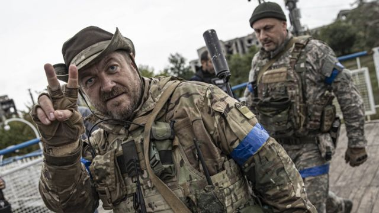
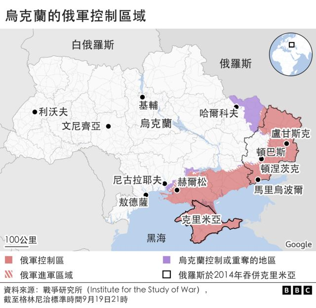
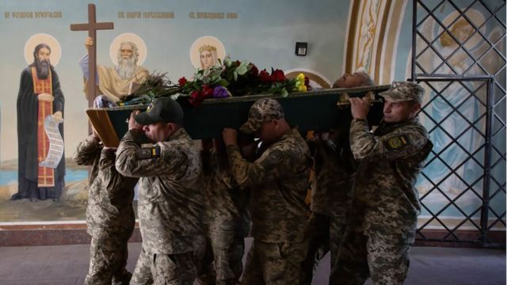
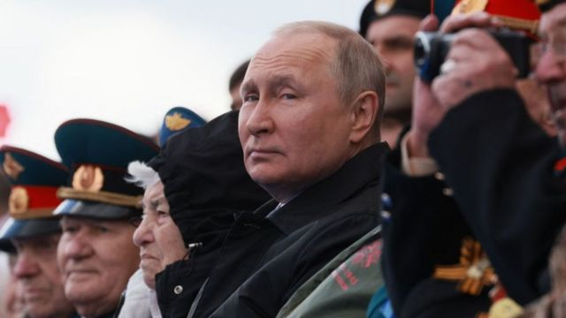

# 乌克兰战争：战事进展如何？究竟谁占上风？

#  俄罗斯入侵乌克兰：战况如何？谁胜谁负？

> 图像来源，  Getty Images

**乌克兰部队在最近几天的快速反攻中取得重大进展，并在乌克兰东部夺回了被俄罗斯占领的卢甘斯克地区。**

然而，俄罗斯军队仍然控制着乌克兰约五分之一的地区。

##  俄乌战局有哪些变化？

俄罗斯于2月24日入侵乌克兰，包围了乌克兰首都基辅。俄罗斯还在乌克兰的南部、东部和北部发动了攻击。

4月初，在俄罗斯放弃对基辅的进攻后，乌克兰军队重新占领了基辅周围的大片地区。

此后，俄罗斯一直将军事行动集中在乌克兰的南部、东部和东北部，夺取了大量乌克兰国土。

然而，9月初，局面发生了巨大的变化。

在东北部的一次决定性反攻中，乌克兰击退了俄罗斯军队。乌克兰声称仅在哈尔科夫市周围就收复了3000平方公里的领土。

乌克兰部队还夺回了位于乌克兰东部的卢甘斯克的领土。自7月以来，卢甘斯克地区一直被俄罗斯完全占领。

乌克兰表示，在9月份从俄罗斯控制下夺回的领土超过8000平方公里。这是自战争开始以来乌克兰在收复领土方面取得的最重大的成果。

乌克兰称，9月10日夺回的伊久姆和库皮扬斯克市都是俄罗斯军队的重要军需供应中心。因此，这标志着重大的战略成功。

乌克兰军队还在南部的赫尔松地区发起反击。

战争研究所（ISW）表示，乌克兰部队使俄罗斯部队蒙受了“重大的作战失败”。

英国皇家国防安全联合军种研究所（Royal United Service Institute）的贾斯汀·布朗克 (JustinBronk) 说，哈尔科夫的俄罗斯阵地遭到重创“全面崩溃”。

他说，俄罗斯的撤退是“自从俄罗斯4月从基辅撤退以来，我们看到的最戏剧性的逆转。”

##  俄罗斯如何回应？

俄罗斯证实，部队从伊久姆和库比安斯克撤退， 但说这是一次战略撤退，以便"重新集结"。

俄罗斯还说将继续对这些地区实施军事打击。

但俄罗斯军队在撤退过程中似乎丢弃了大量的设备和弹药。

##  俄罗斯仍占据多少乌克兰领土？

根据战争研究所ISW的数据，俄罗斯仍然占有乌克兰约20%的土地。

这些地区主要在东部的顿巴斯地区和乌克兰大陆的南部，以及俄罗斯在2014年吞并的克里米亚半岛。

顿巴斯是一个以俄语为主的地区，2014年俄罗斯吞并克里米亚后，亲俄势力占领了该地区三分之一以上的土地并在那里建立了两个所谓的人民共和国。

> 图像来源，  Getty Images

乌克兰西部地区包括利沃夫，虽然遭到俄罗斯的导弹袭击，但俄罗斯军队没有占领的意图。

##  俄罗斯想要什么？

俄罗斯拒绝承认对乌克兰的入侵是一场战争，只说是在乌克兰进行“特别军事行动”。

克里姆林宫说，军事行动将继续下去，“直到所有最初设定的目标”都得以实现。

在2月份发动入侵时，俄罗斯总统普京说他的目标是“使乌克兰非军事化”。

其中一个目标是确保乌克兰不加入西方防御军事联盟——北约。

俄罗斯最初的目标是攻克乌克兰并推翻现政府。然而，它现在似乎已将目标限制在确保能守住在乌克兰东部和南部占领的领土。

##  乌克兰想要什么？

乌克兰总统泽连斯基(VolodymyrZelensky)表示，他的主要目标是将所有俄罗斯军队赶出去，“收复所有领土”。

泽连斯基呼吁各国提供更多资金和设备，保住从俄罗斯夺回的地区。

乌克兰在对俄罗斯战争中大量使用的是西方国家运送的武器装备。

> 图像来源，  Getty Images
>
> 图像加注文字，普京在最近参加上海合作组织峰会时曾与中国领导人习近平会面。他透露，中国对俄罗斯在乌克兰的军事行动有”顾虑和问题“。但外界并不知道他是否打消了中国的顾虑。

##  俄乌人员损失多大？

战争中俄罗斯和乌克兰双方都遭受了损失，但都没有公布确切数字。

乌克兰声称已经歼灭了5万俄军，并在8月底表示，自冲突开始以来，乌克兰也已经损失了近9000名军事人员。

俄罗斯很少披露部队死亡人数。它最近一次公开死亡人数是在3月份，当时它说自入侵开始以来有1351名俄罗斯士兵死亡。

7月，美国官员估计，约有15000名俄罗斯士兵死亡。

另外平民也有死亡。9月初，联合国证实有5,700多人死亡。

然而，联合国表示实际数字可能要高得多。

