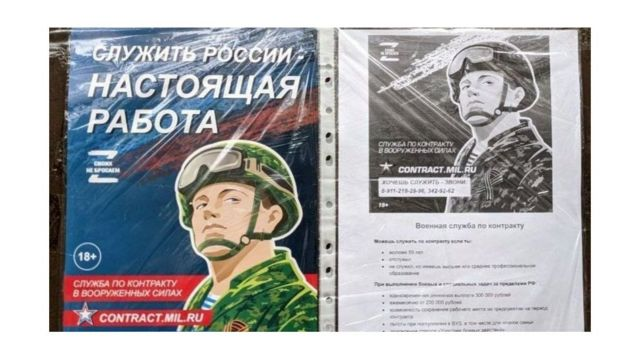
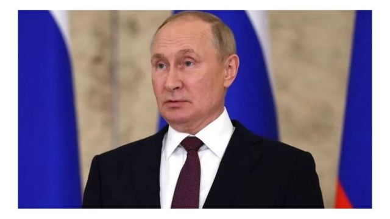
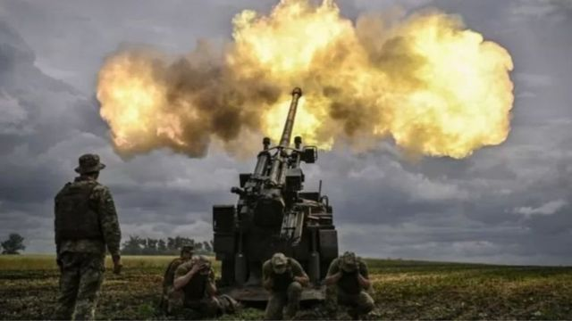

# 俄罗斯军队在乌东败退暴露其关键弱点 但普京称军事计划不变

#  俄罗斯军队在乌东败退暴露其关键弱点 但普京称军事计划不变

> 图像加注文字，俄国招聘传单被贴在民宅门上，张贴在公共交通工具和住宅区甚至精神病院门外。

**乌克兰最近在该国东部的反攻不会改变俄罗斯的计划，俄罗斯总统普京（（Vladimir Putin 普丁）在他对最近乌东战役的首次公开评论中称。但有迹象显示， 俄军在乌克兰东北部哈尔科夫的败退，暴露了该国武装部队在供应和人员配置方面的关键弱点。**

乌克兰军队表示，他们在过去 6 天内在哈尔科夫东北部地区夺回了 8,000 多平方公里的领土。

面对危机，普京说他毫不着急，并称莫斯科在乌克兰顿巴斯地区的战事仍在进行。他并指出，俄罗斯迄今尚未部署全部兵力。

“我们在顿巴斯的进攻行动并没有停止。他们正在向前推进——速度不是很快——但他们正在逐渐占领越来越多的领土，”他在乌兹别克斯坦举行的上海合作组织峰会会后说。

事实上，乌克兰东部的工业地区顿巴斯是俄罗斯入侵的焦点。自2014年以来，顿巴斯的部分地区一直被俄罗斯支持的乌克兰分裂主义团体占领。乌克兰最近发起反击的哈尔科夫地区则不属于顿巴斯。

在上述评论中，普京又威胁乌克兰说，如果乌克兰持续发动攻击，俄军将有“更严厉”的回应。

“我提醒你，俄罗斯军队并没有全面战斗……只有专业军队在战斗。”

> 图像来源，  Getty Images
>
> 图像加注文字，普京威胁乌克兰说，如果基辅持续发动攻击，俄军将有“更严厉”的回应。

##  俄军弱点

俄罗斯退伍军人和军事博主说，俄军在乌克兰东北部哈尔科夫的败退，暴露了该国武装部队在供应和人员配置方面的关键弱点。

据报道，一名在乌克兰战场内的俄罗斯海军陆战队军官在通讯软件Telegram中向国内的前战友倾诉说： “你不知道我有多精疲力尽，早上还和某人打过招呼，然后同一天晚些时候就要去辨识他的遗体。”

“就在昨天，我的两个狙击手小组被一辆坦克摧毁。三个人当场死亡，第四个人挣扎了一个半小时后死去。另一个情况危殆的人被送往医院。我们几乎没有什么人了，我们守着几十公里长的前线。”

虽然俄罗斯官员和官媒正试图淡化俄军从哈尔科夫的撤退， 但是，俄国独立战争记者、退伍军人和具有影响力的军事博主私底下承认了这次俄军撤退面临的种种挑战。

许多俄国军事博客和通讯媒体Telegram的频道中充斥着俄军军事装备和人员不足的信息，还有僵化的军事行中的阶级制度。

其中，一个Telegram频道最近在俄军的一次撤退后不久便分享了乌克兰战场上的士兵经验。该频道描述了俄军即便是部署一架小型监视无人机，也需要得到高级军官或将军的批准。这大大减慢了对敌人阵地的探测。

此外，据说是由一名俄罗斯特种部队退伍军人经营的Telegram频道发布了一张俄罗斯士兵的照片，他的手臂上有一个绣着字的补丁说：“没有比你自己的指挥官更糟糕的敌人了，他是一个...... ”他用秽语来形容他的长官。

目前我们尚未知道这张图片是在何时何地拍摄的。但重点是这照片被俄国退伍军人和战场上的士兵广泛分享，反映了该国官兵的普遍看法。

尽管有士气低落的传言，但俄罗斯战争记者和在乌克兰服役的士兵并不认为， 乌克兰战场上普遍存在的逃兵现象促成了该国在乌克兰东部的最新溃败。他们认为，更有可能的是这些部队只是服从撤退的命令。

一些俄罗斯军人在另一个Telegram频道上颇有黑色幽默地说，俄罗斯政府公开场合所说的“特别军事行动”是“没有什么目标，只有道路。”

不仅仅有针对军事领导不力的担忧， 俄国军队基本设备似乎非常短缺，以至于不得不通过众筹。数十个社交媒体团体正在筹集资金俄军购买战争装备，从无人机到袜子和内衣的所有东西。

其中一个名为 “人民阵线”（The People's Front,）的团体自称，在过去3个月里已经筹到约15亿卢布（约1700万美元）将其用于购买制服、头盔和防弹衣，以及急救包、望远镜和热像仪 （thermal imagers）。

尽管筹款持续，但几十个军事单位，包括俄罗斯最现代化的战斗机的飞行员都在网上发布了数百份请求，要求国家提供具体军事物品，如防火服、火把和双向无线电。

俄军不仅仅是缺乏设备，而且还缺乏人力。

> 图像来源，  Getty Images
>
> 图像加注文字，乌克兰军队表示，他们在过去 6 天内在哈尔科夫东北部地区夺回了 8,000 多平方公里的领土。

##  缺乏部队

虽然没有迹象表明莫斯科将强制征兵。但自从俄国入侵乌克兰后不久，便一直在推动征兵工作，官方称其 “非正式动员”。

俄罗斯国防部在今年3月初便开始在该国知名的招聘网站上张贴广告，过去这是很少发生的情况。

在另一个招聘网站上可以看到超过7000个军事职位空缺，包含枪手、迫击炮手和其他以军事战斗为重点的职位。

所有的广告都没提到俄国在乌克兰所谓的 “特别军事行动”。

招聘传单也被贴在民宅门上，张贴在公共交通工具和住宅区甚至精神病院门外。

一些被官方接触过的民众向BBC表示，征兵中心还打电话给已经离开或退伍的士兵，要求他们重新加入军队。一名1990年代在车臣作战的士兵说，他和他的朋友接了三、四次。

这位要求匿名的民众告诉BBC说他最终同意了，但后来拒绝签署合同，因为合同条件似乎很差。

现在，可能是为了使服役更有吸引力，合同中最短的参军期限已从3年降至4个月，而征兵年龄上限从第一份合同的40岁提高到了60岁。

广告中参军的月薪从10万到45万卢布（约1139至5125美元）不等。尽管有被部署到乌克兰的危险，但对那些在该国经济贫困地区工作，且职涯前景不佳的人来说是个诱人条件。

据信，俄罗斯每10天就会向乌克兰派出几支这样的小分队，此前的军事训练时间只有一星期甚至更短。

在战争前线的2个独立消息来源告诉BBC，这类部队由短期军事承包商，和瓦格纳雇佣兵组织的战士组成。该组织的负责人被拍到在俄罗斯中部的监狱招募人员，后者现在是组成俄军前线部队的多数。

还有一些报道说，签署参军合同的人可能并非都是自愿的。有俄罗斯人权人士指控，在车臣甚至有男子被当局强迫加入军队的情况。

俄罗斯独立记者说，有多达500名罪犯也被征召入伍。譬如，一名囚犯特林诺夫（Konstantin Tulinov）在7月阵亡后，俄国官媒公开表扬他。但，图林诺夫生前曾多次入狱服刑，最近一次是因在俄罗斯监狱中折磨其他囚犯而被判刑。

虽然，这些挑战正在俄国封闭的圈子里被讨论，但该国官方仍未公开承认这次军事撤退。

十分有影响力的俄国斯国家战争记者普得比尼（Yevgeny Poddubny）在他的Telegram私人频道上认为，俄军最近在乌克兰的溃败暴露了长期存在的问题。

“对我们的部队来说，情况确实很艰难。在公开和秘密会议上讨论过的问题已经被暴露出来了，”他说。

但没有证据表明这些信息正在向莫斯科高层传递上去。 普得比尼和其他几位战地记者在6月的圣彼得堡经济论坛期间与普京有过简短交谈。

尚不清楚他们到底向普京解释了什么，但供应不足仍然是俄国军方一直面临的关键问题。

