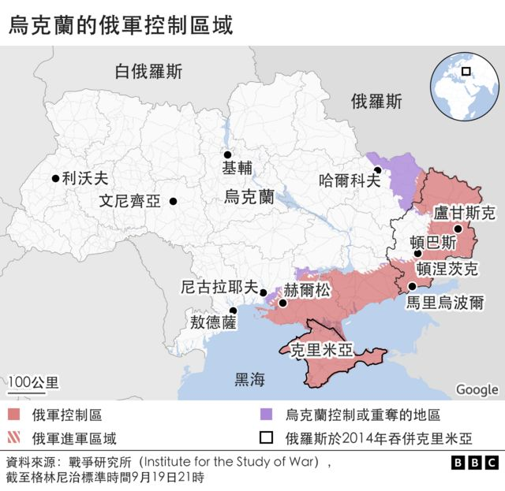

# 乌克兰境内四大俄占区筹划紧急入俄公投

#  乌克兰战争：四大俄占区筹划入俄公投，普京宣布动员30万预备役

> 图像来源，  EPA-EFE/REX/Shutterstock
>
> 图像加注文字，顿涅茨克和扎波罗热州很多地方仍在乌克兰控制之下，目前很难明确知道，这些公投会如何进行

**乌克兰境内有四个被莫斯科所控制的区域已经宣布计划，进行所谓的紧急公投决定是否加入俄罗斯，若成事将会为俄罗斯吞并这些区域铺平道路。**

俄罗斯的入侵行动在近数月陷入停滞，而乌克兰则在东北部夺回多处领土。

现在，东南部一些由俄罗斯支持的官员表示，他们想要在本周开始公投，决定是否加入俄罗斯。

俄罗斯在2014年一次招致国际社会遣责的公投之后吞并克里米亚。

外界曾预期俄罗斯总统普京（Vladimir Putin）会在当地时间周二晚间向全国讲话，但稍后一度延迟。

当地时间周三上午，普京在电视发表全国讲话称，俄罗斯即日开始进入部分总动员状态。俄罗斯国防部长随后宣布征召30万预备役部队。

乌克兰外交部长德米特罗·库列巴（Dmytro Kuleba）周二表示，“虚假的‘公投’不会改变任何事情。”

国际社会从未承认俄罗斯对克里米亚的吞并，但是长期以来一直很清楚的一点是，俄罗斯总是意图以同样的方式为占领地区设立橡皮图章，即没有实权的当地政府。

吞并乌克兰更多领土将会令克里姆林宫能够宣称，俄罗斯国土受到了北约武力威胁。俄罗斯于今年2月24日发动入侵了入侵乌克兰的战争。

外界一直猜测俄罗斯可能宣布进行全民动员，以加强其在乌克兰的军力——此前俄罗斯国会已经通过对诸如逃避兵役、破坏军队财产和动员或战事行动期间不服从命令等犯罪施以更严酷的刑罚。

周三的讲话意味着这一猜测已经成为实际行动。

普京表示，俄罗斯的行动不是虚张声势。

“我们祖国的领土完整、独立和自由会受到保护，我再说一遍，我们会动用一切手段。”

俄罗斯联邦安全会议（Security Council）副主席梅德韦杰夫（Dmitry Medvedev）周二较早时表示，在顿涅茨克和卢甘斯克的东部地区——亦称顿巴斯——进行投票将会修正“历史正义”，并且不可逆转：“在我们国家的宪法修改之后，未来没有任何俄罗斯领导人、任何官员能够推翻这些决定。”

不久之后，顿涅茨克和卢甘斯克两个由俄罗斯支持的地方当局就表示，它们会在9月23-27日进行公投。两地都是在俄军从东、南、北三个方向入侵乌克兰之前三天获得普京承认独立。

俄罗斯在南部地区赫尔松安插的官员表示，他们也会进行投票，扎波罗热的俄占区也发布了类似的宣言。俄罗斯官方媒体表示，人们将可以亲自到场或远程投票。

多个月来，俄罗斯安插的当局官员都在试图进行自治公投。自由公平的投票根本没有希望实现，而且持续的战事，也使得要吞并那些未完全受他们控制的区域显得不切实际。乌克兰的反攻也令事情变得更加困难。

虽然卢甘斯克的大部分地区从7月以来就一直在俄罗斯控制之下，但是在周一，卢甘斯克的乌克兰领导人宣布乌军已经重夺比洛戈里夫卡村。

顿涅茨克的很多地区仍然在乌克兰控制之下，不过俄罗斯已经夺取亚速海（Sea of Azov）沿岸的狭长地带。

虽然俄军在战争之初迅速地夺取了赫尔松，但是乌克兰军队已经夺回了部分领地，而俄罗斯支持的当局官员也面临持续的攻击。较早前当地曾试图进行投票，之后被延迟。

扎波罗热州很多地方仍在乌克兰控制之下，包括同名的地区首府。尽管2014年克里米亚的公投被广泛认定为非法而不予承认，且受到大量当地居民的抵制，但是俄军仍然控制着这个半岛。

乌克兰军队距离顿涅茨克城并不远。周一，俄罗斯支持的市长指控乌军轰炸该市，造成至少13人死亡。

任何进一步吞并乌克兰主权领土的意图都肯定会激怒基辅的领导层，并使得谈判解决争端的希望破灭。

乌克兰国防部长顾问科皮特科（Oleksiy Kopytko）表示，投票的计划是莫斯科一个“歇斯底里的迹象”。乌克兰总统泽连斯基（Volodymyr Zelensky）在周一晚上表示，“占领者明显处在恐慌当中。”

德国总理朔尔茨（Olaf Scholz）表示，投票是一场“骗局”，而法国总统马克龙遣责这一计划“偏激”和“荒谬”，明显不会受到国际社会的承诺。北约秘书长斯托尔滕贝格（Jens Stoltenberg）表示，这些公投没有合法性，也是“普京对战争的进一步升级”。

备受尊敬的俄罗斯分析人士塔蒂安娜·斯坦诺瓦亚（Tatiana Stanovaya）认为，这一最新的行动是俄罗斯对乌克兰以及西方的“毫不含糊的最后通谍”。她表示，如果它们不作出适当的回应，俄罗斯就会全面动员其武装部队开战。在普京看来，吞并将会给他权力，在被莫斯科认定为俄罗斯领土的受保护区域使用任何武器。

在俄罗斯一些地方，已经有越来越多的声音呼吁全面动员武装部队。总统普京仍然将这场入侵形容为一次“特别军事行动”。

有迹象显示克里姆林宫正准备支持这场公投，俄罗斯外长拉夫罗夫（Sergei Lavrov）表示，从行动一开始，俄罗斯就希望由居民来做决定：“目前整个状况明确显示，他们想要做自己命运的主人。”

