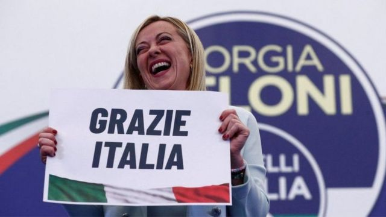
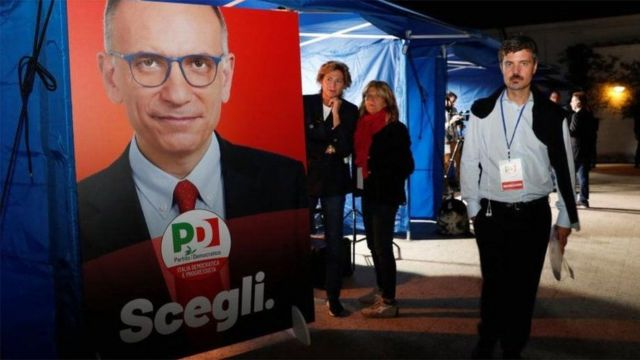
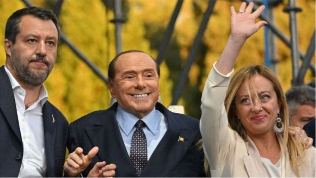
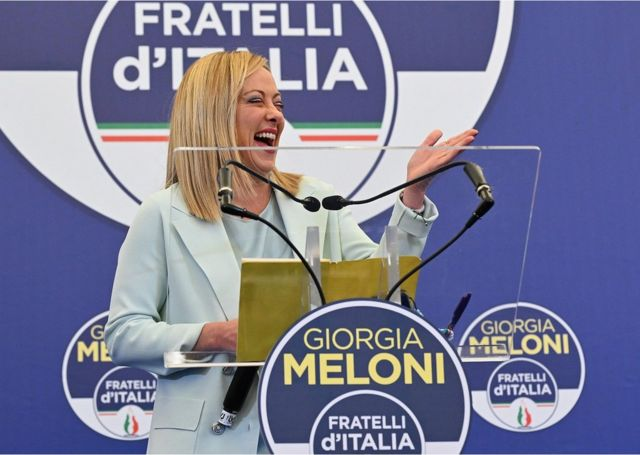

# 意大利大选极右翼政党获胜：有望诞生首位女总理 涉台发言引发关注

#  意大利大选极右翼政党获胜：有望诞生首位女总理 涉台发言引发关注

  * 保罗·柯尔比（Paul Kirby） 
  * BBC记者发自罗马 

> 图像来源，  Getty Images
>
> 图像加注文字，外界预计梅洛尼将组建意大利自二战以来最右翼的政府。

​​

**意大利（Italy，义大利）极右翼领袖乔治亚·梅洛尼（Giorgia Meloni）在大选中获胜，并有望成为该国第一位女总理。外界预计梅洛尼将组建意大利自二战以来最右翼的政府。她在大选中获胜使欧洲大部分地区感到震惊，因为意大利是欧盟第三大经济体。**

然而，梅洛尼女士在投票后表示，她的政党——意大利兄弟党（Brothers of Italy）将 “为所有人执政”，不会背叛人民的信任。她在首都罗马对记者说：“意大利人已经发出了一个明确的信息，赞成由意大利兄弟党领导的右翼政府。”她举着一个“谢谢你！意大利”的标语说。

根据临时投票结果，她将赢得约26%的选票，领先她最接近的竞争对手——代表中间偏左政党的领袖恩里科·莱塔（ Enrico Letta），后者拿下19.3%的选票。

梅洛尼的右翼联盟，其中还包括马萨尔维尼（Matteo Salvini）的极右翼联盟和前总理贝卢斯科尼（Silvio Berlusconi）的中右翼政党意大利力量（ Forza Italia），现在看来已经拿下了该国参议院和众议院，预计将获得参议院42.2%的选票。

谁成为意大利下一任领导人的决定权在意大利总统塞尔吉奥·马塔雷拉（Sergio Mattarella）手中，而这还需要时间知道结果。

尽管梅洛尼一直在努力软化自己的形象，强调她对乌克兰的支持，并淡化反欧盟的言论，但她领导的政党是从尊崇该国过去独裁者墨索里尼（ Benito Mussolini）的新法西斯分子的运动中崛起。

今年早些时候，梅洛尼在参与西班牙极右翼政党Vox的一次闹腾的演讲中概述了她若执政后的优先事项：“赞成自然家庭，反对LGBT权益团体游说，赞成性别认同（gender identity），反对性别意识形态（gender ideology），反对伊斯兰暴力，赞成安全边界，反对大规模移民，向国际大金融说不......抵抗布鲁塞尔的官僚们！”

> 图像来源，  Reuters
>
> 图像加注文字，意大利内政部表示，此次投票率急剧下降，投票结束时为63.82%，比2018年少了近10%。包括西西里岛在内的南部地区的投票率尤其低。

意大利中间偏左的左翼联盟以26%的选票比例远远落后。民主党人士黛博拉·塞拉基亚尼（Debora Serracchiani）说，这对意大利来说是一个悲伤的夜晚。她坚持认为，右派“在议会中占多数，但在全国则没有”。

在意大利为期18个月的民族团结政府于今年7月垮台后，左派未能与其他政党形成可行的联盟。甚至在投票前，现任官员们就已经感到沮丧。朱塞佩·孔蒂（Giuseppe Conte）领导的“五星运动”（Five Star Movement）有望获得第三名，但尽管其政党有一些中偏左的政策，但与前总理莱塔领导的左翼政党民主党（Partito Democratico）的意见一直不一致。

意大利内政部表示，此次投票率急剧下降，投票结束时为63.82%，比2018年少了近10%。包括西西里岛在内的南部地区的投票率尤其低。

意大利是欧盟的创始国之一，也是北约成员国，梅洛尼关于欧盟的言论使她被认为与匈牙利的民族主义领导人维克多·欧尔班（Viktor Orban，奥尔班）关系密切。此外，她的盟友都与俄罗斯有着密切的联系。85岁的贝卢斯科尼上周声称，普京是被逼着入侵乌克兰，而萨尔维尼则对西方对莫斯科的制裁表示质疑。

梅洛尼希望重新审视意大利与欧盟达成的改革，以换取高达2千亿欧元，用在后疫情时代的复苏和贷款。她宣称欧洲的能源危机已经改变了情况。长期担任匈牙利总理政治主管的巴拉兹·欧尔班（Balazs Orban）很快就对意大利右翼政党表示祝贺：“我们比以往任何时候都更需要有共同愿景以及应对欧洲挑战的盟友。”

在法国，极右翼政党“国家集会”（National Rally）成员约旦·巴尔德拉（Jordan Bardella ）表示，意大利选民给了欧盟委员会主席乌苏拉·冯德莱恩（ Ursula von der Leyen）上了一堂谦逊的课。因为，后者之前曾表示，若意大利选择往“困难的方向”走，欧洲将有“手段”回应。

> 图像来源，  Getty Images
>
> 图像加注文字，三位意大利右翼领导人上周在舞台上团结起来，这是两年多以来的第一次。

然而，罗马第一大学教授詹卢卡·帕萨雷利（ Gianluca Passarrelli ）告诉BBC，他认为梅洛尼若上台，一开始会先避免冲撞有关欧洲的政策，而专注于其他方面：“我认为我们将看到对国内公民权利、LGBT和移民政策的更多限制。”

萨尔维尼希望回到内政部，阻止从利比亚进入意大利境内的难民船只。这次选举标志着两院规模缩小了三分之一，这将使拿下多数席次的政党受益。根据意大利广播电视公司（Rai TV）的出口民意调查显示，三大党将在改组后的400个议席中拿下约227至257个席位。在参议院共200个席位中则占据111至131个席位。

萨尔维尼说，右翼在两院都有明显优势。意大利广播电视公司的同一项民意调查还显示，梅洛尼领导的联盟可能会占据主导地位，中左翼在众议院的席位仅为78至98席，在参议院的席位则预计拿下33至53席次。

##  意大利党魁罕见接受台媒专访

BBC中文记者 **吕嘉鸿**

此次选举，外界亦同样关注这位新任总理大热门的两岸政策。2019年3月，中国国家主席习近平飞抵罗马，与时任该国总理孔蒂签署了“一带一路”倡议备忘录。意大利是七大工业国集团（G7）参与“一带一路”的唯一成员。

台湾官媒 中央社在9月23日刊出了专访  ，梅洛尼以书面回覆两岸议题。这是多年来意大利政坛领袖首次接受台湾媒体访问。梅洛尼向中央社表示，台海若发生军事冲突，将对欧洲造成直接影响。她表示欧盟应该运用一切政治与外交手段，“尽全力施压，以避免台海发生冲突。”

> 图像来源，  EPA
>
> 图像加注文字，台湾官媒中央社在9月23日刊出了专访，梅洛尼以书面回覆两岸议题。

她又告诉中央社，“别忘了欧盟也是中国的主要出口市场，若他们决定攻台，可能导致市场（对中国出口商品）关闭“。她表示，她所领导的极右翼政党与台湾“因诚挚友谊互相连结”。她若能领导下一届政府，将推动更多意大利与台湾的双边合作。

但她的发言也随即遭致北京抗议。中央社专访发布后， 中国驻意大利大使馆当日也随即刊出声明  称“中方注意到一些涉台负面言论，借台湾问题说事、鼓噪对华强硬。中方对有关言论表达强烈不满和坚决反对。”

该声明强调“无论国际局势如何变幻，坚持开放合作、互利共赢始终应成为中意关系发展的主流。中方高度重视发展对意大利关系，愿同意方共同把握好中意全面战略伙伴关系正确发展方向。”

无论如何，此次大选已经对该国年轻民众带来冲击。来自意大利北部、20多岁从事时尚业的杰西卡（Jessica）告诉BBC中文，“我其实对这个结果不意外，这是当今意大利右翼盛行气候的结果，虽然投票率很低。但作为一名年轻女性，我担心民权道路会突然停止。但作为欧盟的一员，我希望某些极端政策方面会被阻止”。

> 图像来源，  Getty Images
>
> 图像加注文字，此次意大利大选，外界亦同样关注这位新任总理大热门的两岸政策。

