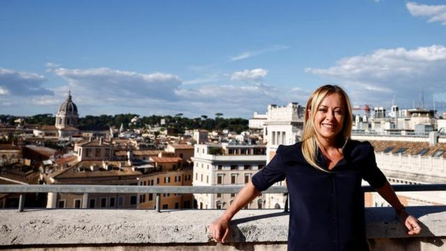
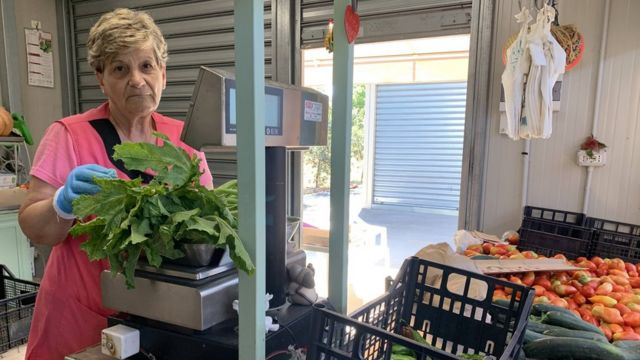
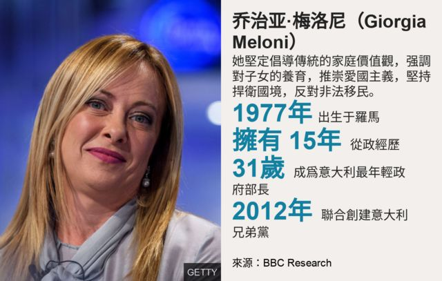
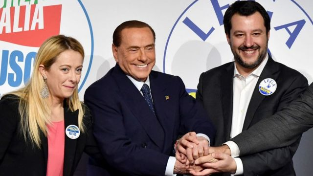
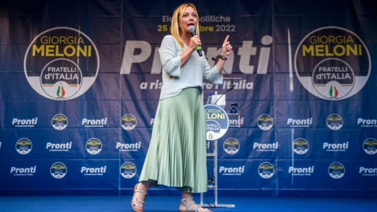

# 新闻人物：有望成为意大利首位女总理的右翼党魁梅洛尼是谁？

#  梅洛尼：有望执掌一国大权的意大利右翼党魁其人其事

  * 马克·洛温（Mark Lowen） 
  * BBC 驻罗马记者 

> 图像来源，  Reuters
>
> 图像加注文字，梅洛尼（Giorgia Meloni），45岁，是极右翼政党“意大利兄弟党”的党魁

**过去40年来，安娜·玛丽亚·托尔托拉（Anna Maria Tortora）一直在罗马的农贸市场自己的摊位上卖自家种的西红柿和新鲜黄瓜，她有一批忠实的顾客。不过，她完全没有料到那个曾经牵着祖父的手排队买菜的小女孩现在几乎要成为意大利的下一任总理。**

“他是个非常好的人，” 她回忆说，“很宠爱小孙女”。

那个名叫乔治亚·梅洛尼的小女孩带领自己的政党在选举中夺魁，安娜·玛丽亚万分自豪。她说：“是我用我的豆子把她养大的！她吃得很好，出落得很好。”

这个市场位于加尔巴特拉，是罗马南部的劳工阶层聚居区，传统上是左翼的堡垒。

对于一个现在处于头号地位、即将成为自墨索里尼（Benito Mussolini）以来意大利第一位极右翼派总理的政治家来说，这个地方是个有点奇怪的起源。

一旦意大利提前选举的结果得到确认，总统塞尔吉奥·马塔雷拉（Sergio Mattarella）将与党的领导人协商，以确定谁可以领导一个稳定的政府。作为领跑者的梅洛尼会声称她有优先权。

“她不能代表这个地区，这个区传统上是红色的，”来市场采购的玛塔（Marta）说；她正推着婴儿车经过蔬菜摊位。她年迈的母亲卢西亚娜（Luciana）告诉我，她对这种前景感到害怕。

“我非常反对法西斯主义，”她补充道。“如果她上去了，那会带来一段非常丑陋的时期。”

> 图像加注文字，安娜-玛丽亚和梅洛尼从小吃着长大的蔬菜

法西斯主义这个标签是梅洛尼强烈反对的。在最近公布的一段视频中，她用英语、西班牙语和法语宣称，这种意识形态已经属于历史。

但是，在一个二战结束后没有类似德国去纳粹化那种经历的国家，历史始终是现实问题的一部分，法西斯政党因此得以改头换面。意大利兄弟党成立于2012年，其政治根源是意大利社会运动（MSI），而该运动正是从墨索里尼法西斯主义的灰烬中崛起的。

这个党保留了战后极右翼政党的标志：三色火焰；它通常被看作墨索里尼的坟墓上燃烧的火焰。

“乔治亚·梅洛尼不愿放弃这个符号，因为那是她无法逃避的身份标识；这是她的青春，” 罗马萨皮恩扎大学政治学教授吉安卢卡·帕萨雷利（Gianluca Passarelli）说。

“她的政党不是法西斯党，”他解释说。“法西斯主义意味着获得权力并摧毁体系。她不会那样做，也做不到。但党内有些派别与新法西斯主义运动有牵扯。她一直设法扮演中间派角色。”

她的青春岁月确实根植于强硬的右翼阵营，她的人生起于卑微：这是她作为大众女性形象的关键。

梅洛尼出生在罗马。一岁时，父亲弗朗切斯科（Francesco）离家出走，搬到了加纳利群岛。父亲弗朗切斯科是左翼，她的母亲安娜则是右翼。人们因此不免猜测，她的政治道路选择或许有部分动机是希望藉此报复缺席自己人生的父亲。

后来，梅洛尼随全家搬到了加尔巴特拉，那里离她的祖父母很近。她15岁时在那里加入了青年阵线（Youth Front）—— 新法西斯主义MSI 的青年组织，该运动变成全国联盟（National Alliance）后，她又成为联盟旗下学生组织的主席。

1992年，有一天梅洛尼到 MSI 在加尔巴泰拉的办公室去，敲门时马可·马西利奥（Marco Marsilio）正在开会。他比她大 10 岁，两人后来成为亲密的朋友和政治盟友。他如今是阿布鲁佐大区的政府首脑。

“那是个身材苗条的女孩，却总是非常认真，意志坚定，”他说。“人们会注意到她，因为在学生会议上，她绝不让任何人从她手里夺走麦克风。”

> 图像来源，  Getty Images
>
> 图像加注文字，梅洛尼希望与贝卢斯科尼（中）和萨尔维尼组建右翼政府

多年来，两家人一起度假，两人一同参加辩论和社交聚会，他看着她成长，越来越自信。“她当时有不安全感，”马西利奥说，“这也许是一种积极力量，因为这让她在处理问题之前查阅更多资料，而不是更少。”

2008年，31 岁的梅洛尼成为意大利有史以来最年轻的部长，被贝卢斯科尼任命为青年和体育部长。

她2012年组建自己的政党，2018年参加上一次选举，但只赢得了4%的选票。

今天，作为唯一一个远离德拉吉民族团结联合政府的主要政党，初步结果显示意大利兄弟党赢得26%的选票，梅洛尼与贝卢斯科尼和前内政部长萨尔维尼的极右翼联盟党将获得议会多数席位。

但是，即使她试图通过大力支持德拉吉政府的亲乌克兰政策来安抚意大利的西方盟友，她的强硬保守社会政策仍令许多人感到担忧。

> 图像来源，  Getty Images
>
> 图像加注文字，意大利兄弟党的三色火焰标识曾经被二战后兴起的新法西斯主义政党意大利社会运动（MSI）使用。

在西班牙极右翼Vox党最近的一次集会上，她怒吼道：“对自然家庭说是，对 LGBT 游说团体说不！” 她呼吁对利比亚实行海上封锁以阻止非法移民船进入意大利海域。

“梅洛尼不是对民主的威胁，而是对欧盟的威胁，” 帕萨雷利教授说，她与匈牙利和法国的民族主义领导人如出一辙。

“她与（法国的）勒庞或（匈牙利的）欧尔班在同一个阵营。她想要的是一个所有国家各行其是的欧洲。意大利有可能成为普京破坏欧洲团结的特洛伊木马，因此她将会为他继续削弱欧洲助力。”

在争取成为意大利有史以来第一位女总理的过程中，她强调自己的女性身份。但是，帕萨雷利教授以一种大男子主义、政治化的方式指出：“意大利家庭中占主导地位是‘妈妈’。她是主宰厨房的男子气概的人物。梅洛尼巧妙地利用了这一点，因为它直接切入我们的体制的核心。”

对于她的盟友来说，国民经济长期停滞、老年政治主导社会的意大利需要激进的政治变革，而她正代表了这种变革。

“我感觉很振奋，就像婚礼上挽着女儿走向圣坛的父亲，”马西利奥说。“我们要是认为她没有潜力，就不会成立这个党。”

在她的庆功酒会上，香槟瓶塞弹出时，他打算对她说什么？

“来吧！”，他回答。“我们大家都那么渴望这个。现在就享受努力的成果吧。”

