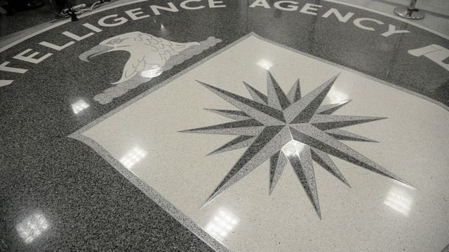
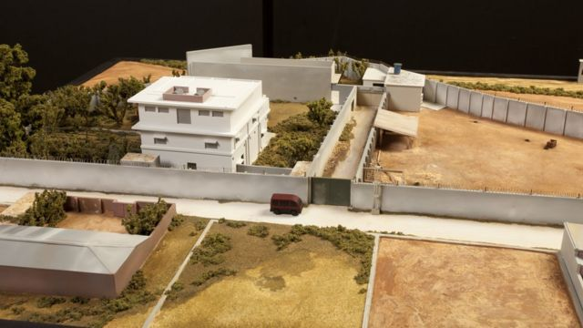
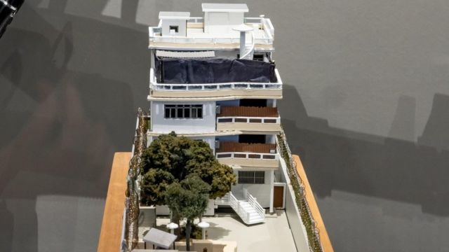
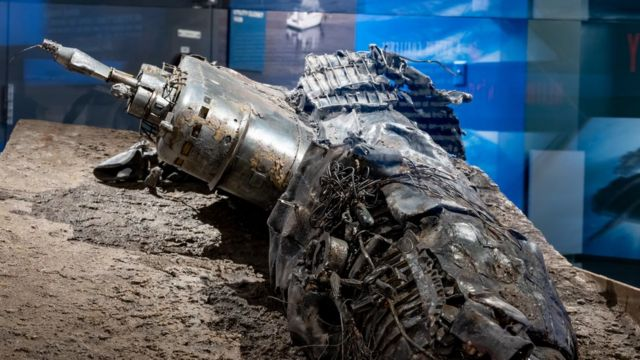
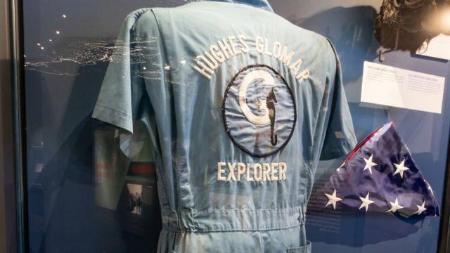
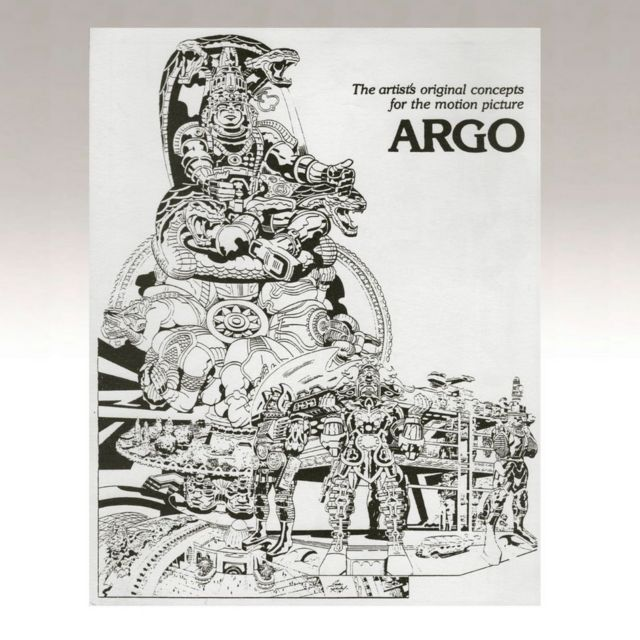
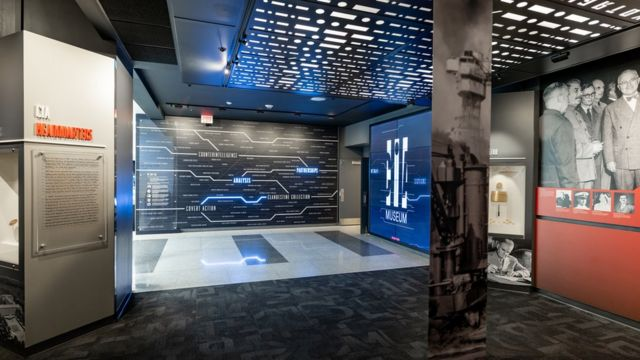

# [World] 美国中情局博物馆：从冷战到反恐，世界最机密的博物馆中都有什么？

#  美国中情局博物馆：从冷战到反恐，世界最机密的博物馆中都有什么？

  * 戈登-科雷拉（Gordon Corera） 
  * BBC安全事务记者 

> 图像来源，  Pool/Getty Images

美国中情局博物馆：从冷战到反恐，世界最机密的博物馆中都有什么？

**这可能算是世界上最非同寻常，最私密的博物馆，里面陈列了影响历史的展品。但是博物馆并不对公众开放。**

在那里人们不仅能看到本拉登被杀时候他身边的枪支，还有伊拉克前领导人萨达姆的皮夹克。

这就是中情局的秘密内部博物馆。

博物馆位于在弗吉尼亚兰利美国中央情报局总部里，为庆祝中情局成立75周年，里面的展品更新。包括BBC记者在内的一小批记者被允许进入博物馆参观，但参观者身边一直有保安陪同。

在600多件陈列品当中，有冷战时期的间谍工具，例如一只间谍把信息藏在里面的“死投老鼠”；一台隐藏在香烟盒里的相机；一只携带秘密相机的鸽子；还有一个能够爆炸的马提尼玻璃酒杯。

部分展品涉及中情局最近一些更著名的行动。

> 图像来源，  Central Intelligence Agency
>
> 图像加注文字，奥巴马总统曾经看过这个巴基斯坦阿伯塔巴德（Abbottabad）的院落模型，当是官员向总统汇报袭击本拉登行动计划时使用过这个模型

展品当中有本拉登在巴基斯坦居住院落建筑的缩尺模型。奥巴马总统在批准攻击行动前曾经看过这个模型。2011年的那次突袭行动中，基地组织领导人本拉登被打死。

博物馆负责人罗伯特·贝尔（Robert Z Byer）解释说，“能够看到立体模型有助于决策者做决定，也能帮助行动人员策划。”

今年7月30日，美国一枚导弹打击了阿富汗首都喀布尔的另外一处建筑。打击目标是基地组织的另外一个领导人艾曼•扎瓦希里（Ayman al-Zawahiri）。

在最近解密的一些展品中，有一个给拜登总统看过的模型，即今年7月1日向拜登汇报行动计划时向他展示过该建筑模型。美国情报机构经过数月侦察，了解扎瓦希里的行踪，最后在扎瓦希里出现在阳台上的时候用导弹击中了他。

贝尔说，“这说明了反恐官员如何理解目标人物的生活规律。”

> 图像来源，  Central Intelligence Agency
>
> 图像加注文字，基地组织领导人扎瓦希里住所的模型。扎瓦希里出现在建筑阳台上的时候遭到美国发射的导弹轰击

博物馆的前半部分是按时间顺序展示了1947年中情局成立，经过冷战，到2001年9/11恐怖袭击。那次恐怖袭击是向聚焦反恐的一个转折点，一些展品来自攻击中死者家属捐赠。

博物馆对中情局自己的雇员和正式的来访者开放。展览的焦点不是渲染成功。还有一部分展品是关于猪湾登陆惨败。当时中情局设法推翻古巴的卡斯特罗，但他们组织的行动遭遇惨败。展览还提到在伊拉克寻找大规模杀伤性武器方面的失败。

贝尔说，“这个博物馆不仅仅是为了再现历史。这是一个讲解行动内容的博物馆。我们让中情局的官员观看展览，了解我们在好的和坏的两方面的历史。我们确保让这些官员了解他们的过去，让他们能更好地应对未来的工作。我们必须吸取成功的经验和失败的教训，才能在未来有所改善。”

当然中情局一些最有争议的行动在展览中反映不多，例如1953年中情局同英国军情六处推翻伊朗民主选举政府的联合行动，以及2001年以后中情局刑刑讯折磨恐怖嫌疑人的行动。

##  “我们既不证实也不否认”

博物馆的第二部分详细展示了一些特别的行动。

“我们既不证实也不否认”对于报道情报机构的人来说是个比较熟悉的说法。博物馆的展览内容首次说明了这一说法的出处。

1960年代后期，苏联的一艘潜艇在大洋底失踪。后来美国了解到了潜艇的位置，中情局同美国商业大亨霍华德·休斯（Howard Hughes）合作试图打捞残骸，获得潜艇上面的技术设备。当时霍华德·休斯宣称他们要利用格洛玛探险家（the Glomar Explorer）号勘探船进行海底采矿，以此掩人耳目。

> 图像来源，  Central Intelligence Agency
>
> 图像加注文字，“亚速尔计划”中设计的苏联沉没潜艇K-129的模型，博物馆首次展出了这个模型

> 图像来源，  Central Intelligence Agency
>
> 图像加注文字，展品包括连身工作服和旗帜等物品，显示了中情局和商界大亨为打捞行动保密做了大量工作。这些都是从前没有展示过的物品

博物馆还陈列了那艘苏联潜艇的模型和打捞船船员的衣物，烟灰缸和为掩护格洛玛探险家勘探船真实目的而制作的邮袋。陈列品当中甚至还有中情局副局长秘密登上勘探船时化妆用的假发。

那次行动仅获得部分成功，因为勘探船用钢爪打捞吊起潜艇时，潜艇船体断开，只有一部分被打捞上来。

贝尔说，“他们在潜艇上发现的大部分物品目前仍然属于机密。”

潜艇其余部分还没有从海底打捞上来时就曝出当时被称作“亚速尔计划”（Project Azorian）的新闻，随后美国官员被告知，只能说他们“既不证实也不否认”发生了什么，这就是当时的“格洛玛回答”，现在仍然被广泛使用。

> 图像来源，  Central Intelligence Agency

1979年伊朗革命后，为了掩人耳目制作了名为“阿果”（Argo）的虚假影片，里面使用的艺术品也成了博物馆的展品。那次行动是为了拯救被伊朗扣押的美国外交官人质，行动人员装扮成电影拍摄人员。那件艺术品故意被做得让人难以理解。那次行动后来成了好莱坞电影的题材。

谈到破解神秘的艺术品，新博物馆的天花板上还包含了用不同种密码隐藏的各种信息。

> 图像来源，  Central Intelligence Agency
>
> 图像加注文字，在中情局博物馆入口处，参观客能看到贯穿整个展览的线索：反间，合作伙伴，分析，秘密搜集，秘密行动

中情局官员说，那样做的目的是让图片分享到社交媒体的公共领域，看看人们能否破解其含义。其中一些展品也可以在网络上看到。但在目前，这个博物馆的展览对大多数人来说只是网络展示的内容。

