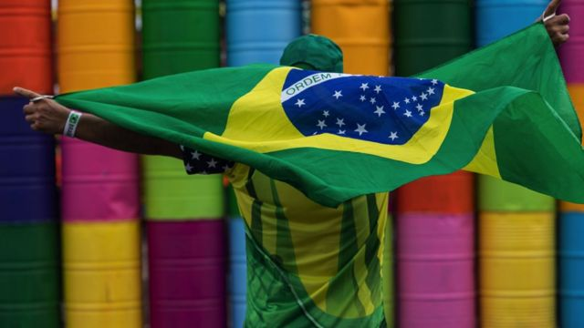
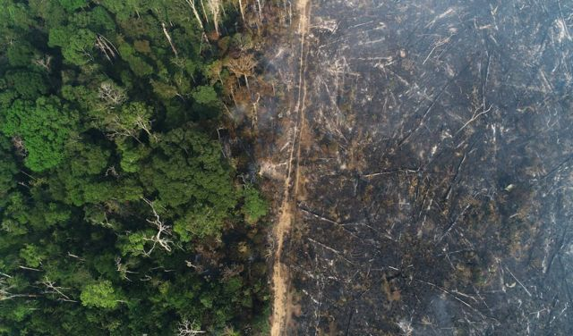
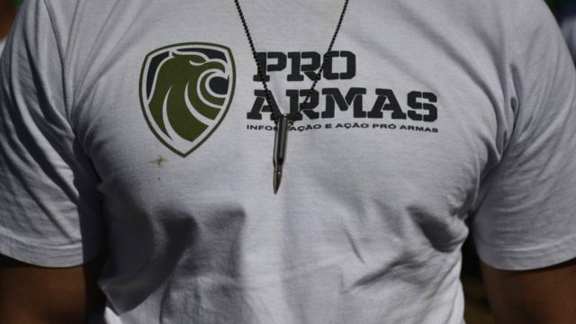
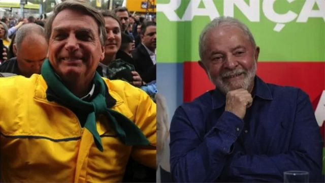

# 世界应该关心巴西大选的三个理由

#  巴西大选：世界应该关心博尔索纳罗与卢拉摊牌的三个原因

  * 费尔南多·杜阿尔特 
  * BBC国际部 

> 图像来源，  EPA
>
> 图像加注文字，拉丁美洲最大和人口最多的国家巴西将于10月2日举行总统大选

**10月2日，创纪录的选民人数将参加巴西大选，一些观察人士认为这是对该国政治制度的“关键考验”。**

超过1.5亿人将投票选择州长和地方议员，以及国会议员和参议员，但重点无疑将放在现任总统雅博尔索纳罗和前总统卢拉之间的总统竞选对决上。

在民意两极分化的大背景下，总统竞选的结果 - 如果11名候选人中没有任何一位获得超过50%选票，得票最高的两人进入第二轮决选，之后产生胜者 - 将在拉丁美洲最大和人口最多的国家的边界之外产生反响。

全世界都已经在关注巴西选举。也许最直言不讳的是美国 - 在现任巴西总统公开质疑该国的电子投票系统之后，美国呼吁博尔索纳罗政府要“尊重民主进程”。

> 图像来源，  Reuters
>
> 图像加注文字，民意测验结果显示，前总统卢拉有可能重新上台执政

最近（9月22日），联合国发表声明，敦促巴西当局、候选人和政党“确保即将举行的大选是和平的，并防止与选举有关的暴力”。

根据巴西最高选举法院（TSE）的数据，预计将前往巴西进行民意调查观察选举的国际组织数量是创纪录的。

但热闹的气氛并不是全世界人民观看10月2日投票的唯一原因。

##  亚马逊问题

从两位主要候选人的环境记录来看，世界上最大的热带雨林的未来可能在这次选举中受到威胁。

在卢拉担任巴西总统的两个任期（2003-2010）期间，他通过遏制该地区的非法采伐，采矿和养牛，监督亚马逊森林砍伐速度的降低，保护亚马逊在缓解气候变化的努力中发挥了巨大作用。

虽然在博尔索纳罗在2018年大选中获胜之前，亚马逊雨林的破坏率已经上升，但自2019年1月他宣誓就职以来，破坏速度有相当大的加快：巴西亚马逊环境研究所今年早些时候发布的一份报告称，在博尔索纳罗政府的监督下，森林砍伐增加了近57%。

> 图像来源，  Reuters
>
> 图像加注文字，巴西亚马逊环境研究所早些时候发布的一份报告称，博尔索纳罗在2018年上台后亚马逊雨林的破坏率上升

这位极右翼的总统公开支持在亚马逊河的商业勘探，并特别反对保护原住民土地。他是自1988年以来第一位没有签署划定原住民土地的巴西领导人。

外国政府和环保组织对这种情况表示担忧。绿色和平组织发言人泰伊斯·班瓦特告诉英国广播公司，这次选举“需要发出一个信息，即放弃我们的环境遗产是不能容忍的”。

班瓦特说，科学家们已经警告，亚马逊正在接近所谓的临界点，森林将在干旱，火灾和砍伐树木等事件后失去自我再生的能力。

他说：“在过去近四年中，博尔索纳罗政府的言辞，行动和措施都表明了他对环境保护机构、土著人民、环境活动家和民主的蔑视。”

博尔索纳罗在国际上采取了更加温和的立场：在9月份的联合国大会上，这位总统声称他的环境记录没有得到媒体的公正报道。

他说：“在环境和可持续发展方面，巴西是解决方案的一部分，也是世界的一个参考坐标”。

##  巴西在经济和政治上都很重要

巴西不仅是拉丁美洲最大和人口最多的国家，是世界前15大经济体之一，也是全球商业某些领域的主要角色。

> 图像来源，  Getty Images
>
> 图像加注文字，巴西是世界铁矿石，大豆、牛肉等大宗商品主要生产国，也是美国和中国的主要贸易伙伴。图为巴西铁矿

巴西是大豆、牛肉和铁矿石等大宗商品的主要生产国，也是美国和中国的主要贸易伙伴。因此，一次动乱的选举，或选举后出现动乱，是一种也引起国际关注的可能性。

巴西社会学家和国际关系专家莱昂纳多·丰特斯认为，由于博尔索纳罗对电子投票系统的反复质疑，该国“年轻的民主”将受到考验，这导致人们猜测，这位绰号为“热带特朗普”的人的支持者可能会像特朗普支持者2021年1月6日在美国国会大厦所做的那样，发动一个巴西自己版本的选举后骚乱。

丰特斯解释说：“几个西方国家的民主制度正受到威胁，我们已经在巴西看到了出现类似情况的迹象。”

他说，需要看看博尔索纳罗在选举失败的情况下会怎么做，但公平地说，民主制度正在巴西受到考验。

博尔索纳罗的煽动性言论还伴随着立法放宽巴西的枪支所有权规则。根据巴西安全智库“我爱和平研究所”（Sou da Paz）分析的巴西军队和警方的数据，自2018年以来，私人手中的枪支数量翻了一番，达到近200万支。

“我爱和平研究所”的执行董事卡罗琳娜·里卡多说：“今天我们巴西已经有一支真正的武装平民军队，这种情况非常令人担忧。”

> 图像来源，  Getty Images
>
> 图像加注文字，自2018年以来，巴西私人手中的枪支数量翻了一番，达到近200万支。图为支持拥有枪支的一个标志

人们还担心真正的巴西军队在选举后可能发挥的作用。巴西在1964年至1985年间由军方统治，博尔索纳罗总统是前陆军上尉，其副总统汉密尔顿·穆劳是一名将军。但专家们不久前告诉英国广播公司，他们没有看到军方内部策动政变的兴趣。

另一个战场是虚假信息战线。在竞选期间，人们特别担心使用社交媒体传播谣言，特别是巴西人最常用的即时通讯社交媒体软件WhatsApp。

在接受巴西报纸《圣保罗时报》采访时，WhatsApp巴西公共政策主管达里奥·杜里根表示， 10月2日的投票对这家元宇宙（脸书）旗下的公司来说是世界上最重要的投票。

杜里根说：“这是一个两极分化的国家，经营环境艰难”。

##  左右路线之争？

> 图像来源，  EPA/Reuters
>
> 图像加注文字，政治科学家们从全球政治的大背景来看待巴西政治的左右之争

巴西最近的民意调查显示，卢拉较大幅领先博尔索纳罗。虽然这并不一定意味着前总统将获得足够的选票来避免第二轮决定性选举投票，但民意调查也表明，这位左翼政客将在第二轮投票中击败现任总统。

对于观察过去几年各国极右翼领导人崛起 -- 最近一次是梅洛尼在意大利大选中的胜利 -- 的政治科学家来说，如果卢拉获胜，将是一股相当规模的逆流。

伦敦国王学院巴西和拉丁美洲研究院的讲师维尼修斯·德卡瓦尔霍博士认为。“巴西是一个经济和政治上都很重要的国家，所以这确实会代表着极右翼的挫折。”

德卡瓦尔霍博士补充说：“巴西大选在全球左、右政治力量双方都取得重大胜利之际举行。” 他所指的是哥伦比亚去年六月左翼总统首次当选。

