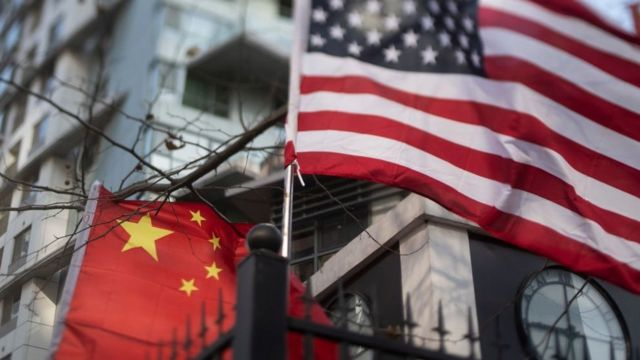
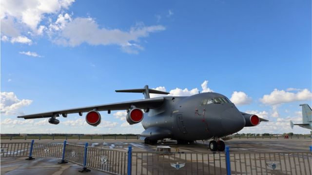

# 在美中国留学生被指当间谍 面临十年监禁

#  在美中国留学生被指当间谍 面临十年监禁

> 图像来源，  Getty Images

**近日，一名在芝加哥的中国留学生被指控充当中国政府间谍，收集美国科学家和工程师的信息，他最高面临10年监禁。**

##  充当中国间谍

美国司法部周一（9月26日）发布公告指，今年31岁的纪超群（Ji Chaoqun， 音译）因充当中国政府间谍、以及对美国军方做出重大虚假陈述被定罪。陪审团认为纪超群两项电子欺诈罪名不成立。

纪超群因在美国境内充当中国间谍面临最高10年监禁。目前，宣判日期尚未确定。

案件在芝加哥美国地方法院进行了两周的审理，证据显示，纪超群在江苏省国家安全局的指导下工作，江苏国家安全局是中国国家安全部的下属机构。

居住在芝加哥的纪超群听命于中国国家安全部副处长徐严军（音译），向一名情报官员提供某些个人的生平信息，供江苏省国家安全部招募。

这些人包括在美国担任工程师和科学家的中国人，其中一些人为美国国防承包商工作。

2016年，纪超群通过“紧缺人才征兵计划”加入美国陆军预备役。他在申请参加时，谎称自己在过去7年内没有与外国政府接触。在随后与一名美国陆军军官的面试中，他没有透露与外国情报官员的关系和联系。

##  “只是收集背景资料”

据《芝加哥论坛报》报道，纪超群2013年到芝加哥伊利诺理工学院学习电气工程后，被中国国安部人员盯上。

检方称，寒假回到中国后，中国国安部人员宴请纪超群，纪超群获得了一份绝密合同。他在合同中宣誓效忠于该部门的事业，同意“将我的余生奉献给国家安全”。

最终，纪超群搜集了8名美国公民的背景报告，他们都出生在中国或台湾，从事科学技术行业，其中几人专注于航空航天领域。检察官说，其中7人为美国国防承包商工作。

> 图像来源，  Getty Images
>
> 图像加注文字，纪超群搜集了8名美国公民的背景报告，其中几人专注于航空航天领域（资料图片）

2015年，纪超群从伊利诺理工学院毕业，第二年他通过“紧缺人才征兵计划”加入美国陆军预备役。

美联社报道，纪超群律师切罗尼斯（Damon Cheronis）在判决后的一份声明中表示，他“很高兴陪审团对两项电子欺诈指控做出了无罪判决”。

“虽然我们显然对剩下的罪名感到失望，但我们尊重陪审团的程序和他们为审判这个案子所付出的努力。”

切罗尼斯曾在结案陈词中称，纪超群从未被指控窃取任何政府机密，他只是收集了一些背景资料，那些想要调查邻居或潜在约会对象的人可以在网上付费获得这些资料。

