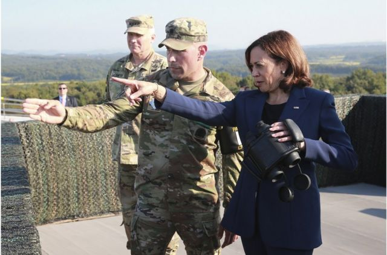
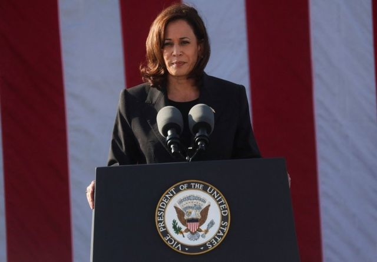
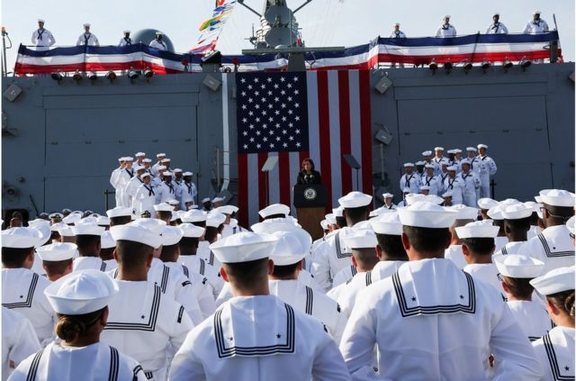

# 朝鲜五天内三次试射导弹 美日韩重启反潜军演

#  朝鲜五天内三次试射导弹 美日韩重启反潜军演

> 图像来源，  EPA
>
> 图像加注文字，在访问韩国期间，哈里斯 (右) 前往位于首尔北部的韩朝边界西段分隔两韩的非军事区内观察哨，从那里观察朝鲜。

**美国副总统卡马拉·哈里斯（Kamala Harris，贺锦丽）在周四（9月29日）访问韩国，在她结束访问数小时后，朝鲜随即发射弹道导弹，这是朝鲜本周第三度试射弹道导弹。**

韩联社引述韩国联合参谋本部报道，朝鲜在当地时间29日晚上8时48分至57分，从平安南道顺川市一带，向半岛东部海域发射两枚短程弹道导弹，飞行距离约350公里，最高飞行高度约5万米，最大飞行速度约5马赫。

这是朝鲜连续第二天向东部海域发射导弹，也是五天内第三次。较早前于分别于25日和28日发射一枚及两枚疑似短程弹道导弹。

分析人士指，平壤是针对美韩26日至29日在朝鲜半岛东部海域的韩国战区（KTO）进行的联合军演，及30日的美日韩反潜演习。另有评论认为，试射是为了抗议哈里斯访韩期间前往朝韩非军事区。

##  时隔五年再度联合军演

美韩海军和日本海上自卫队9月30日在东海公海海域，开展针对朝鲜的反潜联合军事演习。这是三国继2017年12月以来再度重启有关训练。

美国核潜艇“安纳波利斯”号（USS Annapolis）将在联演中扮演搭载潜射弹道导弹的朝鲜潜艇，参演三方将对其进行探测和追击，互换情报并确认互操作性。参加演习的包括韩国的“文武大王”号驱逐舰（ROKS Munmu the Great）、美军“里根”号（USS Ronald Reagan）核动力航母战斗群，以及日本海上自卫队的“朝日”号（JS Asahi）驱逐舰。

本周早些时候，朝鲜常驻联合国代表金星在联合国大会的讲话中批评了美国和韩国的军事演习，称他们正在将朝鲜半岛推向“战争边缘”。他说，美国对朝鲜的“敌对政策”是世界现在“进入一个更加危险阶段”的原因。

而韩国和美国一直在为他们的联合演习辩护，他们称其目的是稳定该地区。

> 图像来源，  EPA
>
> 图像加注文字，9月30日，一名韩国妇女在首尔的一个车站观看有关朝鲜弹道导弹发射的新闻。

韩联社引述韩方指出，三方将通过联演加强对朝鲜潜射弹道导弹的应对力量，日方则表示，联演将加深日本与韩美海军的合作，实现自由开放的印太地区。据推测，韩日有关恢复《韩日军事情报保护协定》（GSOMIA）的谈判或在联合军演后提速。

另一方面，韩国外交部长朴振9月30日在记者会上表示，针对朝鲜连日试射弹道导弹，将坚决予以应对，必要时考虑加强对朝鲜制裁的方案，包括海运、网络、金融在内的应对措施。

分析指，朴振所提到的海运和网络制裁可被解读为切断朝鲜以转运方式进行走私，以及窃取加密货币获取核研发资金等。

##  哈里斯访韩日均谈及台海

哈里斯周四从日本转到韩国访问，到首尔龙山总统府与韩国总统尹锡悦会面85分钟，双方讨论朝鲜问题、美韩关系、经济安全、美国电动车补贴措施及女性问题等，并谴责朝鲜试射导弹，美方重申防卫韩国的承诺。双方又决定通过外交渠道，协调尹锡悦明年韩美同盟70周年访问美国。

另外，白宫指两人曾讨论中国在台海的动作，双方强调重视台海和平稳定的基本立场。南韩总统府办公室起初没有透露相关内容，其后在白宫新闻稿发布后再作补充。

哈里斯在会面后出席韩国女性座谈会，其后到访朝韩非军事区，是首位拜登政府高层官员到访。她形容朝鲜是"恶劣的独裁政权"，并称美国追求没有朝鲜威胁的世界。

周三（9月28日），哈里斯访问日本横须贺海军基地并对驻地美军发表讲话。她指责中国“破坏基于规则的国际秩序的关键要素”，并称中国在东海、南海和台海的行为“令人不安”。

哈里斯还抨击中国“利用其军事和经济实力来胁迫和恐吓其邻国”。哈里斯的讲话呼应了拜登总统最近支持台湾的言论，称美国将“继续反对任何单方面改变现状的做法。我们将继续支持台湾的自卫，符合我们的长期政策”。

她补充说，美国认为台湾海峡的和平与稳定是“自由开放印太地区的基本特征”。

> 图像来源，  Reuters
>
> 图像加注文字，哈里斯抨击中国“利用其军事和经济实力来胁迫和恐吓其邻国”。

> 图像来源，  Reuters
>
> 图像加注文字，9月28日，哈里斯在日本横须贺海军基地访问时对美军发表讲话。

