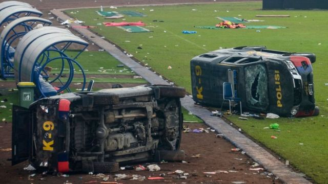

# 印尼足球场发生惨痛踩踏事故 已导致至少120 余人死亡

#  印尼足球场发生惨痛踩踏事故 已导致至少120 余人死亡

> 图像来源，  AFP via Getty Images
>
> 图像加注文字，警方发射催泪弹，随后发生了人群踩踏。

**印度尼西亚周六（10月1日）晚间发生的足球场踩踏事故已导致至少120余人死亡。**

官方表示，另外还有大约180人受伤。事故发生在东爪哇省的一场印尼甲级足球联赛上。10月1日晚上，主场的阿雷马队（Arema FC）以2比3负于作客的帕尔斯巴亚队(PersebayaSurabaya)，这是20多年来阿雷马队第一次输给这个老对手。

该国安全官员称，入场人数超过了该球场38000人的上限，多出了大约4000人。

印尼官员一度称死亡人数达到174人，但后来修改了这一数字。

印尼总统佐科（Joko Widodo）已要求联赛所有比赛暂停，直至调查结束。

现场视频显示，比赛结束时，主场球迷闯进了球场，并与客队球迷发生冲突。

东爪哇警察负责人阿芬塔(NicoAfinta)表示，警方发射了催泪弹，随后发生了群体踩踏，有人窒息。

死者中有两名警察，约有30多人当场死亡，其余在医院去世。

“人群冲向一个出口，出现了拥挤，这个过程出现了呼吸困难和缺氧。”

印尼足协（PSSI）表示将启动调查，并表示这次事故“玷污了印尼足球的脸面”。

国际足联已经强调，警察不应该在球场使用“人群管控气体”。

> 图像来源，  EPA
>
> 图像加注文字，坎朱鲁汉球场被毁坏的警车

