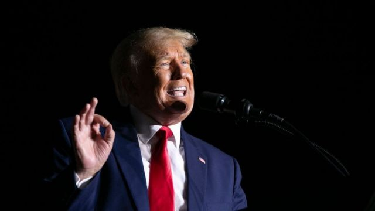
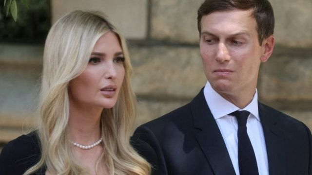

# 美国普利策奖得主出版新书 揭秘前总统特朗普的八件事

#  美国普利策奖得主出版新书 揭秘前总统特朗普的八件事

> 图像来源，  Getty Images
>
> 图像加注文字，美国前总统特朗普批新书中的爆料都是“瞎编乱造”。

**美国前总统特朗普差一点解雇了女儿伊万卡，把文件冲入马桶是常事。**

美国《纽约时报》记者玛吉·哈伯曼（Maggie Haberman）备受瞩目和期待的新书《Confidence Man》周二（10月4日）出版，披露了以上和更多有关特朗普总统的猛料细节。

这本书讲述了特朗普从纽约商人到总统期间的生活。书中爆料来自作者对 200 多名内幕人士的采访，包括对特朗普总统的三次采访和对他前助手的采访。

特朗普总统在他的社交媒体平台上对作者大加讨伐，说书里尽是些“胡编乱造”。

BBC总结了书中的八大猛料：

##  1）特朗普曾想解雇女儿伊万卡和女婿贾里德库什纳

哈伯曼写道，特朗普在与当时的白宫幕僚长约翰·凯利（John Kelly）和白宫顾问唐·麦加恩（Don McGahn）开会时，差一点就要在推特上宣布解雇女儿伊万卡和女婿贾里德库什纳 。他们两人当时都是白宫高级助理。

凯利当时拦下了特朗普，建议他在发送推文之前先与伊万卡和库什纳谈话。不过特朗普没跟他们二人就此谈过话，他们都一直是白宫助理，直到特朗普总统任期结束。

书中透露，特朗普经常贬低女婿库什纳，并曾在 2017 年听完库什纳的公开演讲后评论说库什纳“听起来像个小孩”。

特朗普否认曾想过解雇伊万卡和她的丈夫。他说：“纯属虚构。我连想都没想过。”

##  2）特朗普考虑过轰炸墨西哥的毒品实验室

哈伯曼写道，特朗普曾多次提出轰炸墨西哥毒品实验室的可能性——这一建议让美国前国防部长马克·埃斯珀（Mark Esper）听了目瞪口呆。

这个想法最早源于特朗普与公共卫生官员兼美国公共卫生服务军官团海军上将布雷特·吉罗尔（Brett Giroir）的一次谈话。

吉罗尔按照公共卫生服务军官团的惯例身穿制服走进总统的椭圆形办公室。他对特朗普总统说，墨西哥生产非法毒品的实验室应该是首要攻击目标，以阻止毒品越过边界进入美国。

特朗普先生误认吉罗尔是军官，然后建议应该轰炸毒品设施。

白宫后来对此事作出的反应是要求吉罗尔不要再穿制服。

##  3) 特朗普害怕死于新冠

2020 年 10 月特朗普感染了新冠病毒，他在白宫时病情恶化，他害怕会死于新冠感染。

他病情严重的某一刻，特朗普的白宫副幕僚长托尼·奥纳托（Tony Ornato）曾经警告总统，如果他的健康状况进一步恶化，他将不得不启动程序以确保政府的连续性。

尽管特朗普多次努力将病毒蔓延控制在最小，但他对死于新冠的恐惧一直都在。他担心病毒会对自己的形象和政治意愿产生负面影响。哈伯曼写道，他要求身边的助手摘下口罩，并建议当时的纽约州州长安德鲁·库莫（Andrew Cuomo）不要在电视上谈论新冠病毒。

书中写道，特朗普对库莫说：“不要大惊小怪。 你会让病毒变成一个问题。”

##  4) 特朗普会见英国首相时提到了他的房产

哈伯曼的书详细描述了特朗普与世界领导人之间的几次会面。

例如，在与当时的英国首相特蕾莎·梅的第一次会面中，特朗普先生谈到了堕胎，他说“有些人支持生命权，有些人支持选择权。设想如果一些有纹身的禽兽强奸了你的女儿，她怀孕了怎么办？”

然后，他在讨论北爱尔兰的谈话中改变了话题，谈到如何阻止在他的房产附近建立海上风电项目。

##  5）特朗普要求朱利安尼“不择手段”推翻2020年大选结果

特朗普在 2020 年大选中输给美国总统乔·拜登的局面变得明显时，他打电话给前纽约市市长和他的私人律师鲁迪·朱利安尼 (RudyGiuliani)。

在其他律师拒绝按照他的要求去推翻选举结果后，他对朱利安尼说：“好吧，鲁迪，你现在全盘操作吧。大动作，想怎么做就怎么做。我不在乎。”

书中说特朗普总统对朱利安尼说：“我的律师很糟糕。” 他还经常对白宫律师帕特·西波隆（Pat Cipollone）不满。

书中显示，当时特朗普迷恋阴谋论，所找的律师都是被白宫顾问认为偏信阴谋论的人。

##  6）特朗普在飞行途中想出了一个税收借口

2016 年竞选总统期间，特朗普在飞机上被他的竞选经理科里·莱万多夫斯基和他的新闻秘书霍普·希克斯要求解决他拒绝公布纳税申报单的问题。他们认为这是特朗普入主白宫的一个障碍。

哈伯曼写道，特朗普听完后向后一靠，然后突然想出一个主意说：“好吧，你们知道我的税收正在接受审计，我总是被审计。”

> 图像来源，  Reuters
>
> 图像加注文字，特朗普的女儿伊万卡和女婿库什纳被认为是他的左膀右臂。

“所以我可以说，等我被审计完了，我就会公布。但我永远都不会有不被审计的时候。”

自尼克松总统以来，每一位美国总统都自愿公布了他们的纳税申报表。此后，《纽约时报》2020 年的调查显示，特朗普在出任总统的那一年供缴纳了 750 美元的联邦所得税。

##  7) 特朗普将文件冲入白宫厕所

特朗普上任时，白宫工作人员隔一段时间就会发现厕所被印刷品堵塞，并认为他把文件扔进了厕所。

据称，他还违反了《总统记录法》撕毁文件。根据这一法规，总统发出或接收的文件都是美国政府的财产，一旦总统任期结束，将由美国国家档案馆处理。

在国家档案馆对特朗普丢失白宫文件所做的更多指控中披露了这些细节。特朗普还面临司法部的刑事调查，原因是他在离任后将政府档案保存在他位于佛罗里达州的海湖庄园。

##  8) 特朗普认为少数族裔员工是服务员

在 2017 年就职典礼后不久的一次国会会议上，哈伯曼写道，特朗普误以为一群种族多元化的民主党工作人员是服务员，要求他们去端点心过来。

这本书详细介绍了特朗普对参议员查克·舒默（Chuck Schumer）和众议员南希·佩洛西（Nancy Pelosi）的工作人员发表的言论。

哈伯曼还在书中记录了据称是特朗普以往说过的各种恐同性恋的言论。

