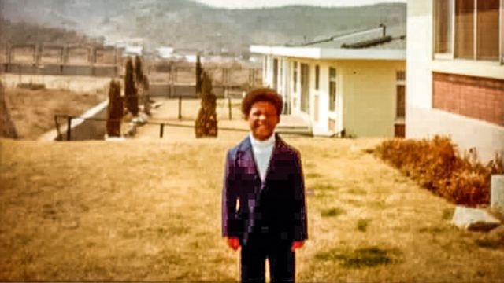
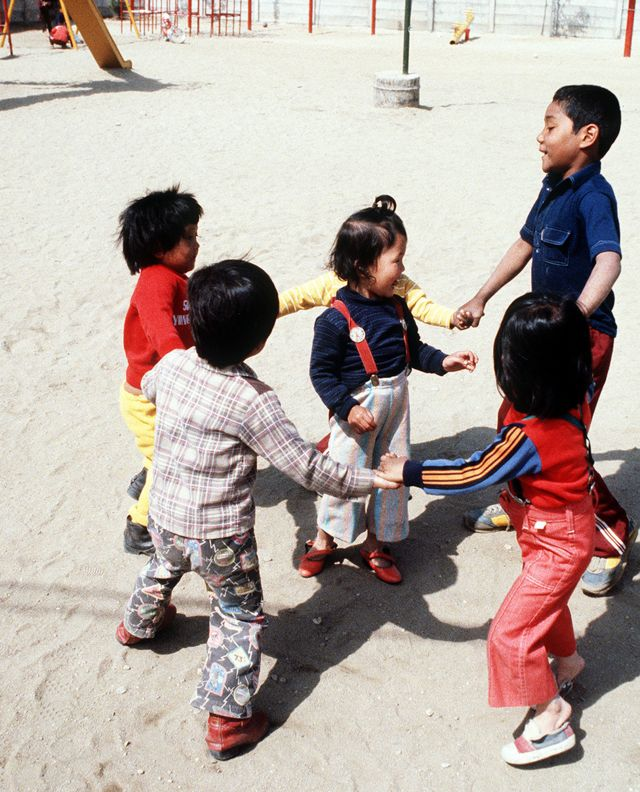
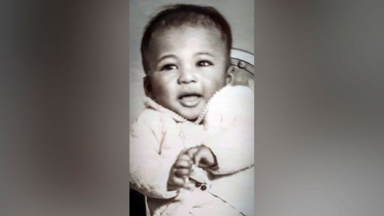
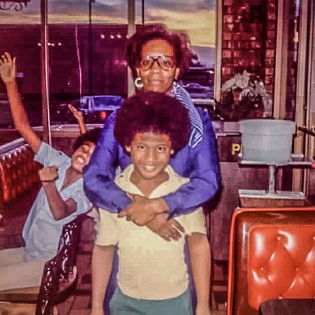
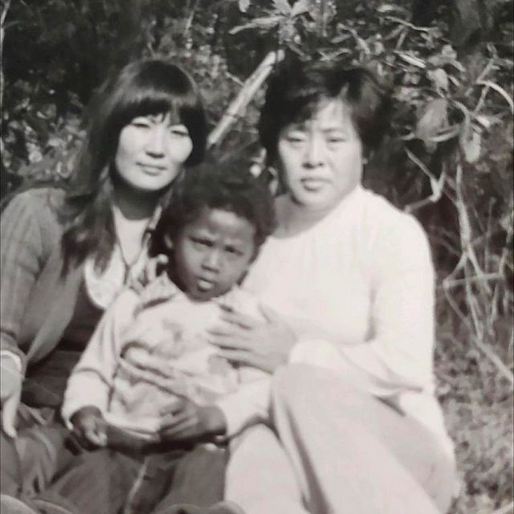
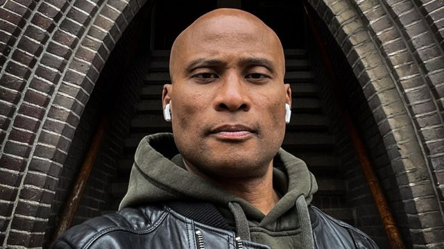

# “我拒绝下车 除非他们带我回家”：韩美黑人“孤儿”美国寻梦记

#  一个韩美黑人“孤儿”美国寻梦的故事

  * 劳拉·汤玛斯（Laura Thomas） 
  * BBC国际部 

> 图像来源，  Milton Washington
>
> 图像加注文字，米尔顿在被收养后不久在韩国的美军住宅区合影。

**米尔顿·华盛顿（Milton Washington）的妈妈是韩国人，爸爸则是一名黑人美国士兵，他从出生时就成为社会弃儿，后来则成为一名“狡猾男孩”（“slickyboy”），其实就是儿童扒手的意思。但米尔顿梦想到美国去。在8岁的时候，他抓住了机会。**

一天，一辆漂亮的轿车停在韩国圣文森特孤儿院外，米尔顿·华盛顿瞬间做出了一个将改变他人生轨迹的决定。

一对黑人美国夫妇走下车来。男人穿着军装，女士则留着非洲式发型，并穿着美丽飘逸的裙子。当米尔顿意识到他们即将领养他的朋友约瑟夫时 - 他也跟他一样是黑人和韩国人的混血儿 - 他跑到这对夫妇的汽车边上，跳到车里并锁上所有车门。

他在里面使劲地大哭大叫，除非他们也把他带回家，否则他不出来。

> 图像来源，  The US National Archives
>
> 图像加注文字，在圣文森特孤儿院操场上和其他美韩混血儿一起玩耍。

这对夫妇 - 华盛顿上尉和夫人 - 同意把约瑟夫和米尔顿都带回家，但他们只想看看他们两人中谁与他们家人更合适。他们说，将给几天的时间，然后再做选择。

那天晚上，躺在东豆川美军基地陌生房子的陌生卧室中，小米尔顿做出了当天的第二个重大决定 - 出逃。

他说，“我不想被再送回孤儿院 - 也许他们不会选择我。我只是想去美国。”

##  美国在韩国驻军

  * 朝鲜战争从1950年持续到1953年，最后以停战告终 
  * 自那以后，南北朝鲜在技术上仍处于战争状态 - 并且关系紧张 
  * 美国和韩国签署协议，为美国在韩国驻军奠定基础 
  * 在韩国的美国驻军仍有28500人 

在进孤儿院之前，米尔顿是在靠近朝鲜边界韩国一个小村子里唯一的黑人孩子。他的父亲是一名美国士兵，早已离开韩国。但他在稻田地里辛苦工作的母亲非常爱他，并极力保护他免受别人的偏见。

米尔顿所在韩国村子的孩子们会唱一首关于红苹果、香蕉、火车和猴子的儿歌。

“我记得他们在对我唱得最响亮的那段，就是关于黑猴子的红屁股那段。这就定了调，”他说。

米尔顿表示，表面上它只是一首天真的操场儿歌而已- 并非带有种族主义味道，至少当初并非这样设计的。但他们却把它变成一首具有伤害性的歌曲：就因为他皮肤的颜色而被人欺负。

米尔顿说，作为黑人的儿子，在60和70年代的韩国，他不被当成韩国人看待。还因为他父亲不是韩国人，他无权获得出生证明。

> 图像来源，  Milton Washington
>
> 图像加注文字，婴儿时期的米尔顿，但他不知道自己确切的出生年代。

米尔顿知道他父亲来自美国 - 在他脑子里，那是一个车会飞的地方，城市是由黄金打造的，还有冰激凌山。

米尔顿说，“我梦想去美国因为那里到处是黑人 - 这些神奇的人，而且自己能被接受。”

米尔顿心中的美国是一片梦幻乐土，跟他的现实不能再大相径庭了。

现实中他和母亲住在泥石屋中，睡在地上，并用河水洗衣服。

一天早上，村里的一些长者登门造访，告诉米尔顿的妈妈他们不想再接受“由于那个黑孩子你给全村所带来的羞耻了”。虽然米尔顿妈妈极力争辩但也无济于事。最后，她和米尔顿不得不离开家，搬到附近一个隶属美国军事基地的小镇上生活。

那里有汽车、电，还有钱。这些对米尔顿来说都很新奇 - 因为在他们的村子里，人们用盐做货币。

米尔顿也第一次看到了美国黑人士兵，让他感觉距离找到父亲更近了一步。

在他们狭小公寓楼下的红灯区小巷里，无家可归的男孩们乞讨、扒窃，并和其他帮派打架。美国士兵把他们叫做“狡猾的男孩”，即小小偷的俚语。

当6岁的米尔顿和其他男孩享用一包奥利奥时（他妈妈的美国男朋友给的），米尔顿也成了一名小小偷，他终于感觉自己有归属感了。

米尔顿说，“所有黑人士兵都会给我钱，不仅是零钱，还有美元钞票。它彻底改变了我的生活。”

米尔顿的母亲在镇上的一家俱乐部成为性工作者，她晚上出去工作。米尔顿独自一人留在家里，尽管她妈妈严令他不要出去，但他一般根本不听。

一天晚上，米尔顿的妈妈没有按时回家，因为俱乐部遭到警察的突击搜查，她和其他一些在那里工作的女性被关进监狱2周。

摆脱了妈妈的管制，米尔顿和他的朋友们彻底狂野了，他们从酒吧偷饮料，在城里到处玩耍、冒险。

当他妈妈回来后，她确保决不让米尔顿独自一个人。每次当她得知警察要来突袭的消息时就把米尔顿（预先）送孤儿院呆2个星期，以保证他安全。

米尔顿记得在孤儿院受到一些主要是韩国孩子的种族歧视和欺负，就跟他以前在村子里时一样。但这次，他没有让自己受影响。

他说，“我就一笑了之。是的，你们可以用种族言论辱骂我，但‘你才是孤儿。我有妈妈。她说她2周后会回来。’她总是在两周后回来。”

这种情况持续了好一段时间。然后有一天早晨，米尔顿和妈妈坐出租车到了另一家孤儿院，那里的许多孩子长得跟米尔顿一样。这是一家专门收养由美国军人和韩国母亲所生孩子的孤儿院，它就是圣文森美亚人（Amerasian）儿童之家。

米尔顿母亲向他保证第二天会回来，并承诺会给他买礼物 - 米尔顿说想要一套玩具火车。但当她回来时没有送他火车礼物，只是给了他一个拥抱，当时米尔顿并不知道它其实意味着道别。

“她告诉我‘我需要你坚强，’那是我最后一次看见她，”米尔顿说。

在米尔顿刚到圣文森孤儿院不久就碰上了来孤儿院领养的华盛顿上尉夫妇，他们把他带到了他们在军事基地的家 - 但米尔顿决定从那里逃走。

但他并没有跑多远。他还很小，大院的围栏很高，几个小时后人们就找到了在儿童游乐场熟睡的米尔顿。

但这一事件震动了华盛顿一家人，他们决定米尔顿和约瑟夫可以永远跟他们在一起。两个男孩在1977年被领养，并最终搬回美国 - 成为一个有6个孩子的喧闹、友爱大家庭的一员。他们骑自行车、做运动、上学 - 所有这些都是米尔顿渴望的正常童年生活。

但他担心母亲的下落，往往哭着入睡。他经常做恶梦，梦中他趟着水在稻田地里寻找她。

他说，她永远是他在“异常艰难世界中的避难所。”

> 图像来源，  Milton Washington
>
> 图像加注文字，米尔顿10岁生日时与养母在一起

如今已经50多岁的米尔顿（他不确定自己的准确年龄）在纽约担任摄影师工作。他正在写一本叫做“狡猾男孩”的回忆录。他一直对自己亲生家庭充满好奇。最近几年开始通过DNA网站寻根溯源。

2019年4月，他找到了一个匹配，是他母亲那边的一个家庭成员，对方希望能马上跟他通话。

“你好，我是从西雅图打来的电话，”电话那头带着浓重韩国口音的声音说。

“我是小米尔顿，”他说，他用了生母经常叫他的名字。

“我是你姐姐Tong ，你记得我吗？”

米尔顿的确记得见过Tong - 她是他的姐姐之一。在米尔顿小的时候他们在韩国见过几次面。Tong跟着祖父母一起住，而米尔顿的妈妈跟他们已经疏远了

米尔顿说，跟他同母异父的姐姐讲话是“一个令人难以置信的时刻”。

他说，“我真的非常兴奋，能找到过去的一些联系，并能让我的记忆得到她的验证。”

> 图像来源，  Milton Washington
>
> 图像加注文字，米尔顿和他的姐姐董和他们的母亲朴英子（音译）

米尔顿没有料到他母亲会活下来，但姐姐告诉他她很长寿，几年前刚刚去世。他妈妈和姐姐们1998年来到美国。虽然他们知道米尔顿也生活在美国，但他妈妈觉得自己无权力联系他。

但她给米尔顿留下一个纪念物，让姐姐Tong帮他保存 - 一条金玉项链，留个纪念。

“项链非常漂亮，也是一种能随身佩戴纪念妈妈的方式，”他说。

> 图像来源，  Milton Washington
>
> 图像加注文字，米尔顿说，人们听到他是韩国人时常感到惊讶

米尔顿也一直在寻求关于他生父的答案。他认为父亲可能来自路易斯安那州，但没有更多信息。

米尔顿说，“我想知道他是什么样的人。他是唯一缺失的环节。”

尽管米尔顿有时仍然会感到伤感，但他肯定多年前他妈妈决定放弃他时的决定是正确的。

“她知道如果我有机会在美国生活，我会过得很好。我爱她有勇气这样做，”他说。

他说，“我心中将永远有一种缺失。但是，要是拿我可能过上的人生同我目前生活的好处相比 - 那绝对不能比。”

