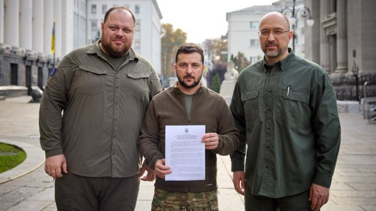

# 俄乌战争 乌克兰申请加入北约的四个障碍

#  俄乌战争 乌克兰申请加入北约的四个障碍

> 图像来源，  Reuters
>
> 图像加注文字，乌克兰递交了加入北约的申请，但要获得批准还需要时间与努力。

**尽管俄罗斯在入侵乌克兰的战争中受挫，但总统普京签署了法律，正式吞并乌克兰东部的顿涅茨克和卢甘斯克，以及南部的赫尔松和扎波罗热四个地区。**

在此之前，乌克兰总统泽连斯基宣布，乌克兰已经提交了加入北约的申请。

泽连斯基表示，乌克兰采取这一“决定性步骤”，是为了保护整个乌克兰社区。他还表示，乌克兰加入北约的申请将以“快速的方式”进行。

然而，乌克兰真的要加入北约，面临至少四个重大障碍。

##  1）乌克兰加入北约可能使战事扩大

全称为“北大西洋公约组织”（North Atlantic Treaty Organisation）的北约是1949年由12个国家组成的军事联盟，初始签约国包括美国、加拿大、英国、法国、意大利、挪威、比利时、荷兰、丹麦、葡萄牙、冰岛和卢森堡。

1952年，希腊和土耳其加入，1955年西德加入。1999年苏联解体后，北约向前东欧阵营国家打开大门，成员国总数至今达到30个。

成立北约协议第5条规定，对北约任何成员国的武装或军事侵略，都等同于对所有成员国的攻击。这也被认为是北约最重要的共同防御原则。

根据这一原则，所有国家都必须采取军事行动保护受到攻击的国家，无论是通过调动部队，还是提供武器和装备。

因此分析人士指出，乌克兰与俄罗斯战争期间加入北约，理论上可能让北约所有成员国加入战事，北约直接卷入战争。

##  2）乌克兰此时并无紧急加入北约必要性

自2022年2月俄罗斯入侵乌克兰以来，北约国家已经向乌克兰提供了大量的武器、装备和人道支援。这些装备包括一些据信在迄今为止的冲突中发挥了关键作用的远程火箭发射器和反坦克武器等。

从某种程度上来说，乌克兰虽然不是北约成员国，但所收到的援助并不亚于成员国。

据德国独立研究机构基尔世界经济研究所（Kiel Institute for the World Economy）的统计，美国是迄今为止最大的捐助国，提供了约90亿美元的援助。其次是波兰，约18亿美元，英国约13亿美元。

另外西方媒体相信，北约成员国一直在帮助向乌克兰提供情报。

北约部队虽然没有直接参与战争，但约有4万名北约部队驻扎在波罗的海国家和波兰，另有30万部队处于高度戒备状态，应对俄罗斯的可能入侵。

北约成员国还帮助培训乌克兰军队。

##  3) 乌克兰加入北约尚“不达标”

所有申请加入北约的国家，必须在经济、政治和军事层面满足北约要求的标准。

据《纽约时报》报道，“乌克兰这个前苏联共和国自独立以来就一直在与地方性的腐败作斗争，它难以满足加入北约的几个必要条件，包括对法治的承诺。相比之下，瑞典和芬兰几十年来已经发展成为充满活力和健康的自由民主国家。”

加入北约的成员国需要展现出对民主、个人自由和支持法治的承诺。

根据透明国际(TransparencyInternational)发布的2021年清廉指数，乌克兰在总共180个国家中排名第122位，接近赞比亚、加蓬和墨西哥等国，而芬兰排名第一。

##  4）成员国全部支持乌克兰加入北约还有很长的路

根据北约规则，只有在30个成员国全部都同意的情况下才能接纳新成员。即使只有一个国家反对，加入北约的进程就会受到阻碍甚至完全中断。

瑞典和芬兰在申请加入北约时就遇到了这样的困难，因为最初土耳其对这两个国家加入北约提出了反对意见。

在乌克兰加入北约的问题上，普遍预计匈牙利很可能成为障碍。

匈牙利和乌克兰两国有着共同的陆地边界，讲匈牙利语的少数民族在乌克兰的权利长期以来是两国矛盾的焦点。

即便是北约的老成员国，在对待乌克兰申请加入的问题上也并非没有保留意见。

在乌克兰正式提交申请后，北约共有九个中欧和东欧的成员国发表联合声明表示支持，加拿大也单独表示了支持，但这些国家也仅占所有北约成员国的三分之一。

