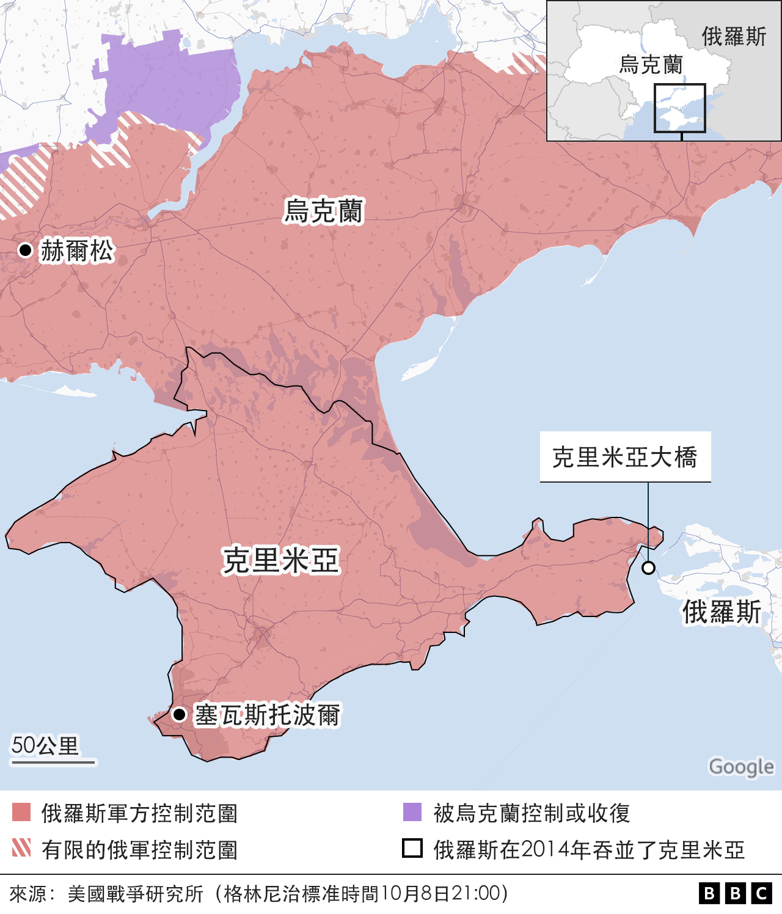
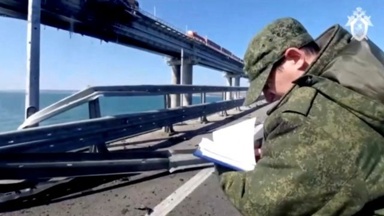

# 克里米亚大桥爆炸：普京指责乌克兰实施“恐怖主义行为”

#  克里米亚大桥爆炸：普京指责乌克兰实施“恐怖主义行为”

**俄罗斯总统普京指责乌克兰袭击了克里米亚大桥，称这是“恐怖主义行为”。这座大桥连接俄罗斯和被其吞并的克里米亚。**

普京表示，乌克兰情报部队的目标是摧毁俄罗斯民用基础设施中至关重要的一部分。

普京在与俄罗斯调查委员会主席亚历山大·巴斯特雷金（Alexander Bastrykin）会面时发表了上述讲话。

俄方官员表示，有3人在大桥爆炸中丧生。

该官员说，一辆卡车爆炸，遇害者当时正在附近的一辆轿车里。

普京表示：“毫无疑问，这是一起旨在摧毁俄罗斯关键民用基础设施的恐怖主义行为。”

“肇事者和受益人是乌克兰的安全部门。”

巴斯特雷金表示，俄罗斯和一些外国公民协助了此次袭击。

他透露，调查人员已经确定，他们所说的发生爆炸的卡车之前途径了保加利亚、格鲁吉亚、亚美尼亚、北奥塞梯和克拉斯诺达尔地区。

他已下令对这次导致部分路段垮塌的事件进行调查。

乌克兰官员没有表示他们的军队是这次袭击的幕后黑手。

但是，乌克兰总统弗拉基米尔·泽连斯基（Volodymyr Zelensky）的顾问米哈伊洛·波多利亚克（Mykhailo Podolyak）否认了普京的指控。

他写道，“这里只有一个恐怖主义国家”，“全世界都知道它是谁”。

“普京指责乌克兰参与了恐怖主义？即使对俄罗斯来说，这也显得太过狡猾了。”

> 图像来源，  Reuters
>
> 图像加注文字，周六在铁路桥上可以看到烧焦的痕迹。

周六，乌克兰总统泽连斯基在晚间讲话中提到了这一事件，他说：“今天是不错的一天，我们的国土上大部分都是晴天。”

“不幸的是，克里米亚虽然暖和，但天气多云。”他补充说。

袭击发生数小时后，俄罗斯当局重新开放了桥上的部分道路，但只对重量较轻的车辆开放。

这座桥的铁路部分，也就是油罐车箱起火的地方，也重新开放了。

这座桥长19公里（12英里），是欧洲最长的桥梁，是在乌克兰作战的俄罗斯军队的重要补给通道。

俄罗斯利用这座桥将军事装备、弹药和人员从俄罗斯运往乌克兰南部的战场。

2018年，在俄罗斯吞并克里米亚四年后，该桥由普京亲自剪彩通车。

##  分析

**BBC** **外交** **事务** **记者** **** **保罗·亚当斯（Paul Adams）**

社交媒体上公布的安全摄像头录像显示，爆炸发生时，一辆卡车正在向西通过大桥，据称来自距离十字路口一小时车程的俄罗斯城市克拉斯诺达尔（Krasnodar）。

视频显示，当卡车开始爬上桥的高架部分时，一个巨大的火球在卡车后方和一侧喷发。

卡车炸弹理论开始在俄罗斯圈子里传播，速度之快令人怀疑。它表明，克里姆林宫倾向认为这是恐怖主义行动，而不是其他可能：比如乌克兰实施了一次大胆的破坏行动，这令人担忧。

“我这辈子见过很多大型车载简易爆炸装置，”一位前英国军队爆炸物专家告诉我。“这看起来不像。”

他说，一个更合理的解释是，桥下发生了大规模爆炸——可能是用某种秘密海上无人机发射。

他说：“桥梁的设计通常是为了抵抗甲板上的向下载荷和一定程度的风侧载荷。”“通常不能抵抗向上负载。我认为发生在乌克兰的袭击利用了这一事实。”

一些观察人士注意到，在另一段监控录像中，爆炸发生前的一瞬间，桥墩旁出现了类似小船船头波浪的东西。

