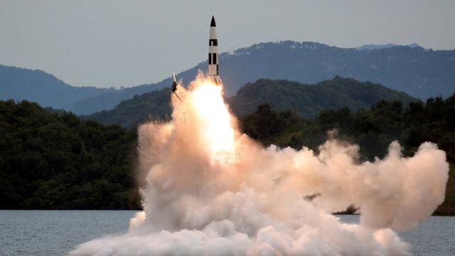
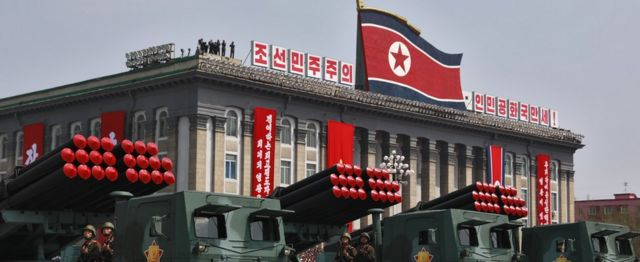
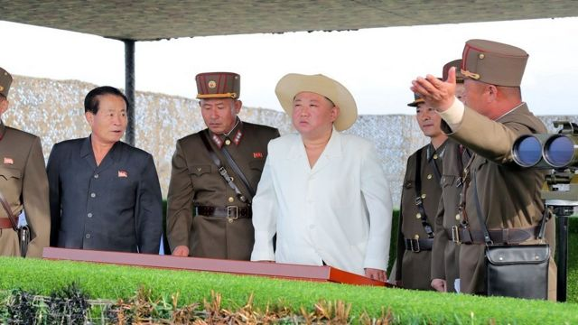

# 朝鲜承认“模拟”核攻击韩国　盘点近期导弹试射

#  朝鲜承认“模拟”核攻击韩国 盘点近期导弹试射

  * 毛远扬（Frances Mao） 
  * BBC记者 

> 图像来源，  KCNA/Reuters
>
> 图像加注文字，朝鲜在过去两周七度发射导弹。

**在有关情报认为朝鲜正准备五年来首次核试验之际，朝鲜称其最近一轮导弹发射是在“模拟”核攻击韩国。**

最近几周，朝鲜先后七次发射导弹，以示回应美韩联合军演。

星期一（10月10日），朝鲜官方媒体发表详尽报道，声称有关导弹是为携带战略核武器而设计。有关武器属短程，拟运用于“作战地区”。报道称，军方利用模拟版本的小型化弹头，演练了装载导弹的过程。

平壤还声称成功模拟攻击韩国军事基地、港口与机场，并称各次导弹试射是对美国和韩国发出警告。
 官方朝中社  发布了朝鲜最高领导人金正恩视察与“指导”试射的过程。

韩国总统尹锡悦星期二（11日）说，朝鲜不会因为使用核武而得益。

尹锡悦说：“朝鲜不断研制、发展核武，对大韩民国乃至全世界构成威胁。”

“我相信朝鲜拥核得不到任何好处。”

##  分析：朝鲜核试验与中国

**BBC中文**

> 图像来源，  EPA

朝鲜第七次核试验已传闻多时，若朝鲜真于此时进行核试验，对中国有何利弊？

瑞典安全和发展政策研究所斯德哥尔摩韩国中心（ISDP Stockholm Korea Centre）主任李相洙博士稍早前对BBC中文记者分析了最新一次核试验的可能背景。他首先指出，平壤进行核试验的目的，在于提升他日一旦与华盛顿恢复谈判时的筹码。

李相洙博士说：“安全问题，例如终止联合军事演练和从韩国撤走美国战略武器，都已被摆上台面，作为朝鲜去核化的条件。北京或会希望看到美国在朝鲜半岛的军事影响力受挫。”

他认为，平壤也有可能在试探能否在此博弈中提升其对北京的筹码，尤其是前段时间新冠病毒病（COVID-19）疫情肆虐期间，要是朝鲜疫情失控，平壤将需要中国提供更大规模的人道援助。

美国等曾经希望中国能左右朝鲜，劝阻平壤发展核武器，但多年来氛围已有变化。在10月5日的联合国安全理事会会议上，美国驻联合国大使琳达·托马斯—格林菲尔德（Linda Thomas-Greenfield）称朝鲜受到了两个安理会常任理事国的“全天候包庇”，意指中国与俄罗斯。

李相洙博士认为，无论西方如何施压，即便朝鲜再次进行核试验，北京也不会支持对平壤施加新的制裁，而只会一如既往的促请各相关方保持克制，不要让紧张局势升级。

> 图像来源，  KCNA/Reuters
>
> 图像加注文字，官方朝中社发布了多张金正恩“指导”导弹试射的照片。

美国与韩国情报官员最近指出，朝鲜或许很快就会试验核武器，这将是2017年以来首次核试验。

专家相信朝鲜也将利用这次机会，首次引爆一枚小型战略武器，其大小或许适合搭载到最近试射的导弹之上。
 金正恩上月宣布朝鲜已是“不可逆变”的拥核国  ，并修订法律，允许朝鲜动用核武器先发制人。在此之前，朝鲜政策只允许在遇袭时以核武还击。

朝鲜今年以来还显著增加了发射导弹次数，迄今已发射40次，属历年来最多。

过去两周，多数导弹试射涉及短程导弹，主要落入朝鲜与日本之间海域。

但朝鲜上星期二（4日）也曾发射一枚射程较长的导弹，并飞越日本。分析人士根据该武器设计判断为新型中程弹道导弹。

朝鲜今年以来在不同平台上试射导弹，包括火车和车队。分析人士指出，采用这些移动发射平台，能使武器难以被空袭摧毁。

分析人士还指出，朝鲜官方媒体星期一的报道将近期试射描绘成“战术核武器运用部队”——而非单纯形容为导弹试射——意味着平壤现已开发出运用体积更小，射程更短的核武器系统。

在9月25日至10月9日间举行的连串试射是朝鲜针对美国调配核动力航空母舰“里根”号（USS Ronald Reagan，又译“列根”号）到朝鲜半岛周边海域，以及与首尔和东京举行联合演练所作出的回应。

如此的升级举动，标志着自平壤与时任美国总统特朗普（Donald Trump）于2018至2019年间就去核化谈判以来的显著变化。

分析人士还说，朝鲜这些举措也是在回应今年5月当选的韩国总统尹锡悦。尹锡悦就任以来改走对朝鹰派路线，并推动与美国的更紧密联系。

##  朝鲜近期各次导弹发射

  **2022年9月28日：** 在美国副总统员卡玛拉·哈里斯（Kamala Harris；贺锦丽）访问首尔与韩朝非军事区（DMZ）前夕发射两枚短程导弹。 _飞行距离360公里、飞行最高高度30公里_

  **2022年10月1日：** 在美韩联合军演期间发射两枚短程导弹。 _飞行距离400公里、飞行最高高度50公里_

  **2022年10月4日：** 发射一枚中程弹道导弹，并飞越日本。 _飞行距离4500公里、飞行最高高度2800公里_

  **2022年10月6日：** 发射两枚短程导弹。 _飞行距离800公里、飞行最高高度50公里_

  **2022年10月9日：** 再次发射两枚短程导弹。 

