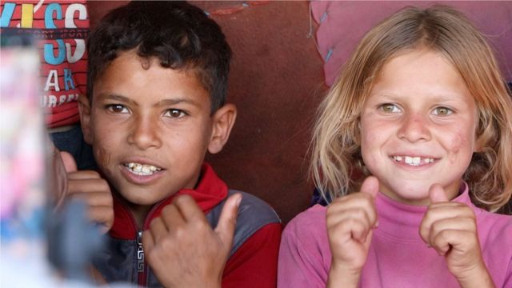
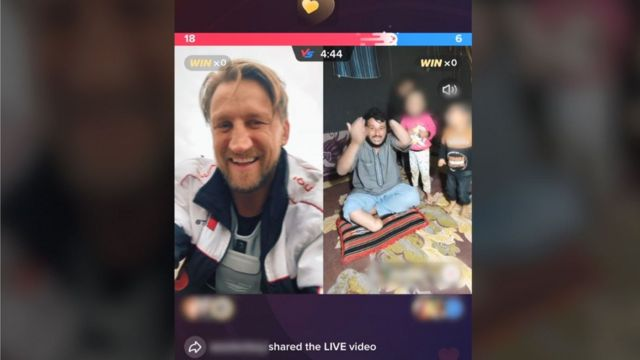

# BBC调查报道：难民直播乞讨　TikTok从中获利

#  BBC调查报道：难民直播乞讨 TikTok提成达七成

  * 汉娜·盖尔巴特（Hannah Gelbart）、马姆多·阿克比克（Mamdouh Akbiek）、齐亚德·艾卡坦（Ziad Al-Qattan） 
  * BBC全球错误信息调查组（Global Disinformation Unit）, BBC阿拉伯语组、BBC调查之眼（BBC Eye Investigations） 

**BBC的调查发现，叙利亚难民营中的家庭在TikTok上直播行乞，而该公司则从中提成达70%。**

孩子们在这个社交媒体平台做多个小时的串流直播，乞求有现金价值的电子礼品打赏。

BBC发现，有串流直播一小时收入达1000美元（900英镑），但是这些难民只获得其中的很小一部分。

TikTok表示，将会迅速采取行动打击“剥削性的行乞”。

该公司表示，此类内容不允许出现在该平台上，还表示它从电子礼品中抽取的佣金远低于70%，但拒绝确认具体的数额。

今年较早前，有TikTok用户看到他们的页面充斥了叙利亚难民营的家庭直播。一些看客表示支持，另一些则担心是骗局。

在叙利亚西北部难民营，BBC发现这一潮流是由所谓的“TikTok中间人”促成的，他们向这些家庭提供手机和直播器材。

中间人表示，他们与中国和中东的TikTok附属机构合作，后者给这些家庭提供TikTok帐户。这些机构是TikTok全球搜罗直播客策略的一部分，以此鼓励用户花更多时间在这个平台上。

> 图像加注文字，很多难民儿童在多个小时的TikTok直播中乞求网络打赏

中间人表示，由于TikTok的运算法是基于用户电话号码的归属地来推荐内容，因此他们更倾向使用英国的手机卡。他们说，来自英国的人是打赏最慷慨的。

莫娜·阿里·艾卡里姆（Mona Ali Al- Karim）和她的六个女儿就是每天上TikTok直播的家庭之一。她们坐在自己帐篷里的地上多个小时，重复着她们所仅知道的几个英文词组：“请点赞，请分享，请打赏。”

莫娜·的丈夫在空袭中遇害，她是在利用串流直播来筹钱给她失明的女儿莎里法（Sharifa）做手术。

她们索要的礼品是虚拟的，但是打赏会花掉看客真实的现金，也可以从应用程式上提取现金。串流直播看客发送礼品——从几美分的电子玫瑰到约500美元的虚拟狮子——来回报或者打赏内容的创作者。

五个月来，BBC跟踪了30个从叙利亚难民营做直播的TikTok帐户，并制作了一个电脑程序并从帐户上搜集信息，显示看客经常每小时给每个帐户捐赠总价值达1000美元的电子礼品。

然而，这些难民营中的家庭表示，他们只获得这些总额当中的很小一部分。

由于TikTok拒绝透露公司从打赏中抽取多少钱，BBC进行了一个实验，追踪钱的去向。

叙利亚一名记者联系了其中一家TikTok的附属机构，他表示自己住在营地里。他获取了一个帐户然后上直播，而伦敦的BBC工作人员则从另一个帐户打赏价值106美元的电子礼品。

在直播末尾，这名叙利亚人的测试帐户余额为33美元。TikTok从中抽取了69%的价值。

> 图像加注文字，基思·梅森表示，有5万人观看了他与一个叙利亚家庭的直播

TikTok网红、前英式橄榄球选手基思·梅森（Keith Mason）在其中一家人的直播里捐赠了300英镑（330美元），并鼓励他的近100万粉丝学他一样这么做。

当被BBC告知这些钱大部分都被这家社交媒体公司抽走时，他表示这很“荒唐”，且对这些叙利亚家庭“不公平”。

“你必须要有一些透明度。对我来说，这是非常贪婪。就是贪婪，”他说。

从BBC给出的106美元电子礼品当中剩下的33美元，在从当地找换店提现时又被扣掉了10%。TikTok中间人还会再从余下的钱中扣35%，难民家庭真正到手的只有19美元。

难民营内的一个TikTok中间人哈密德（Hamid）向BBC表示，他卖掉自己的家畜来买手机、电话卡和无线网络，才能与这些家庭合作上TikTok。

他现在与12个不同的家庭合作做直播，每天做几个小时。

哈密德说，他是用TikTok帮助这些家庭谋生计。他说，他将大部分利润给了这些家庭，减去他的运营费用。

哈密德说，他像其他中间人一样，是由中国的“直播机构”支持，这些机构直接与TikTok合作。

“如果应用程序有任何问题，他们会帮助我们。他们会解锁被禁的帐户。我们给他们页面的名字、头像照片，他们就会开帐户，”哈密德说。

像这样的机构，被称为“直播公会”，驻扎在世界各地，与抖音签约，帮助内容制作者生产更多拉流量的串流直播。

这些机构向BBC透露，TikTok会根据直播时长以及获得打赏的数额来给它们支付佣金。

强调直播时长，就意味着这些播客——也包括叙利亚难民营里的孩子们——一次直播要持续多个小时。

数字网络权益组织“Access Now”的玛瓦·法塔夫塔（Marwa Fatafta）表示，这些串流直播与TikTok自身“防止损伤、危害或者剥削”未成年人的政策背道而驰。

 叙利亚难民在TikTok上的行乞直播（英文） 

BBC调查报道，追踪TikTok直播的一个现象——叙利亚难民营内数以百计的家庭通过TikTok串流直播行乞
 BBC新闻频道或BBC iPlayer于周日2时30分播出（仅限英国） 

“TikTok清楚表明不允许用户公开索要打赏，所以这明显是违反了他们自己的服务守则，也侵害了这些人的权益，”她说。

她承认，人们有权利在网上分享他们的故事，“以此寻求支持和同情”，但是她说，这些串流直播“缺乏体面，并且是羞辱性的”。

TikTok的守则声称，你必须要有1000个关注者才能做直播，你不能直接索要打赏，而且必须在此平台上“防止损伤、危害或者剥削”未成年人。

但是，当BBC利用应用程式内的系统报告30个涉及儿童行乞的帐户时，TikTok却表示，这些案例无一违反平台政策。

BBC直接联络TikTok请求置评之后，该公司封禁了所有这些帐户。

该公司在一份声明中表示：“我们深切关注由BBC向我们反映的信息和指控，并已采取迅速且有力的行动。”

“我们的平台不允许此类内容，而我们也在进一步加强我们在剥削性行乞问题方面的全球政策。”

TikTok是全世界发展最快的社交媒体应用程式，据分析公司Sensor Tower指，它自2017年创立以来，已经从应用内消费中获得超过62亿美元的纯利。

BBC联系了数家在叙利亚支援难民营家庭的慈善机构，它们提供TikTok直播以外的另一种赚钱途径。

一家叫“Takaful Alsham”的当地慈善机构表示，会在未来三个月为这些家庭提供基本物资，帮助孩子找学校，并包办他们的学费”。

但是对于难民营内很多人来说，除了上网行乞之外，赚钱的选择很少。数以百计的家庭仍在继续每天直播，大多数获得的捐赠仍然落到TikTok帐下。

_补充资料研究及报道：穆罕默德·阿卜杜拉（_ _Mohammed Abdullah_ _）、鲁纳科·塞利纳（_ _Runako Celina_ _）、Cyrus Chan、内德·戴维斯（Ned Davies）、Katy Ling_

