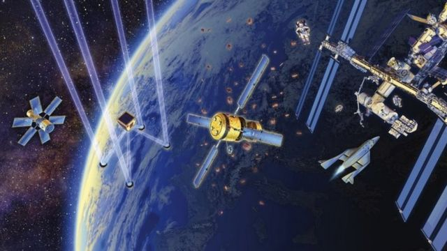
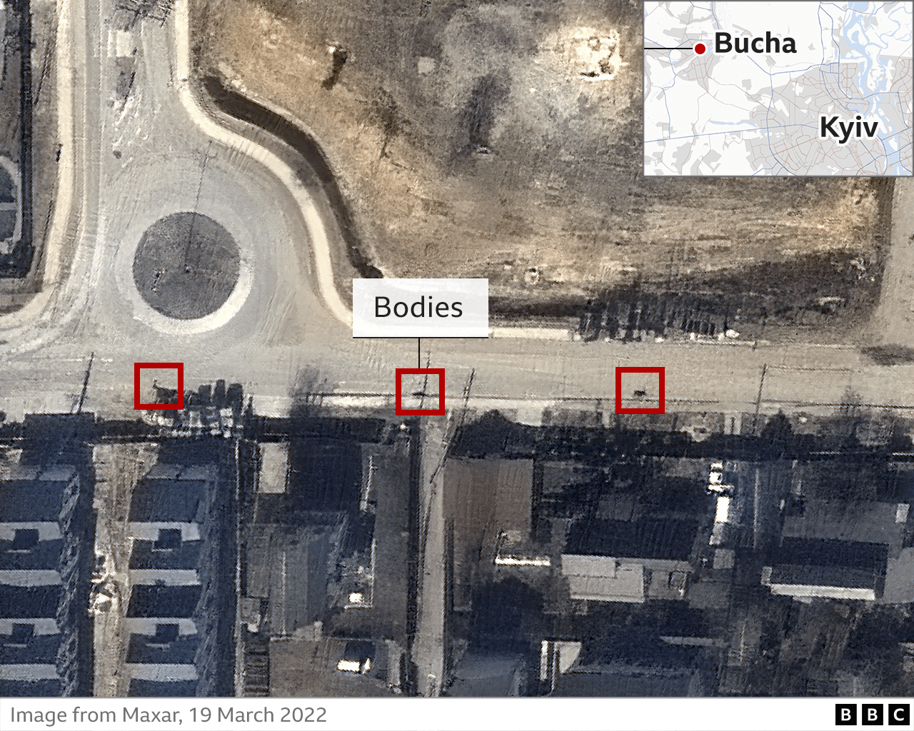
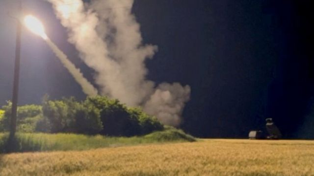

# [World] 太空：俄罗斯乌克兰战争中前所未见的新战线

#  太空：俄罗斯乌克兰战争中前所未见的新战线

  * 乔纳森·比尔(JonathanBeale) 
  * BBC防务记者 

> 图像来源，  Science Photo Library

**乌克兰的战争凸显了空间对地面军事行动的影响越来越重要。**

美国太空军负责人杰伊·雷蒙德（Jay Raymond）上将在接受BBC采访时将这次战争形容为“第一场商业太空能力发挥重要作用的战争”。这也是第一次战争双方都依赖太空能力的主要冲突。

雷蒙德这位美军最新部门的负责人没有详细说明美国及其盟友如何向乌克兰提供帮助。

不过他明确表示美国正在做些什么。 他说，“针对美国、我们的盟友和伙伴可能面对的任何威胁，我们利用空间技术帮助提供精确打击，我们利用空间技术提供导弹预警。”

> 图像加注文字，美国太空军负责人雷蒙德上将警告说太空中有存在各种威胁

目前在太空有5,000多人造卫星，大部分是商用卫星。

但是其中也有成百上千的军事用途卫星，美国、俄罗斯和中国拥有这类卫星最多。

乌克兰没有军用卫星，但是乌克兰通过很多途径从西方得到帮助。

##  侦察

> 图像加注文字，ISR卫星在揭露战争真相过程中发挥了重要的作用，诸如在乌克兰首都基辅附近布查发生的屠杀

首先是提供情报、监视和侦察，三个词的英文缩写为ISR。

乌克兰得到的商业卫星图像的数量比以往任何时候都多。

在最近的一次会议上，美国国家地理空间情报局负责人说，在战争开始前他们向乌克兰提供的商用图片数量增加了两倍多。

英国太空司令部司令保罗·戈弗雷(PaulGodfrey)说，除了向乌克兰提供的商用和民用的ISR以外，“还有许多具有太空能力的国家，他们也在注视着乌克兰”。

太空的ISR帮助认定最初俄罗斯军队在2月24日入侵乌克兰前进行集结，以及随后的部队和军事装备调动。卫星发挥作用帮助追踪在黑海的俄罗斯军舰，包括被乌克兰击沉的“莫斯科号”巡洋舰。

早期预警雷达，诸如英国皇家空军在北约克郡Fylingdales的巨型雷达，也能够跟踪弹道导弹发射。

保罗·戈弗雷说，ISR卫星在“揭示战争真相”方面发挥着必不可少的作用。

他举例提到在乌克兰城市基辅附近布查发生的屠杀。他说，俄罗斯声称在他们到达那里的时候，街道上已经有了死亡平民的尸体，但是有时间印记的卫星图片则说明了不同的情况。

包括BBC在内的媒体机构也比以前更多地利用商业卫星图片，这些图片能够被用来印证地面发生的情况。这包括确认集体墓地，或乌克兰最近在克里米亚半岛的俄罗斯空军基地发动的攻击行动。

早期预警雷达也被用来跟踪弹道导弹发射。

美国现在还在详细讨论在英国安装更强大的雷达监视太空活动。

最近乌克兰志愿者已经筹集了足够的资金购买整个的卫星帮助他们的军队侦测俄罗斯的目标。

乌克兰官员说，芬兰公司ICEYE生产的合成孔径雷达（Sar）已经在战场上被证明极其有效，在头两天投入使用当中，它就让俄罗斯蒙受了超过1600万美元的军事损失，超过了购买卫星的价格。

##  通讯

整个战争期间的通讯离不开太空。

> 图像来源，  Getty Images
>
> 图像加注文字，马斯克向乌克兰提供了大批卫星互联网通讯设备，诸如在乌克兰敖德萨使用的这个设备

在战争开始的时候，俄罗斯针对乌克兰的关键通讯枢纽进行了一系列军事打击和网络攻击。

戈弗雷说，之前乌克兰数字转型部长斐德罗夫在社交媒体推特上发出呼吁后， 马斯克“让乌克兰的互联网运行得到恢复”。

马斯克向乌克兰送去大量星链互联网设备，让他们能够使用SpaceX公司的卫星星座网。

这为乌克兰军方在安全通讯和获得战情方面发挥了必不可少的作用。我在顿巴斯地区东部的指挥掩体里看到军人使用这些设备。

##  精确武器

> 图像来源，  Reuters
>
> 图像加注文字，乌克兰使用海玛斯高精度火箭打击俄军的关键目标获得了很大成功

俄罗斯和后来的乌克兰都在依赖太空设备提供的定位、导航和计时服务，这样他们才能对关键目标进行精确打击，俄罗斯利用自己的格洛纳斯定位卫星寻找目标。

而乌克兰则获得美国提供的精确武器，这些武器对乌克兰军队最近的进攻进展发挥了重要的作用。

海玛斯火箭射程达80公里，由GPS制导，能够摧毁诸如弹药库和指挥中心等后方目标。精确制导武器对地面战场发挥了决定性作用。

##  太空战的未来

对空间技术的依赖越来越大也引发担忧，人们担心冲突可能会扩展到陆海空之外的太空。

俄罗斯和中国都曾进行了摧毁自己卫星的测试，英国国防参谋长，海军上将拉达金（Tony Radakin）最近警告说，俄罗斯可能会对太空中的西方目标发动攻击。

雷蒙德上将说，“我们担心各种不同的威胁”。他例举了对GPS和通讯的电子干扰，以及可能用诸如从地面发射的激光或导弹等能量武器攻击卫星。

他说，美国及其盟友希望确保太空安全和杜绝不负责任的行为，但他还说，“令我担忧的是，并非所有人都认同我的看法。”

太空军事化实际已经成为现实。

