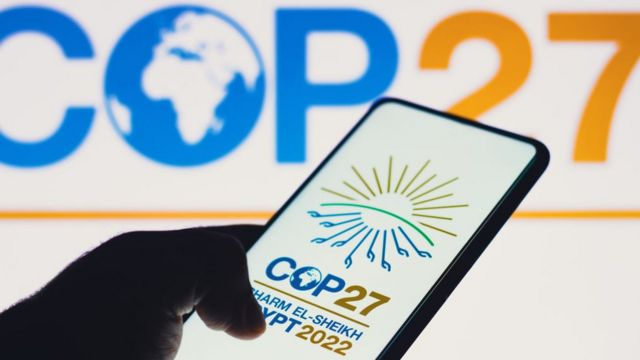
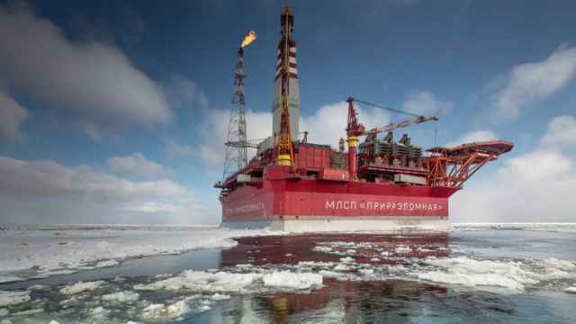
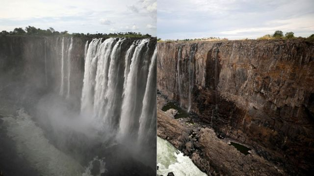
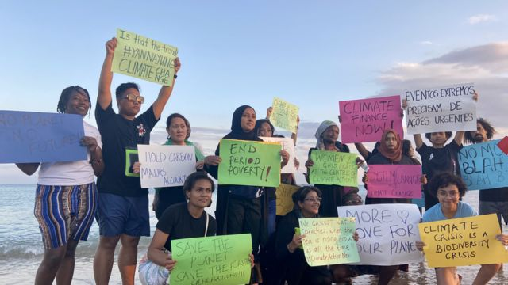

# 联合国气候变化大会COP27的四个看点

#  联合国气候变化大会COP27的四个看点

> 图像来源，  Getty Images
>
> 图像加注文字，联合国气候变化会议COP27将于2022年11月份在埃及沿海城市沙姆沙伊赫召开。

**2022年11月6日至18日，埃及邀请各国元首、部长和谈判代表，以及气候活动家、市长、民间社会代表和首席执行官们前往其沿海城市沙姆沙伊赫参加COP27会议。**

这次会议和我们每个人有什么关系？

COP27是在联合国领导下为实现具有里程碑意义的《巴黎协定》目标而举行的年度大会，这是关系到全人类共同未来的问题。

为了应对全球气候变化，197个国家于2015年12月12日在巴黎召开的COP21会议上通过《巴黎协定》, 旨在大幅减少全球温室气体排放，将本世纪全球气温升幅限制在2℃以内，同时寻求将气温升幅进一步限制在1.5℃以内的措施。

这份协定2016年11月4日正式生效，是具有法律约束力的国际条约。目前，共有193个缔约方（192个国家加上欧盟）正式加入了《巴黎协定》。

《巴黎协定》虽然是一个以科学为基础的国际协议，但它影响到能源，金融，环保，产业等方方面面的经济问题，也涉及到国际关系和现实政治问题。每年的COP会议对各国各行业人们关注的问题会有不同的侧重。

今年的COP27有很多看点，其中以下4项既是独立的焦点，也相互关联，值得关注：

##  1、国际关系的紧张和能源危机

2021年格拉斯哥COP26气候大会还促成不同国家集团之间达成了多项多边协议，包括承诺削减甲烷排放，停止森林砍伐，以及停止为海外化石能源项目提供融资。

俄国和乌克兰战争爆发以后，特别是石油、天然气等传统国际能源供应突然紧张，粮食、经济危机威胁增大。这些对原来全球减排的进程造成很大的影响。

对普通百姓来说，俄乌战争后通货膨胀率急剧上升，能源、食品以及供应链安全成为日常生活中担忧的大事。

> 图像来源，  Getty Images
>
> 图像加注文字，俄国入侵乌克兰遭到出口制裁，全球石油天然气价格暴涨。天然气供应紧张影响到企业向清洁能源过渡。

尽管一些国家政府努力利用这场危机加快减碳和提高能效的步伐，但也有一些国家增加寻找新的化石燃料来源，以保证短期能源安全。

比如中国、德国等制造业大国，原来都是世界开发新能源的领军者，但也为了维持经济和百姓生活需要，在继续努力发展新能源领域的同时，重新恢复对污染最大的石化能源煤炭的使用。

中国和美国是世界最大的两个排放国。因为中美关系紧张，中国暂停了在气候变化问题上与美国的官方对话。

COP27如何在现实面前做好各国各方的协调，达成一个平衡目标，巩固《巴黎协定》和2021年在英国召开的格拉斯哥COP26的成果，值得关注。

##  2．气候资金和金融问题

气候资金问题源于发达国家和发展中国家不同的历史责任和应对气候变化能力。

因为西方在人类历史上率先实现工业化，在这个过程中西方对现有的排放负有较大的责任，也有着应对气候变化更大的能力。而经济发展落后的国家，特别是气候变化下适应能力脆弱国家最容易受到气候变化冲击。

因此，在《巴黎协定》中，发达国家承诺到2020年每年提供1000亿美元气候融资，帮助发展中国家节能减排应对气候变化。但到目前为止，这部分资金只兑现了一小部分。

此外就有关气候资金的概念，透明度，审计等一系列问题，各国争议很大。比如发达国家通过多边、双边官方发展援助等其他渠道所提供的资金是否可以界定为气候资金？

請刷新瀏覽器

各国决策者们认识到，全球经济在2050年前实现向脱碳经济转型蕴藏着巨大的增长机遇，企业和一些主要投资者对采用符合1.5°C温控目标的可持续业务计划的兴趣大增。

前英格兰银行行长的联合国气候融资特使马克·卡尼表示，一个新型可持续金融体系正在缓慢建立，将为私营部门的倡议和创新提供资金，进而有可能增强各国政府气候政策的有效性。

目前在全球经济下行的背景下，从现实角度出发，埃及的COP27在气候资金和金融问题上能作出多大的进展？

##  3． 极端气候与天灾应对

2022年世界面临更多的极端、罕见的天气和前所未有的自然灾害，比如严重的干旱和洪水。

2022年夏天，中国高温天气持续了两个多月，是1960年代有记录以来最长的一次。中国南方大片地区抗旱，现有大型水利发电工程地区出现缺电的同时，北方地区出现的暴雨却导致洪水。

在欧洲，据欧盟全球环境与安全监测计划的监测，2022年夏天的干旱可能是欧洲大陆500年来所经历的最严重干旱。

> 图像来源，  Reuters
>
> 图像加注文字，非洲维多利亚大瀑布从飞流直下的壮观到在干旱中消失。

西伯利亚和美国西部的干旱地区扩大，非洲的干旱导致农业收成的大幅减少。

从6月中旬开始，巴基斯坦遭受史无前例的季风降雨，引发的前所未有的洪涝灾害让1/3的国土变成菏泽，人员财产损失巨大。联合国秘书长古特雷斯指出，巴基斯坦洪灾是气候变化受害者：“人类已经向自然宣战，自然正在反击。”

《巴黎协定》规定了“损失与损害”融资，目的是为了应对无法适应、会造成永久性损失的气候变化影响，如海平面上升等。COP27会议将对“适应”、“损失与损害”等做出何种安排，提供什么样的解决方案？

##  4．投资和帮助非洲

COP27是一次在非洲召开的气候大会。

非洲至今仍是全球贫困人口最多的大陆, 也是最容易受到气候变化影响的大陆之一，尤其是旱涝灾害加剧。

> 图像来源，  Nathalia Clark
>
> 图像加注文字，年轻一代更注意气候变化问题，包括南北贫富差距，公平，环境保护等。

非洲仅占全球排放量的一小部分，但它的经济在迅速发展之中。清洁技术成本下降为非洲的未来带来了新的希望，非洲很有可能帮助缩小可再生能源需求方面的差距。

实现非洲的能源和气候目标意味着今后十年的能源投资要翻一番以上，并大幅提升适应能力。过去20年，只有2%的清洁能源投资于非洲。

这次在埃及举行的COP27也将成为观察世界大国对非洲如何投资和援助的一个视角。

