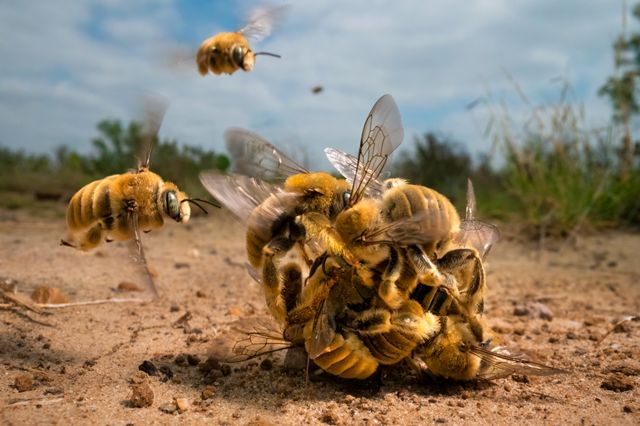
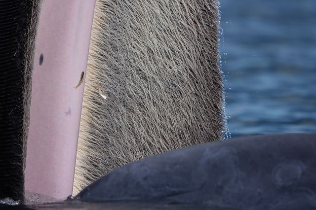
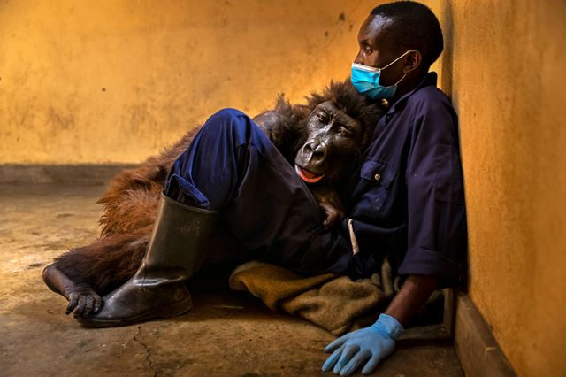
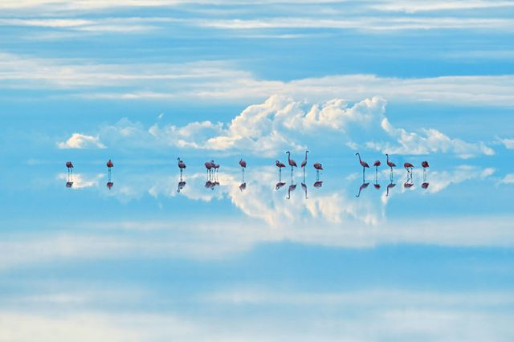
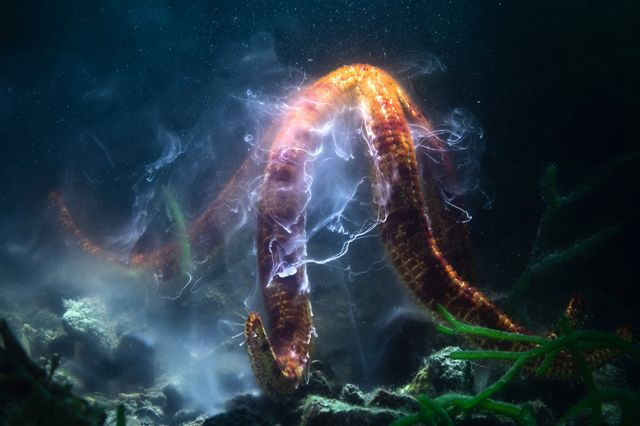
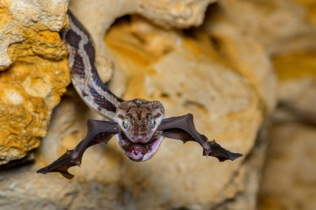
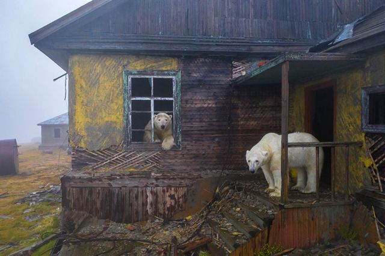

# [World] 2022年度野生动物摄影师：蜜蜂忙得不亦乐乎

#  2022年度野生动物摄影师：蜜蜂忙得不亦乐乎

  * 乔纳森·阿莫斯（ Jonathan Amos） 
  * BBC 科技事务记者 

> 图像来源，  Karine Aigner/WPY
>
> 图像加注文字，嗡嗡嗡：卡琳·艾格纳夺得2022年年度野生动物摄影大奖的这张蜜蜂争夺交配权瞬间图片花了数周时间才成功

**这是一个狂躁的时刻** **—— 一群** **雄性** **仙人掌** **蜜蜂** **裹** **着一只雌** **蜂** **。** **悬念：** **在这个充满爱意的混战中，谁** **将成为** **与她交配** **的幸运儿** **？**

卡琳·艾格纳 (KarineAigner) 的这幅作品夺得2022年度野生动物摄影师大赛（WPY）总冠军。

在某种意义上，这是一辐技术含量相当高的摄影作品；它需要使用微距探头镜头才能接近拍摄对象的核心。

“我不得不长时间俯趴在泥地里，”卡琳笑言。

这个美国摄影师是WPY 长达 58 年的历史上第五名获得最高奖项的女性。

她告诉BBC新闻：“我没有刻意去找这个场景。多年来我一直在德克萨斯州南部一个牧场工作，当时只是碰巧在这个地方。我看到地上到处是这些小‘火山’ —— 雌峰为筑巢挖的一个个洞穴。”

仙人掌蜜蜂，顾名思义，生活在仙人掌植物上和周围。雌性收集花粉，将其制成小球并储存在土壤中的穴室中。这些球用来喂养蜜蜂幼虫，直到它们长大成熟，变成蜜蜂飞出巢穴，开始繁殖周期。

“这张图很棒，充满动感能量。这是一个妥帖的‘行为’镜头。这就是你可以从无脊椎动物那里得到的，也正是为什么我爱它们，” 担任 WPY 评委主席的罗兹·基德曼·考克斯（Roz Kidman Cox）说。

“还有构图。是那只从侧旁进入的蜜蜂使画面完整。它提供了‘背景音乐’。”

> 图像来源，  Katanyou Wuttichaitanakorn/WPY
>
> 图像加注文字，鲸须之美：卡坦尤·乌提查伊塔那科恩（ Katanyou Wuttichaitanakorn）为了这张照片乘船出海20-30次。

2022年度青年野生动物摄影师桂冠给了泰国的卡塔尼尤·乌提查伊塔那空（Katanyou Wuttichaitanakorn），16岁。

他的获奖作品是布莱德鲸鱼的特写镜头，以及嘴里用来过滤食物的须盘。

你可以看到一条沙丁鱼在空中飞翔，试图逃脱被鲸类动物吞噬的结局。

“不知道为什么，沙丁鱼跳上了船，”卡塔尤回忆道。“我很幸运。我在船上向那里靠近。鲸鱼在水面上停留了大约一分钟。”

WPY 是世界摄影界同类赛事中最负盛名的大赛之一，由 BBC 野生动物杂志于1964年创立，现在由伦敦的自然历史博物馆操办。

今年的赛事吸引了来自 93 个国家的 38575名参赛者。

以下是一些类别的获奖者。

##  《恩达卡西去世》（Ndakasi‘s Passing)，布伦特·斯特顿（Brent Stirton），南非

> 图像来源，  Brent Stirton/WPY

布伦特·斯特顿（Brent Stirton）以新闻摄影著称。他是今年 WPY 这个类别的获奖者。他的获奖作品显示了山地大猩猩恩达卡西（Ndakasi）生命的弥留时分。她两个月大的时候，她的部落在刚果民主共和国的维龙加国家公园惨遭木炭黑手党屠杀，她被救出。

图中，生命即将走到尽头的恩达卡西依偎在救助并养育她的安德烈·鲍玛（Andre Bauma）的怀中。

##  《天堂的火烈鸟》（Heavenly Flamingo），高砂淳二（Junji Takasago），日本

> 图像来源，  Junji Takasago/WPY

这些火烈鸟生活在安第斯山脉高处的撒拉尔德乌尤尼，世界上最大的盐田。那里也是玻利维亚最大的锂矿之一，威胁着火烈鸟的未来。

日本摄影师高砂淳二（Junji Takasago）不顾高原反应，最终拍到这张照片。他的付出得到了回报：他赢得了自然艺术类别大奖。

##  《正在死亡的湖泊》(DyingLake)，丹尼尔·努涅斯（Daniel Núñez），危地马拉

> 图像来源，  Daniel Núñez/WPY

这个看起来五颜六色的画面，实际上很不健康。丹尼尔·努涅斯（Daniel Núñez）用无人机捕捉了危地马拉的阿马蒂特兰湖（Lake Amatitlán）边缘繁茂的藻类和森林之间的对比。水中的蓝藻是因水中的污染物质疯长，包括危地马拉城排放的污水。该图获奖类别：湿地，全景类

##  《流星》（Shooting star），托尼·吴（Tony Wu）, 美国/日本

> 图像来源，  Tony Wu/WPY

托尼·吴在日本海岸附近捕捉到了这一幕。那是一个巨大的海星产卵的时刻。它正晃动触须，摇曳躯体，也许是为了将卵子和精子划拉到水流中，让它们在那里受精。图片获 WPY 水下类别奖。

##  《蝙蝠杀手》（The bat-snatcher），费尔南多·C·M·贝尔马（Fernando Constantino Martínez Belmar），墨西哥

> 图像来源，  Fernando Constantino Martínez Belmar/WPY

费尔南多·康斯坦丁诺·马丁内斯·贝尔马在一个被称为悬挂蛇洞的地方拍摄了这张照片。黄昏时分，成千上万的蝙蝠离开洞穴觅食昆虫。当他们离开时，老鼠蛇挂在洞穴的墙壁上，旨在得到自己的一顿饭。这张照片赢得了行为：两栖动物和爬行动物类别。

##  《熊宅》（House of bears），迪米特里·科赫（Dmitry Kokh），俄国

> 图像来源，  Dmitry Kokh/WPY

迪米特里·科赫（Dimitry Kokh）在北极楚科奇海的柯柳钦岛上拍到这张照片，也属偶然。晨雾中的废宅，屋里屋外悠闲自在的北极熊，构成一幅令人难以忘怀的画面。迪米特里当时驾船出海，正在岛上躲避风暴。他用一架小型无人机接近北极熊，拍得近照。获奖类别：城市野生动物。

**2022 年度WPY赛作品展于10月14日在伦敦自然历史博物馆开幕。与往年一样，它还将在英国和全球10个国家巡回展出。第59届年度WPY参赛作品从10月17日开始接受。**

