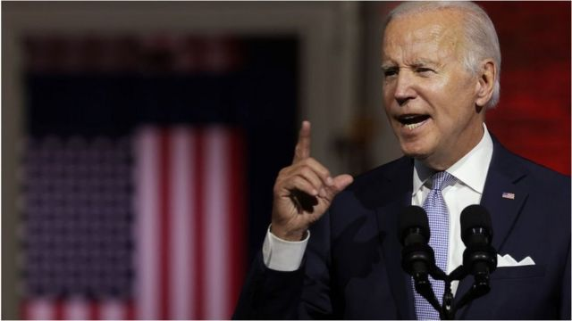
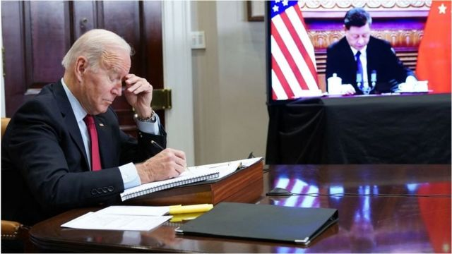

# [World] 拜登政府国家安全战略：中国是对全球秩序最大挑战

#  拜登政府国家安全战略：中国是对全球秩序最大挑战

> 图像来源，  Getty Images

**本周三（10月13日），白宫发布了一份延期已久的国家安全战略报告。报告称，未来几年美国面临的压倒性挑战将是超越中国并遏制俄罗斯。同时强调要与盟友合作，应对民主国家所共同面临的挑战。**

美国每届新政府都会发布一份此类报告，拜登政府的报告原本应该于去年冬天发表，但由于俄乌战争等原因推迟。

报告称“中国是唯一一个既有重塑国际秩序意图的竞争者，也逐渐拥有经济、外交、军事和科技力量来日益推进这一目标”。此外还称“未来十年是美国与中国竞争的决定性十年”。

美国国家安全顾问杰克·沙利文（Jake Sullivan）表示，乌克兰危机确实推迟这份文件的发布，但并没有“从根本上改变”拜登的外交政策方针。

中国外交部发言人毛宁10月13日回应称，注意到美国政府发表的《国家安全战略》报告。她表示，“我们反对固守冷战思维和零和博弈等陈旧观念，也不赞成渲染地缘冲突、大国竞争。这些做法都与当今时代潮流和国际社会期待背道而驰，必定不受欢迎，终将遭到失败。”

##  中国代表着对全球秩序最大挑战

报告声称，即使在俄罗斯入侵乌克兰之后，中国也代表着对全球秩序的最大挑战，如果美国希望保持其全球影响力，就必须赢得与这个超级大国的经济军备竞赛。

美国国家安全顾问杰克·沙利文（Jake Sullivan）表示，美国仍然致力于负责任地管理两国之间的竞争，中国有重塑国际秩序的意图，而且越来越有能力做到这一点，使全球竞争环境向其倾斜。

> 图像来源，  Getty Images

奥巴马任期最后几年，美国开始从中东逐渐抽身，宣布重返亚太，制衡中国的动作加大。但在特朗普任内，中美间的矛盾突然加剧，一开始集中于贸易领域，在新冠疫情后延烧到外交、科技、政治等各个领域，两国关系跌入冰点。

拜登上台后美国对华政策并未转向，但声称要为两国关系设置“安全护栏”。2021年初拜登还将中美关系定义为“极为激烈的竞争”，而非“冲突”。

然而到了2020年，由于俄乌战争、佩洛西（裴洛西）访台等事件，两国关系急转直下。

在战略上，美国对华的重视程度几乎空前。奥巴马时期美国负责东亚事务最高级别外交官丹尼尔·拉塞尔（Daniel Russel）评价，经过21个月的酝酿，这份报告显然已经将重点压倒性地放在与中国的竞争上。

“虽然这份文件声称避免仅仅以战略竞争的视角来看待世界，但与中国的竞争充斥着每一个章节。”拉塞尔称。

##  国际合作前景

沙利文说，华盛顿必须在处理中国关系的同时应对跨国挑战，包括气候变化、粮食安全、疫情、恐怖主义、能源转型和通货膨胀。

近年来，中美两国在应对气候变化上保持着友好的合作关系。在去年的格拉斯哥气候峰会上，中国表示要与美国“紧急”合作以减少温室气体排放。

中美两国还在打击芬太尼等非法毒品贸易的努力中找到了罕见的共同点。

然而，在今年8月，美国众议院议长佩洛西率领代表团访问台湾，中国进行报复，宣布停止与美国在几个关键领域的合作，包括气候变化、军事交流和打击国际犯罪。

拉塞尔表示，该战略承诺建立最广泛的国家间联盟来应对全球挑战，但如果没有中国，就很难做到这一点，而且也没有说明如何确保这种合作。

对于未来的中美关系，美国圣路易斯华盛顿大学东亚系副教授马钊认为，目前美国对华政策基调是“竞争但不撕破脸皮”，中国对美政策是防范加对抗，这种“准冷战”的态势将会持续相当长的一段时间。

在马钊看来，这种“准冷战”未到“新冷战”有三个原因：双方经济互相依存，市场体系相互融合，阻止了双方关系断崖式下跌；拜登不希望与中国的竞争演化为军事对抗；两国盟友并不希望在这场竞争中站队。

