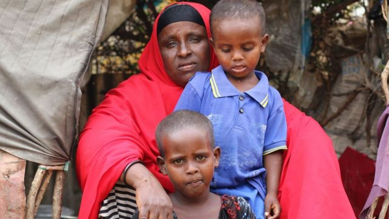
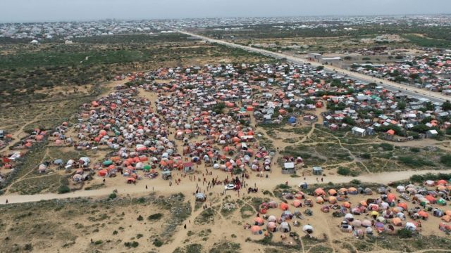
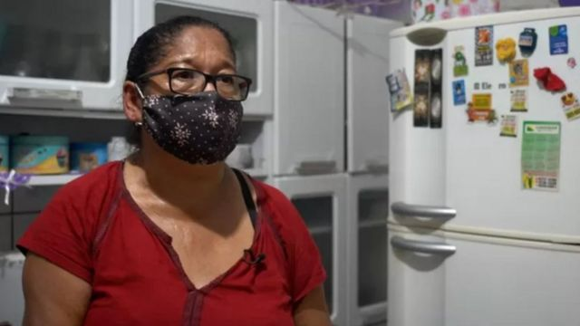
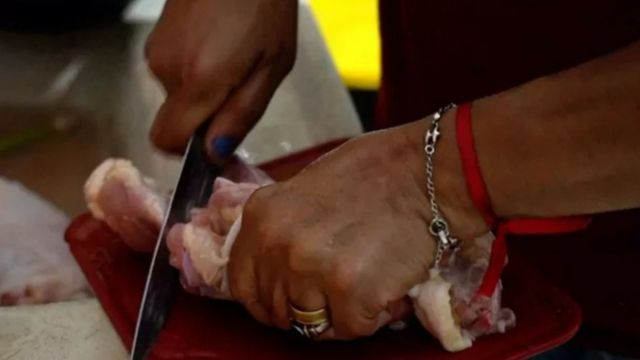
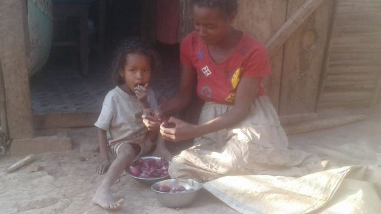

# [World] 世界粮食日：老鼠、骨头、泥土……那些饥荒中的人都在吃什么？

#  世界粮食日：老鼠、骨头、泥土……那些饥荒中的人都在吃什么？

> 图像来源，  Getty Images
>
> 图像加注文字，食物短缺导致索马里许多儿童出现健康问题。

**饥荒、贫穷、战争、疾病——很多因素都可能极大地改变我们所吃的东西。**

在极端情况下，绝境中的人们可能吃泥土、仙人掌果、花、老鼠、丢弃的骨头或者动物皮来充饥。

在世界很多地方，严重饥饿和营养不良是人们每日面对的挑战，而且规模非常庞大：联合国世界粮食计划署（UN's World Food Programme）指，“每天晚上有多达8.28亿人在饥饿中入睡”，而且有“3.45亿人面临严重的粮食危机”。

在世界粮食日（World Food Day，10月16日）之前，BBC访问了世界上四个正经历着严重饥荒地方, 了解那里的人们的生存状况。

##  “老鼠是我唯一吃得起的肉”

“我从小时候起就一直吃老鼠，而且从来没有过健康问题。我也喂我两岁的孙女吃老鼠。我们都习惯了，”来自印度南部的拉妮（Rani）说。

> 图像来源，  Rani
>
> 图像加注文字，来自印度南部的拉妮（Rani）一周至少吃两次鼠肉。

49岁的她生活在清奈附近，属于这个国家最边缘化的社群之一——她读完五年级之后就退学了。

在印度以种姓制度为基础的社会架构里，她的族群长年受到歧视，而拉妮为一个非政府组织工作，援助她的社群——伊鲁拉人（Irula），他们作为债役工人受困于底层。

“我们总是住在城乡之外。我们的父母和祖父母告诉我们，有时候他们会没东西吃——连草根都没得吃。在那样的艰难时期，老鼠就成了我们急需的食物，”拉妮告诉BBC说。

“我从很小年纪就学会捉老鼠了。”

拉妮童年获得的这些生存技能，现在就用来养她的家人——他们每星期至少煮食两次老鼠。

但伊鲁拉人吃的是在稻田里捉的那种田鼠，不是平常在人家里看到的那些。

“我们会把鼠皮剥下来，在火上把肉烤熟了吃。有时候我们把它剁成块，与小扁豆和罗望子一起煮着吃，”拉妮说。

田鼠藏在鼠洞里的那些粮食颗粒，也会被伊鲁拉人拿来吃。

“我一个月只吃得起一次鸡或者鱼。老鼠多得很，而且不花钱，”她说。

##  “我喝脏泥水，也见过人们吃腐肉”

联合国指，索马里面临着灾难性的饥荒。该国40年来最严重的干旱已经令超过100万人流离失所。

四十岁的沙里弗·哈桑·阿里（Sharifo Hassan Ali）是七个孩子的母亲，她就是其中一个失去家园的人。

> 图像来源，  Abdulkadir Mohamed/NRC
>
> 图像加注文字，沙里弗·哈桑·阿里（Sharifo Hassan Ali）和她的孩子

她不得不离开她的村庄，从下谢贝利州（Lower Shabell Region）出行200多公里外——主要是徒步——前往首都摩加迪沙外沿的一个临时居住地。她花了五天时间在路上。

“在途中我们一天只吃一顿饭。没有太多食物的时候，我们就喂孩子吃，自己挨饿，”她说。

在前往首都的路上，她亲眼看到了一些骇人的场面。

“河流完全干涸了。已经有好些年没有多少水流进来，所以我们只能喝泥水，”哈桑·阿里说。

“我在去摩加迪沙的路上看到过几百只死掉的动物。人们甚至在吃腐肉和动物的皮。”

哈桑·阿里曾经拥有25头母牛和25只山羊，但全部都在旱灾中死掉了。

“没有雨，我的田地长不出东西，”她说。

> 图像来源，  Abdulkadir Mohamed/NRC
>
> 图像加注文字，索马里最近的干旱导致100多万人流离失所。

她现在帮人家洗衣服，每天挣不到两美元——不够买食物。

“我这些钱连一公斤米和菜都很难买到，而这不可能够所有人吃。这场干旱把我们害惨了。”

她从救援机构那里得到一些帮助，但她说这并不足够。

“我们什么都没有，”哈桑·阿里说。

##  “我一家靠着丢弃的动物皮和骨头过活”

过去两年，来自圣保罗的63岁退休祖母琳迪娜尔瓦·玛丽娅·达·席尔瓦·纳希门托（Lindinalva Maria da Silva Nascimento），就是一直在吃当地屠夫丢弃的动物骨头和皮。

> 图像来源，  FELIX LIMA/ BBC NEWS BRASIL
>
> 图像加注文字，琳迪娜尔瓦

领退休金的她每天只有4美元，来负担她、她丈夫、一个儿子和两个孙儿的伙食。她买不起肉食，于是就去不同的屠夫那里买死鸡和皮。即使是这些东西也要花0.7美元一公斤。

“我用皮上剩下的肉和骨头一起煮，加一些豆作调味。”

她说，鸡皮会放在锅上无油煎，煎出的脂肪会积起来存下。琳迪娜尔瓦会将它存在空的蛋黄酱瓶和奶瓶里，之后用来煎其他食物。

“我甚至都不考虑买水果、蔬菜或者甜食了。以前，我有一个雪柜装满肉和菜，雪柜里有洋白菜、土豆、洋葱，很多东西，”她说，“现在它是空的，只有水果碗里装着一只洋葱。”

琳迪娜尔瓦在新冠疫情全球大流行期间失业，她的儿子也没有工作。

“我靠着我认识的一些人捐食物，还有当地天主教堂的一些援助。我就这样过活的，”她说。

> 图像来源，  BBC
>
> 图像加注文字，由于普遍的经济困境，琳迪娜尔瓦说这种弃肉也难弄到了。

据巴西粮食安全机构（Brazilian Network for Food Security）最近的一份报告指，在巴西有超过3300万人正生活在饥饿中。6月发表的新研究报告还发现，该国超过一半的人口面临粮食不稳定的问题。

“屠夫都常说他们没有骨头了，”琳迪娜尔瓦说。

她说，她为了存食物，必须吃得越少越好。

“我也是在用我的信念在过活，相信某个时候肯定会有好转。”

##  “我和我的孩子们靠吃红仙人掌果过活”

“没有雨，就没有收成。我们没东西可卖，没有钱。我吃不起米饭。”

费芬尼艾娜（Fefiniaina）是一名25岁的母亲，来自印度洋岛国马达加斯加。

两年的少雨已经毁掉了那里的庄稼，牲口也大量减少。据联合国指，这使得超过100万人面临饥荒。

> 图像来源，  Unicef/Rakoto/2022
>
> 图像加注文字，费芬尼艾娜（Fefiniaina）和儿子

费芬尼艾娜生活在安布阿萨里（Amboasary），那里是受干旱影响最严重的地区之一。

她和丈夫是靠卖水为生的。

“我赚到钱的时候，我会买米或者木薯。没钱的时候我就只能吃红仙人掌果，或者饿着肚子上床睡觉，”她通过联合国儿童基金会（Unicef）的一名翻译向BBC表示。

“这里大多数人都吃红仙人掌果。它味道有点像罗望子。”

“我们过去四个月一直在吃它，现在我两个孩子都拉肚子了。”

世界粮食计划署报告称，去年在马达加斯加南部，“人们用罗望子汁、仙人掌果叶、野根混白粘土吃，只为了缓解饥饿。”

这种果子或许能帮助费芬尼艾娜一家生存，但是它无法提供他们所需的维他命和矿物质——她四岁的孩子就是很多因为营养不良而正在接受治疗的儿童之一。

“哪怕只有一点点雨，我们也能有一些收成。我们能吃甜薯、吃木薯和水果，”费芬尼艾娜说。

“那样我们用不着吃仙人掌果。”

世界粮食计划署称，全世界现在面临的饥饿问题比以往任何时候都更严重。

它将这场“地震级的粮食危机”归咎于四个因素：战乱、气候急变、新冠疫情对经济影响以及成本上涨。

“世界粮食计划署现在的运营成本比2019年的平均数多7360万美元——涨幅是惊人的44%，”该署2022年的报告这样写道，“现在运营成本上的额外支出，足够负担过去400万人一个月的饮食费用。”

不过，该署表示，钱本身并不会终结这场危机。该报告断定：除非有政治意志来终结冲突，并且致力于控制全球暖化，否则“长此以往，饥饿的主要成因将会有增无减”。

(菲利佩·索萨（FelipeSouza）补充报道)

