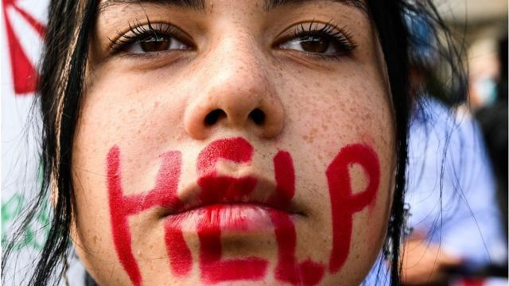
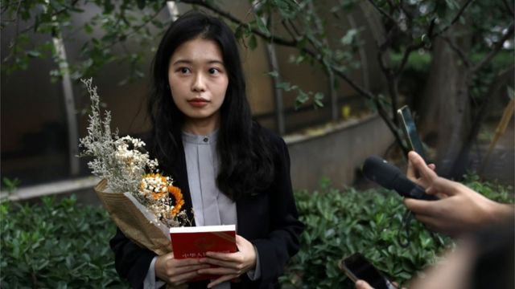
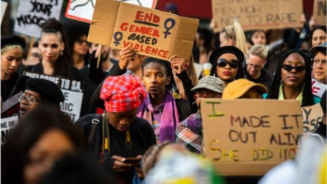
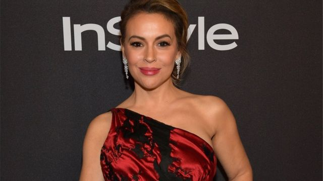
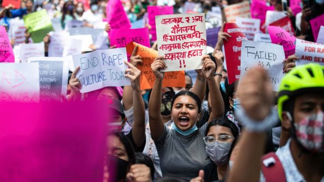

# [World] #MeToo五周年：究竟改变了什么？

#  #MeToo五周年：究竟改变了什么？

  * 桑德琳·隆贡布（Sandrine Lungumbu） 
  * BBC国际部 

> 图像来源，  Getty Images
>
> 图像加注文字，一些活动人士将伊朗目前的抗议活动与 Me Too 运动相比较

**五年前的这时候，你几乎不可能错过（社交媒体）时间轴上的#MeToo标签（中文：#我也是，大陆也称其为#米兔）。**

#MeToo最初由一条推文开始，随即引发一波全球性的关于女性性侵和性骚扰经历的对话。

斯特拉斯克莱德大学（University of Stathclyde）性别研究主任及女权媒体研究讲师博伊尔教授说，“#MeToo标签并非是关于性侵和性暴力的第一个标签，它也不是第一个爆红的标签。但在全世界许多地方，#MeToo给那些或许只在本国或地区已经广为人知的努力一个全球能见度。”

对许多人来说，这场运动引发了关于女性在世界各地社会中以及工作场所所受待遇的一场更广泛的辩论，并鼓励女性公开谈论性骚扰和性虐待经历。

##  如何开始的？

“MeToo”运动本身始于2006年，当时其创始人和活动人士塔拉纳·伯克（Tarana Burke）使用了“我也是”一词，来提高人们对女性所受暴力和虐待的认识。

11年后的2017, 在美国演员艾莉莎·米兰诺（Alyssa Milano）发推文呼吁女性说出她们的性骚扰和性侵经历后，它找到了一个新社交平台。它很快成为全球觉醒的一个催化剂。米兰诺是站出来指控好莱坞大制片人哈维·韦恩斯坦（Harvey Weinstein）性侵和性骚扰的第一批女性之一。

在她10月15日发推文的第一天，“我也是”这个短语在社交媒体上被使用了超过20万次，到次日有超过50万条推文。#MeToo在超过85个国家流行，并有各种不同语言的版本。

> 图像来源，  Reuters
>
> 图像加注文字，弦子控告中国央视名主持人朱军性骚扰

虽然该运动始于美国，但其影响却是全球性的。

博伊尔教授认为，重要一点是要把这一迅速流传的标签和MeToo运动本身分开来，因为“火爆现象”是包括网上和线下几十年来女性维权努力多种因素的结合。

博伊尔教授表示，她倾向于把MeToo时刻和MeToo运动区别看待。她认为MeToo时刻是指这个标签，以及公众的讨论；而MeToo运动则可以追溯到更长时间，并会在（标签）流行过后继续下去。

博伊尔教授还说，“可以这么说，这里有一种危险 - 那就是主流媒体对MeToo的说法和更广泛意义上MeToo的不同。因为往往发生的是， 几十年以来线上线下那些经常由有色人种女性做出的努力最后被排除在叙事以外，因为它变成了一个白人名人的故事。”

##  #MeToo 的全球影响

2015年（巴西）女权团体Think Olga（想想奥尔加）的创始人朱丽安娜·德·法利亚（Juliana de Faria）发起了#我第一次被骚扰（#MeuPrimeiroAssedio，英文：MyFirstHarrassment）活动。

几天之内，人们就分享了数千推文，详细讲述了巴西女性所经历的性骚扰故事。同时，它很快就以西班牙语标签#MiPrimerAcoso蔓延到了拉美。

> 图像来源，  Getty Images
>
> 图像加注文字，南非19岁学生伊娜娜·梅耶提亚娜被奸杀后引发抗议。

最近几年，世界各地已经有许多这样的例子，同样把这一问题推向公众讨论平台，其中包括中国、英国和印度。

在印度，越来越多人呼吁要求把宝莱坞导演萨吉德·汗 （Sajid Khan）从广受欢迎的真人秀Bigg Boss节目中撤换掉。

这是因为他受到8名女性同事以及一名记者提出的性行为不端的指控，其中这名记者的指控是4年前的事 。

汗否认这些指控，警察也没有立案调查他。许多人纷纷诉诸社交媒体，来谴责为性侵和滥用职权提供平台的这一决定，他们说娱乐行业已经为有权有势的男性作袒护。

2018年，随着#MeToo在中国声势壮大，弦子（真名为周晓璇）是开始分享性骚扰的众多女性之一。

在一篇广为流传的3千字文章中，弦子指责CCTV央视主持人朱军2014年在她来到他更衣间希望采访他时，对她进行了性骚扰。

但去年，法院以证据不足为由驳回她的案件。她8月份的上诉也被法院驳回。尽管输掉了这一具有标志性的案件，弦子誓言她绝不放弃。

2019年，19岁的学生伊娜娜·梅耶提亚娜（Uyinene Mrwetyana）在开普敦邮局被奸杀后，#AmInext(我是下一个吗)，#MenAreTrash（男人是垃圾）的标签成为谴责南非针对女性暴力行为的集体呐喊口号。

伊娜娜遭杀害引发该国针对女性高发暴力的大规模抗议。南非政府把对女性暴力行为宣布为该国的全国性危机。在南非，女性遭杀害的人数是全球平均数的5倍。

5月份，在一名前模特连发几个抖音（TikTok）视频，称自己在16岁时遭强奸后，数百名尼泊尔人走向街头，呼吁司法改革，并扩大强奸的定义。

她称自己被一名选美组织者下药、强奸，之后还被勒索。但尼泊尔的法律规定强奸案必须在案发之内一年报案。在公众压力下，一名与案件有关的男子被捕，但却是以与走私人口相关的法律条款为由被逮捕的。

在22岁的库尔德女性马赫萨·阿米尼（Mahsa Amini）遭该国道德警察拘捕死亡后，伊朗全国爆发了抗议活动。

阿米尼被捕是因为被指不遵守头巾蒙面的严格着装规定。据目击者说，她在警车内遭到殴打，之后陷入昏迷。伊朗警察否认所有指控，称她“死于突发性心脏衰竭”。

伊朗活动人士把目前席卷全国的前所未有的抗议与Me Too运动相比较。

伊朗女演员兼活动人士格什菲·法拉哈尼（Golshifteh Farahani）说，“如果你支持#MeToo，但却不支持#MahsaAmini运动，你怎么要求男女权力平等？这与宗教或意识形态，以及戴不戴头巾没有任何关系。”

她补充说，“这是关呼于女性和她们身体的自由选择问题。”

##  超越Me Too标签之外的影响

> 图像来源，  Getty Images
>
> 图像加注文字，米兰诺是站出来指控好莱坞大制片人哈维·韦恩斯坦（Harvey Weinstein）性侵和性骚扰的第一批女性之一。

五年过去了，观察人士认为，该运动最成功之处之一是，它允许人们围绕特别是关于女性受虐待问题进行更多的公开辩论 - 从而进一步推动各国本土的主题标签、抗议以及具有标志性的案例。

博伊尔教授说，“MeToo标签对性骚扰和性侵的公开讨论具有真正意义的影响，它让成千上万人 - 主要是女性 - 能够公开谈论她们的经历，并得到倾听和相信。”

她还表示，除了在对待女性问题上最初公开的和全球性的“觉醒”以外，它还暴露了一些潜在的社会问题。

博伊尔教授表示，不幸的是，它几乎从一开始就伴随着既针对个人、也针对一般性公开发声的强烈反弹，并非所有人的经历都被倾听和相信。

博伊尔教授认为，一些公众人物的指称之所以遭到如此强烈反弹，是它揭示了一种令人不安的现实。

她说，“Me Too运动不仅让人们看到了一些个别肇事者的举止，同时也揭示了某些行业以及整体社会的价值观问题。”

##  下一步做什么？

> 图像来源，  Getty Images
>
> 图像加注文字，尼泊尔女性抗议

博伊尔教授说，风靡一时的Me Too运动为一个重要的讨论创造了空间和运势，但还有更多需要做的事。

她说，“最终，我们将会知道我们已经达到了不再有性侵和性骚扰的终点，但我们还有很长一段路要走。”

“要想让MeToo运动真正具有转变性作用，需要对工作场所、学校、体育场馆以及一切场所和任何地方进行持续不断的结构性转变。这一工作虽然已经进行了几十年，但它仍是刚刚开始而已，” 她补充道。

