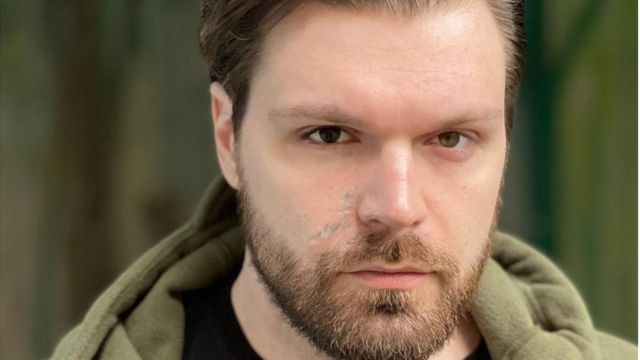
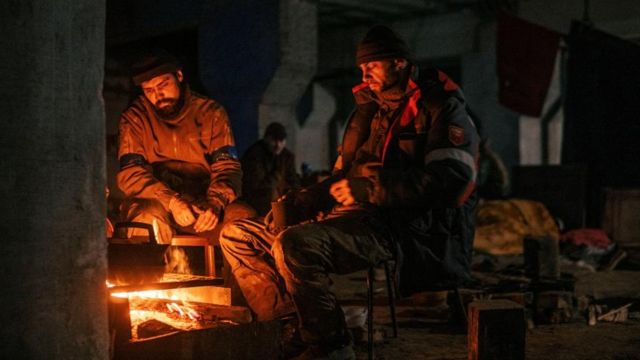
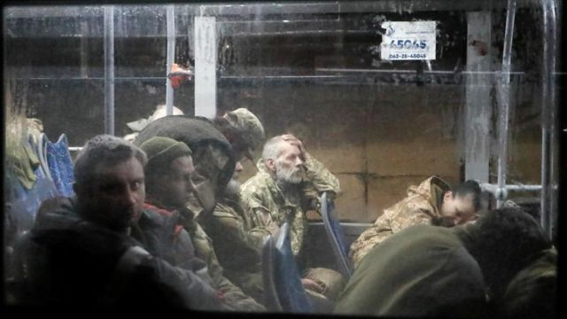

# “我以为我永远回不来了” -- 获释乌克兰亚速战士的故事

#  乌克兰亚速钢厂：获释亚速战士讲述被俄国关押的非人道待遇

  * 雨果·巴切加（Hugo Bachega） 
  * BBC记者发自基辅 

> 图像加注文字，伊利亚·萨莫伊连科上个月在囚犯交换中获释 。

**一名获释战士告诉BBC，乌克兰港口城市马里乌波尔亚速钢铁厂的抵抗官兵在经历数周围城不得不投降后，遭到俄罗斯方面非人道的关押和待遇。**

伊利亚·萨莫伊连科中尉（Lt Illia Samoilenko）告诉BBC， 他在俄罗斯被单独监禁了120天，并担心自己可能永远也无法回到乌克兰。

他说，俄罗斯部队在他被捕后没收了他的假肢。

这名亚速军团的战士在上个月的一次战俘交换中获释。

28岁的萨莫伊连科中尉2018年在执行乌克兰军队与俄罗斯支持的分离主义分子在东部顿巴斯作战的一次任务中，由于弹药在手中爆炸而失去右眼和左臂。

回到乌克兰后，他给自己买的第一样东西就是一包香烟。他说，（这让自己）“感觉还活着”。

萨莫伊连科说，“很高兴看到一直等待我的人，看到他们脸上喜悦的泪水和他们的笑容。”

上个月，俄乌之间曾有一次令人吃惊、且重要的战俘交换，这是自该批战俘获释以来首次有亚速钢厂战士接受国际媒体的采访。

他声称，他一些被单独关押的战友还受到了酷刑折磨，（俄国人）拒绝为他们提供足够的医疗救治和食品。

萨莫伊连科中尉在基辅对我表示，“一些显然的事情”发生了。在获释后，萨莫伊连科正在基辅养伤。 他说，“显然，人们在被俘后受到了俄国人的酷刑折磨。”

俄罗斯则否认折磨或虐待战俘，但乌克兰官员表示，这些战士在被俄国关押期间受到虐待。

> 图像来源，  Reuters
>
> 图像加注文字，乌克兰战士被困在马里乌波尔的钢铁厂长达数周

萨莫伊连科中尉是当时被围困在亚速钢厂地下隧道和掩体中数百名战士当中的一员，他们受到俄国军队连日的无情轰炸。他们拒绝投降，直到接到乌克兰高层军方指挥官的命令，结束马里乌波尔港口市的战斗为止。这是这场战争迄今为止最惨烈和最具毁坏性的战斗。

这些战士们离开时只带着为数不多的几件个人物品，他们看上去筋疲力尽，身上有明显的伤口。一些人拄着拐杖行走。他们被大巴送到俄罗斯控制的领土。

萨莫伊连科中尉说，他们先被带到奥列尼夫卡，这是一座由俄罗斯支持的分离分子控制的顿涅茨克地区的一个监狱。

数天后，他和其他人，主要是亚速领导人被转移到俄罗斯的一个秘密地点。他回忆说，他被独自关在一间牢房中，他每天做俯卧撑和仰卧起坐，并通过心算日期来记录时间。

但他说，“我并没有受到肉体折磨。因此，同其他地方的一些人所经历的折磨相比相去甚远。”

他指称说，那些被送往其他地点的人所受到的待遇“非常、非常糟糕”，而且情况“一周比一周更糟糕”。

一些在上个月获释的人告诉他，他们仅得到有限的一点水，有些人已经出现营养不良。

> 图像来源，  Reuters
>
> 图像加注文字，筋疲力尽的乌克兰战士投降后被大巴送往奥列尼夫卡监狱

7月份，奥列尼夫卡发生爆炸，造成数十名乌克兰囚犯死亡。俄国说该地点受到乌克兰的袭击，但乌克兰政府称这一指控太具讽刺意义，他们指责俄罗斯试图销赃灭据，以掩盖酷刑和杀戮。

萨莫伊连科中尉说，俄罗斯无视战争规则。他说，“他们不在乎《日内瓦公约》。他们不在乎人的死活。” 但他表示他还不能分享更多细节。

他还说，“俄国人也在观看这些采访。当他们看到我们开心的面孔时，他们会变得更生气。”

5月份在亚速钢铁厂投降的几天前，萨莫伊连科中尉曾主持召开一次新闻发布会，并从地下掩体中做现场直播。在接近2个小时的直播中，他描述了受伤战士的绝望处境，并表示他和所有其他战友已经把自己当“死人”看待。

在俄罗斯，萨莫伊连科中尉所属的亚速军团受到许多俄国人的诋毁，因为它最初是与极右翼有联系的民兵组织。俄罗斯的宣传攻势也以它为例，为普京总统对乌克兰发动的“去纳粹化”行动辩护，虽然这一指称毫无依据。

在他们被捕后，一些俄国人为对亚速军团斗士的严判做辩护；另外一些人则呼吁处决他们。

但在乌克兰他们成为抵抗俄国入侵的象征，并被彰显在标语牌上来庆祝。

萨莫伊连科中尉告诉我，“我不认为自己是英雄。”

他们的获释，（共有215名乌克兰战俘与55名俄罗斯人交换）被看作是乌克兰总统泽连斯基的一个胜利，也受到了举国欢庆。这一交换发生时正值俄国在战场上遭遇令人尴尬的挫败之际，至于交易是如何达成的仍是一个迷。

但萨莫伊连科中尉说，他们对获释的感受是苦乐参半，因为还有许多“同志和战友仍被关押。”而且，“俄罗斯人仍在折磨他们，并把他们关押在非人道的处境中。”

回到故乡基辅后，萨莫伊连科中尉与家人住在一起。他目前正在等待新的假肢，并接受心理治疗。他说，因为不久"我们必须要重返战场"。

注：阿纳斯塔西娅·列夫琴科（Anastasia Levchenko）对此文有补充报道

