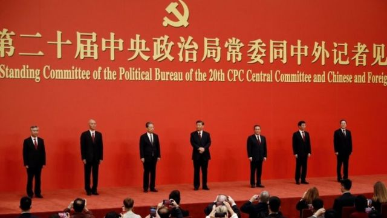
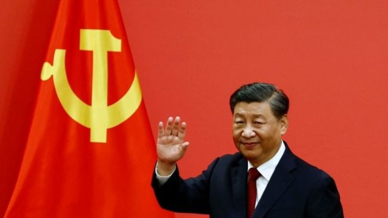

# [World] 中共二十大习近平与政治局常委亮相 海外媒体评论与国际反应

#  中共二十大习近平与政治局常委亮相 海外媒体评论与国际反应

8 小时前

> 图像来源，  Reuters

**周日（10月23日），中共二十大敲定的最高领导层——中共中央政治局常委亮相，外界揣测了多时的中共人事大变动终于尘埃落定。**

虽然此前国际间“习下李上”的传言不断，谁将在明年接替李克强出任中国总理的分析判断诸多，但所有的揣测除了显示某些反对习近平连任者的愿望之外，也再次证明中国政治的难以捉摸。

中共最高层人选的最后确定似乎显示，分析评论人士根据以往的政治局常委年龄“七上八下”、总理必须曾经有担任副总理的经验等所谓的“政治惯例”，并不适用于现在，因为习近平本人就打破了中共过去几十年的惯例第三次出任总书记，也将毫无悬念地在明年人大第三次出任国家主席。

##  习近平连任

英国《卫报》报道认为，中国领导人习近平获得第三个任期，并在政治局小圈子里堆满效忠者，“在过去几十年精英阶层权力分享之后，中国重新倒向一人当政。”

英国天空卫视报道称，习近平“已经统治了中国10年，现在将至少再留任5年。从理论上来说，他可以使自己成为终身领导人。这样不按中国惯例使习近平成为自毛泽东以来中国最强势的领导人，他如何规划中国愿景已变得越来越不可挑战。”

英国《每日电讯报》的报道也认为，通过安插忠臣和清除政治对手，习近平似乎加固了其终身统治者的地位。

美国《华盛顿邮报》报道认为，中国共产党给了习近平行使权力的无限期统治。它标志着十年巩固权力的顶峰，也标志着执政中国共产党开启了一个没有确定性的新篇章，因为习近平打破了几十年来正在形成的常规。

英国《金融时报》报道称，习近平提拔忠心耿耿的上海市长升任高层，李强在上海主持了“破坏性”的新冠封城后，成为中共的第二号人物。

《纽约时报》也报道了此次进入中共最高层的上海市长李强，称他是“从上海封城中走出的中共二号人物”。

路透社在习近平获得第三个任期后发表署名评论文章认为，习近平此次连任的奖品是：（中国）16万亿美元的经济处于脆弱状态，对美国技术依赖，人口面临危机。习近平还因严厉的（清零）政策给普通民众带来经济痛苦而面临社会上的不满。中国的这个所谓万能主席有是有权力让人民免除痛苦的，但不清楚的是他有没有这样的意愿。

美国有线新闻网CNN报道引述专家认为，中共周日亮相的政治局常委“发出了谁是绝对负责人的明确信号”，习近平可能终身掌权，但随着他年龄增大也带来更大的不确定性。

> 图像来源，  Reuters

新加坡《海峡时报》报道说：习近平主席不顾常规和权力派别平衡，在他的领导团队中安置大量政治盟友，这清楚地表明他的统治地位现在是不可动摇的。

牛津大学中国历史和政治教授拉纳·米特尔（Rana Mitter）在英国《卫报》上刊登文章说：习近平被一个使中国更加孤立于世界的愿景所诱惑。这是一个将使中国更加穷困的错误。

文章写道：自1980年代以来，界定中国的一直是“改革”和“开放”并存的理念。然而，这种开放在本世纪的前20年中造成了一种反常现象：中国成为了一个与外部世界高度联系的社会，但同时也在国内受到深入控制和监督，虽然开放但没有自由，一种许多民主理论家认为不可能的组合。

文章认为，这个开放但不自由的中国在2020年3月因为新冠疫情被叫停。中国是当今世界上唯一一个仍然要求病毒清零的大国，这样的决定当然并非完全出于政治考量，与中国的疫苗水平和接种人口比例有关系，但是这样的决定“与习近平本人有很大关系”。

作者认为长此以往，即使中国以自己的方式与外部世界接触，外界仍难以进入，这种可能性是真实存在的。

“然而，相比于真正开放，如此与世隔绝将使中国内外都更加贫困。”

##  国际反应

在二十大闭幕，习近平连任后，朝鲜领导人金正恩向习近平致贺电表示最热烈祝贺，表示他将“同习近平总书记同志一道，适应时代要求，勾勒出朝中关系的更美好未来，并领导将其付诸实践，继续推动两国社会主义伟业取得成就。”

贺电表示，习近平继续担任领导中国共产党的重任充分体现出中国全党和人民一如既往的信任、支持和期待。

俄罗斯总统普京也对习近平连任表示祝贺。他表示：很高兴继续我们的建设性对话和密切的共同工作，以加强我们两国之间的……战略合作。

另外向习近平立即表示祝贺的还有巴基斯坦总理谢利夫和卡塔尔国王阿勒萨尼。

