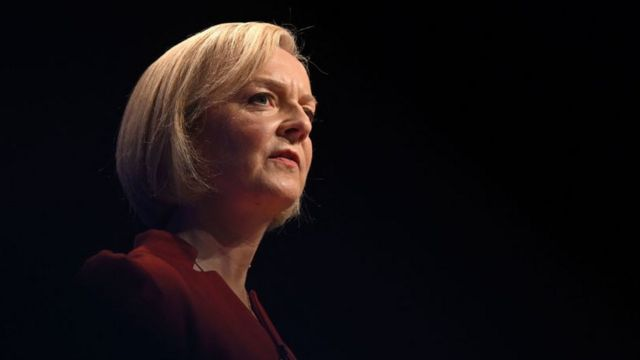
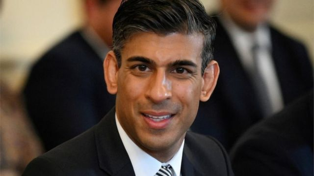
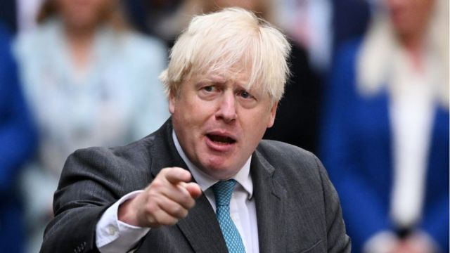

# [World] 英国首相特拉斯辞职：新首相如何选出？

#  英国首相特拉斯辞职：新首相如何选出？

> 图像来源，  Getty Images
>
> 图像加注文字，英国首相特拉斯（又译：卓慧思）宣布辞去首相一职

**英国首相特拉斯（又译：卓慧思）周四（10月20日）宣布辞去首相一职。她将在一周内找到接替她的保守党党魁后辞职。**

新的领导人将成为六年来保守党的第五任首相。

> 图像来源，  Reuters
>
> 图像加注文字，里希·苏纳克

##  接替特拉斯的可能是谁？

  * 里希·苏纳克（辛伟诚/Rishi Sunak）： 苏纳克今年夏天竞选接替鲍里斯·约翰逊（Boris Johnson）成为党魁，并与特拉斯一起进入了前两名。 在竞选期间，他警告说，他的对手的税收计划将损害经济，但他的信息未能吸引党内成员，他以21000张选票的差距落败。 

  * 莫佩琳（Penny Mordaunt）：莫佩琳是保守党下议院领袖和枢密院院长。2019年，她曾创造历史，成为英国首名女性国防大臣。 

  * 鲍里斯·约翰逊（Boris Johnson）：在只有一周时间选出新领导人的情况下，许多竞争者可能都是熟悉的面孔，尤其是数周前还担任首相的人。今年7月，约翰逊在大规模抗议声中辞职，但是他在议会和党内仍有盟友。 

  * 本·华莱士（Ben Wallace）：华莱士是英国现任国防大臣。自俄罗斯入侵乌克兰以来，华莱士引起了越来越多的关注，因为英国很早就决定向乌克兰提供武器和训练支持。尽管华莱士反对英国脱欧，但他一直是鲍里斯·约翰逊的重要支持者，并在2019年获得了一个内阁职位。 

  * 凯米·巴德诺赫（Kemi Badenoch）：巴德诺赫是英国现任贸易大臣。她出生在伦敦南部，在美国和尼日利亚长大。在进入议会前，她曾为顾资银行和《旁观者》杂志工作。 

  * 苏拉·布雷弗曼（Suella Braverman）：布雷弗曼在今年9月至10月短暂担任内阁大臣，她的辞职给特拉斯增加了压力，不到24小时特拉斯也辞职了。尽管布雷弗曼离职表面上是因为数据泄露，但她辞职信表达的愤怒暗示两人在移民问题上有分歧。 

> 图像来源，  Getty Images
>
> 图像加注文字，鲍里斯·约翰逊

##  保守党将如何选出新领袖？

接替特拉斯成为下一任保守党党魁和首相的提名现在已经开放，并将于英国夏令时10月24日星期一14点关闭。

要参加竞选，候选人需要至少100名保守党议员提名。这远远高于上次竞选，当时只需要20个提名。由于保守党目前有357名议员，最多只有3名候选人能够被提名。

如果周一只有一人达到100票的门槛，他将成为下一任领导人，然后成为新首相，无需进行下一阶段竞争。

如果有三名候选人，得票最少的候选人将直接被淘汰。保守党议员将在当日夏令时18点30分至20点30分之间对剩下的两名候选人进行指向性（即显示议员倾向的）投票， 结果会在同一天的21时出来。

如果在指示性投票后没有人退出，全体保守党党员将参加网上投票来决定获胜者。在党内成员投票结束之前，两位候选人有望参加一场电视辩论。10月28日星期五产生获胜者。

##  下一任首相是如何任命的？

无论谁赢得保守党党魁的竞选，都将成为议会中议员人数最多的政党的领袖。

因此国王将要求他或她组建政府，并在此过程中成为英国下一任首相。

##  会举行大选吗?

新首相被任命后不会自动举行大选。

如果新首相决定不提前举行大选，那么下一届大选最晚要到2025年1月才会举行。

##  特拉斯是如何被选中的？

特拉斯赢得的夏季领导人竞选持续了3个月。

候选人只有获得至少20名保守党议员支持才能参加竞选，出现了包括特拉斯在内的8名竞选者。

在竞选的第一阶段，保守党议员选择了两名候选人，进行党内更广泛成员的投票。

为了做到这一点，保守党的358名议员通过一系列投票削减了竞争对手。

任何在每一轮投票中得票少于30票或垫底的人都将被淘汰。这一过程一直持续到只剩最后两名候选人：特拉斯和前财政大臣里希·苏纳克。

在第二阶段，保守党成员通过持续数周的邮寄和在线投票选出最终获胜者。

9月5日选举结果公布时，特拉斯赢得81326票，而苏纳克获得60399票。

