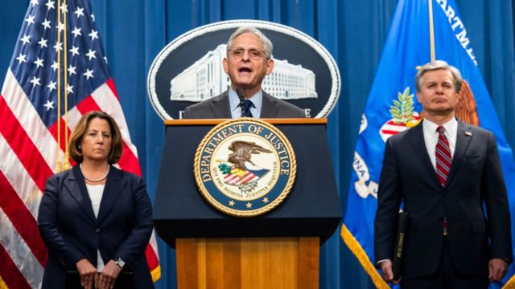
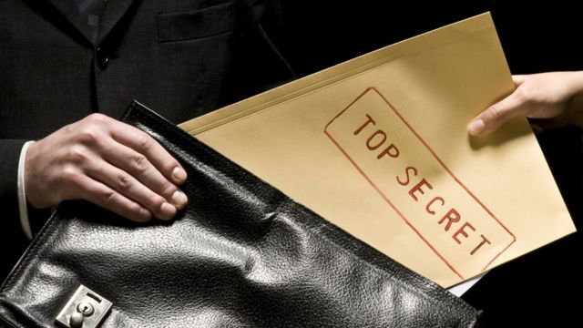
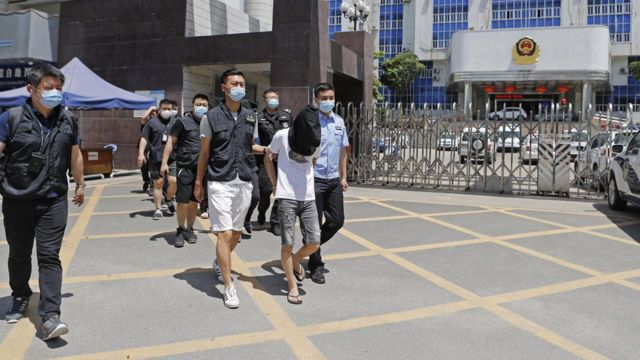
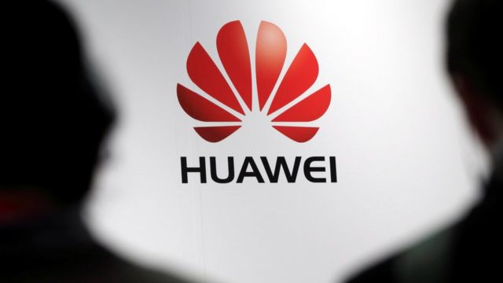
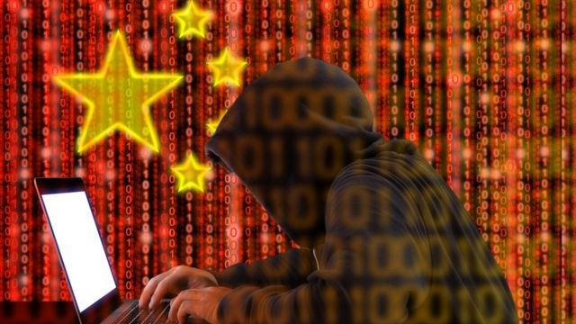

# [World] 美国曝光三起涉华间谍案 事关“猎狐行动”和华为

#  美国曝光三起涉华间谍案 事关“猎狐行动”和华为

最近更新： 7 小时前

> 图像来源，  EPA
>
> 图像加注文字，美国司法部长加兰（中）批评中国试图破坏美国司法制度。

**中共中央总书记习近平** 获得第三个五年任期  **后一天，美国司法部一口气曝光三起涉华间谍案件。美国司法部长梅里克·加兰（Merrick Garland）指控北京试图破坏美国司法。**

司法部星期一（10月25日）公布的三起案件共涉及14名中国公民和一名美籍华人，全部案件发生于纽约州与毗邻的新泽西州。其中一起案件涉及两名美方所称的中国情报人员，他们被指试图以现金、珠宝和虚拟货币收买被定为保密的联邦起诉文件。两人被指控阻碍司法公正与洗钱罪。据多家媒体报道，涉案公司为总部设在广东的电信巨头华为。

其余两起案件分别涉及强迫个人返回中国，以及强迫在美个人为中国国家安全部担任线人。

中国外交部批评美方言论是对中国的“诬蔑抹黑”；华为对BBC中文记者表示“不作评论”。

##  三起案件都涉及什么？
 美国司法部这次公布的案件  均已提起公诉，其中两人新近被捕。

总部设在美国的人权观察组织（Human Rights Watch）中国部主任索菲·理查森（Sophie Richardson）对BBC中文评论说，虽然该组织对最新案件并非特别了解，但该组织长期以来纪录了好些中国政府威胁外国人权的案例，包括骚扰和平的批评者，审查微信等平台言论，妨害学术自由等。

理查森说：“各国政府认定这些威胁，并采取行动，以阻止日后再次发生侵害行为，至关重要。”

##  1\. 两中国情报官涉行贿窃取对华企业起诉文件

> 图像来源，  ferrantraite/E+/Getty Images

美国联邦检察院纽约东区办公室指，中国情报官贺国春与王政自2019年起，指使一名美国执法人员，为“中国一家全球电信公司”窃取与该公司有关的在美刑事起诉相关机密信息。

案中，两名中方情报人员向美方人员以比特币（bitcoin）行贿，总值6.1万美元。

不过，被收买的美国执法人员实际上是联邦调查局（FBI）的双重间谍。贺国春本月再次支付贿款后，美方提起诉讼。

检察院以“刑事控告书”（criminal complaint）形式起诉两人阻碍司法公正罪，其中，贺国春被加控洗钱罪。他们目前在逃。

检察院与FBI专门为此案发布中文通缉令与新闻公告。 检察院公告称  ：”如罪名成立，贺国春面临高达60年的监禁，王面临高达20年的监禁。“

##  2\. 疑涉“猎狐行动” 山东党政工作人员强迫他人回国投案

> 图像来源，  China News Service
 在纽约东区检察院的另一起案件中  ，五名中共山东省纪律检查委员会现任与前任工作人员和两名在美华人被起诉。他们涉嫌在“ 猎狐行动  ”下，“代表中华人民共和国政府在美国领土单方面且未经协调地采取执法行动，意图促使一名美国居民被强迫遣返到中国”。

检察院声明称，居于纽约州长岛Roslyn的被告人安全忠（Quanzhong An；音译）与安广洋（Guangyan "Angela" An；音译）为父女关系，父亲为美国永久居民，女儿在美国出生，拥有美国国籍。两人本月被捕，其余被告人在逃。

安全忠被列为首被告，美方起诉书称，2002年5月，中国公安部透过国际刑警组织（Interpol）对该名涉嫌挪用200万元人民币公款，被称为“无名氏”的美国居民发出红色通告——即俗称“红色通缉令”——并列入与“猎狐行动”有关的“百名红通人员”名单内。

安氏父女俩被指控受中方纪检人员指使，监控并“骚扰和胁迫”该美国居民，包括在2018年安排“无名氏”一名在华亲属到美国与“无名氏”母子见面，要求对方回国投案。

被美方列为在逃的被告人包括山东省纪委常务副书记明春德、第十审查调查室首长陈程华（Chen Chenghua；音译）、工作人员田鹏（Tian Peng；音译）、侯学鑫（Hou Xuexin；音译），以及中国国家税务总局山东省枣庄市市中区税务局副局长袁卫东（Yuan Weidong；音译）。

他们分别被起诉“阴谋担任外国政府代理人”、“阴谋参与跨国骚扰”与洗钱等罪名。司法部称，担任外国代理人罪有罪，则安全忠将要面对最高10年监禁；阴谋洗钱罪一旦被判有罪，可被判监20年。

##  3\. 潜伏10年 四人涉迫使在美学者等为中国国安部工作

> 图像来源，  Andrii Yalanskyi/iStock/Getty Images Plus

美国联邦检察院新泽西办公室起诉四名中国公民“阴谋在美国担任外国政府非法代理人”罪， 起诉书称  ，涉案行为可追溯至2008年，并持续至2018年。

起诉书指控王林（Wang Lin；音译）、毕宏伟（Bi Hongwei；音译）、董婷（Dong Ting；音译）与王强（Wang Qiang；音译）与其他人合谋，“广泛并有系统地”招募大学教授、联邦执法人员、州级国土安全部执法人员等，为中国提供情报。

检方称，王林与董婷为中国国家安全部情报员，他们以山东一家大学的就业岗位作掩护，从事间谍活动。其中包括全费资助目标人物访华，趁机游说提供敏感指纹技术，以及在2008年北京奥运火炬传递途中，协助阻止让中国“尴尬”的示威抗议活动进行。

司法部称，有关指控若被判有罪，可被判处监禁五年，罚款25万美元人民币。

##  华为与这些案件有何关系？

> 图像来源，  Reuters
>
> 图像加注文字，美国起诉华为案件在中美关系间产生莫大摩擦。

美国司法部长加兰并未在记者会上点名贺国春与王政案涉及哪家企业，但美国媒体引述知情人士称，这家濒临刑事起诉的企业就是华为。

加兰说：“中华人民共和国情报人员试图掩护一家中资公司免受问责，并破坏我们司法系统的完整性，实在是个骇人听闻的企图。”

美国在2018年起诉华为涉嫌误导 汇丰银行（HSBC）  等金融机构，隐瞒华为与伊朗之间的业务往来，违反美国制裁伊朗法令。2020年，美国检方加控华为阴谋窃取商业秘密、协助伊朗追查2009年反政府示威参与者下落等罪名，华为否认指控。，

2018年12月，华为首席财务官孟晚舟过境加拿大期间被拘留，美国寻求将其引渡受审，引发争持1000多天的司法争议与外交僵局。 孟晚舟最终在2021年9月获释  。

BBC中文通过邮件联系华为公司，一名发言人回应称：“我们对此没有评论。”

##  中国政府回应

> 图像来源，  BeeBright/iStock/Getty Images Plus
>
> 图像加注文字，中国多次以“诬蔑抹黑”驳斥美国对华指控。
 中国外交部发言人汪文斌星期二（25日）被问及美方表态时回答  ：“我不了解有关案件的具体情况。我想强调，中方一贯要求中国公民遵守所在国法律法规。”

汪文斌说：“美国执法部门一些人抱持冷战零和思维和意识形态偏见，一再捏造各种借口和谎言诬蔑抹黑中方，无理打压中国企业，公然为中方逃犯提供庇护，阻扰破坏中国追逃追赃努力，让美国沦为了腐败分子和不法之徒的避风港。”

“美方所作所为站在了正义和法治的对立面，破坏了中美执法合作的基础，也损害了美方自身形象。我们敦促美方这些人改弦更张，停止对中国的无端攻击。中方将继续维护中国公民正当合法权益。”

汪文斌被追问贿赂与阻碍司法公正案件中的涉案企业是否华为时，再次重申“不了解”，并未承认或否认有关说法。

2020年，美国也曾曝光据称与“猎狐行动”有关的间谍案件。汪文斌当时促请美国“不要沦为犯罪分子的避罪天堂”。

