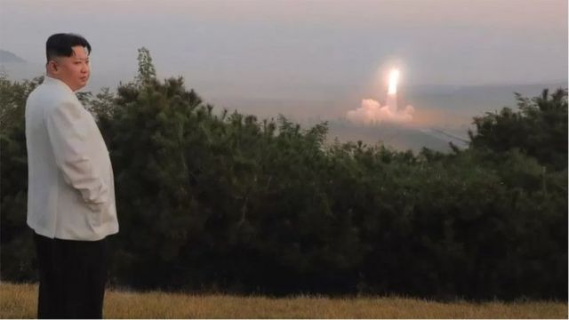
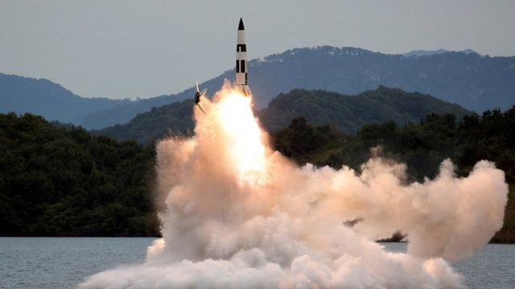

# [World] 朝鲜危机： 金正恩为何现在发力？

#  朝鲜危机： 金正恩为何现在发力？

  * 珍妮·麦肯锡（Jean Mackenzie) 
  * BBC驻韩国记者 

> 图像来源，  KCNA
>
> 图像加注文字，过去的一个月，平壤向日本上空发射了一枚导弹，迫使日本居民寻求庇护。

**朝鲜 （北韩）的紧张局势时隐时现，现在朝鲜半岛的情势却是五年来最不稳定的，而且似乎可能会变得更糟。**

过去一个月，平壤向日本上空发射了一枚导弹，迫使日本居民寻求庇护，这是一种敌对和挑衅的行为。近期，金正恩又发射了其他几枚弹道导弹，派遣战机靠近其与韩国的边界，并向海里发射了数百枚炮弹，落在了朝韩两国在2018年为维持和平而设立的军事缓冲区。

可以说，基本上（technically）这两个国家在仍处于战争状态。本周一（10月24日），一艘朝鲜商船航行穿过两国的海上边界，导致双方鸣枪警告。首尔回应称此次入侵是蓄意行为。

##  金正恩在想什么？

平壤发射导弹可能有三个原因：测试和改进其武器技术，向世界（主要是美国）发出政治信息和做给国人看以巩固他们对政权的忠诚。

要解读平壤的行动是为了上述哪个目的十分不容易， 但这一次该国领导人金正恩说得很清楚，其官媒这几天曾多次报道，最近的导弹发射和演习是回应美国、韩国和日本正在进行的军事演习。朝鲜指责其敌人使紧张局势升级，并说发射导弹是警告这些国家立即“停止”演习。

事实上，过去两个月，华盛顿、首尔和东京一直在单独或共同举行大规模军事演习，以显示他们为应对朝鲜的核攻击做好准备。无疑，这些军演激怒了金正恩。他一直认为这些演习是敌人在为入侵进行操演，而朝鲜发展核武器的原因是为了阻止自己被入侵。

##  五年计划

但是目前， 金正恩似乎让情势逐渐升温，他可能在为一次更具挑衅性的试验做准备， 即五年来第一次进行核武器实验，甚至是对韩国的小规模攻击。

一年前， 金正恩制定了一个五年计划，详细说明了他计划研发的所有新武器，这包括较小的战场核弹。最近实验显示他不仅在努力完成这份愿望清单，而且还在训练他的部队使用这些武器。他声称，最近的一些演习是用来模拟对韩国的核攻击。

金正恩需要让世界的关注到他的这些战果，以期国际社会取消对朝鲜的严厉制裁。经济制裁并没有原有的设想阻止朝鲜发展武器，但制裁正在伤害朝鲜的经济。

旨在减少这些制裁的谈判长期以来一直停滞不前，朝鲜在全球议程中的重要性不断下滑。现在全球更关注乌克兰战争，以及一个专制中国的崛起。美国总统拜登（Joe Biden）的立场是，只有当朝鲜同意放弃其所有核武器时，才能放松对其制裁。

与此同时，华盛顿和首尔已同意通过举行平壤非常讨厌的军事演习来加强防御，并对金正恩的挑衅行为作出武力回应。在朝鲜最近一轮的导弹发射和演习之后，韩国派出了战机并发射了炮弹。

因此，如果金正恩想在与美国进行谈判中赢得更多对自己更有利的条件，他必须证明他的国家已经变得多么危险。

> 图像来源，  KCNA/Reuters
>
> 图像加注文字，朝鲜一场导弹试射，地点不明。

上个月，金正恩宣布朝鲜是一个核武器国家，并称这个立场是不可逆转的。

前韩国国防部顾问金正大（Kim Jong-dae）称，我们该担心平壤似乎变得十分自信。 他强调，过去朝鲜是如何等到美军完成军事演习才进行报复的。 但这一次，他们在演习进行时向海上发射了大炮。

“我们以前从未见过这样大胆和挑衅。朝鲜的行为就像一个核国家，”他解释。

美国和韩国政府则认为，朝鲜第7次核武器试验的准备工作业已完成，而金正恩正等待政治时机采取行动。

现在，一个让朝鲜感到诱人的窗口正在打开：中国共产党20大已结束，美国期中选举即将到来。

与此同时，首尔正在进行另一轮军事演练，而白宫计划加入。这很可能为金正恩提供了他一直在等待的借口。

