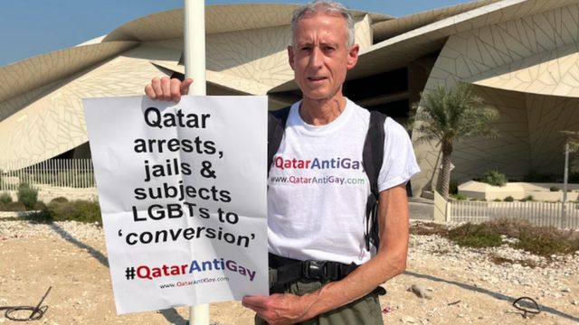

# [World] 卡塔尔世界杯：英国著名LGBT活动人士在多哈抗议遭官员阻止

#  卡塔尔世界杯：英国著名LGBT活动人士在多哈抗议遭官员阻止

  * 贾斯敏·安德森（Jasmine Andersson） 
  * BBC记者 

> 图像来源，  Peter Tatchell Foundation
>
> 图像加注文字，塔切尔在2022年世界杯主办地卡塔尔进行了一场单枪匹马的抗议。

**卡塔尔官员阻止了英国LGBT（同性恋、双性变及跨性别）平权倡议者彼得·塔切尔（Peter Tatchell）的抗议。**

塔切尔表示，他周二（10月25日）在多哈独自进行抗议，在世界杯之前对该国对待LGBT群体的方式表示反对，之后“在路边的人行道被拘捕和扣留”。

他说自己稍后被释放，目前正在回到英国。

卡塔尔政府表示，当局曾要求某人移动位置，但表示被逮捕是“完全错误”的说法。

在离开卡塔尔之前，塔切尔说：“你可以说它是逮捕或者扣留，总之我们不能自由走动。”

他在接受BBC第四电台节目《今夜世界》（The World Tonight）访问时表示，他和同事“不能自由离开”，也不能“自由地继续抗议”。

“最后，我们被非常清楚地告知，最好尽早离开这个国家，”他说。

塔切尔在2018年俄罗斯世界杯时也进行过类似的活动，他表示这是在海湾国家第一次公开的LGBT平权抗议。

他被拍到站在卡塔尔国家博物馆外，手持的纸牌写着“卡塔尔逮捕、监禁和对LGBT人士进行性向回转治疗”，以及#QatarAntiGay（卡塔尔反同性恋）的话题标签。

视频片段显示，随后有卡塔尔官员走向他。

两名穿制服的警员和三名便衣官员来到现场，折叠起他的纸牌，拍下他护照和其它文件的照片，还有一名与他同行的男子的相关证件。

塔切尔在一份声明中表示，他被九名人员“包围和查问”，问他“从哪里来，谁在帮我，我住在哪里，还有我什么时候离开卡塔尔”。

他说，官员也逮捕了当时正在拍摄这个过程的一名他的同事。

“我做这场抗议，是为了凸显卡塔尔对LGBT、女性和移民劳工权益的侵害。我坚定地和勇敢的卡塔尔人权卫士团结在一起。由于逮捕、监禁和虐待的危险，他们的声音无法被听到。”他还表示：“我现在正和同事一起在去机场。”

卡塔尔政府则在一份声明中表示：“社交媒体上的谣言称彼得·塔切尔基金会（Peter Tatchell Foundation）的一名代表在卡塔尔被捕，这是完全虚假和没有依据的。”

“一名站在交通环岛处的人士被礼貌而专业地要求移动到路边人行道，没有发生拘捕。”

“我们一直都与希望讨论重要议题的机构开放对话，但是散播虚假信息，蓄意引起负面回应是不负责任和不可接受的。”

国际特赦组织（Amnesty International）英国执行长戴希穆克（Sacha Deshmukh）表示，对待塔切尔的行为是“关于这个国家打压言论自由氛围的一次严重提醒”。

一名英国政府发言人表示，“在多哈的一宗事件后向两名英国国民提供领事协助”。

随着世界杯临近，卡塔尔的人权问题渐渐成为一个尖锐的焦点。

首轮比赛不到一个月后就将开始，但一些球迷却因为卡塔尔对待移民劳工和LGBT群体的恶劣方式而抵制赛事。

人权观察（Human Rights Watch）在周一表示，直到上月，卡塔尔安保部队还在恣意逮捕和虐待卡塔尔的LGBT人士。路透社报道指，一名卡塔尔官员在一份声明中表示，人权观察的指控“包含明显完全错误的信息”。

同性恋行为在卡塔尔属非法，惩罚措施包括罚款，最高七年监禁，在一些案例中甚至可判死刑。在这个海湾国家，LGBT人士并没有法律保障。

根据官方数据，有37名参与建造世界杯场馆的移民劳工死亡，不过维权组织声称真实的数字达到数千。

作为回应，卡塔尔酋长国埃米尔遣责国际上在世界杯筹办期间对他国家发出的批评是“虚假信息”和“双重标准”。

作为卡塔尔酋长国埃米尔的塔米姆·本·哈迈德·阿勒萨尼（Sheikh Tamim bin Hamad al-Thani）表示，这些前所未有的批评已构成诽谤。

