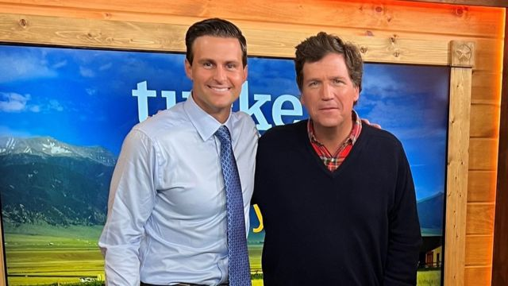
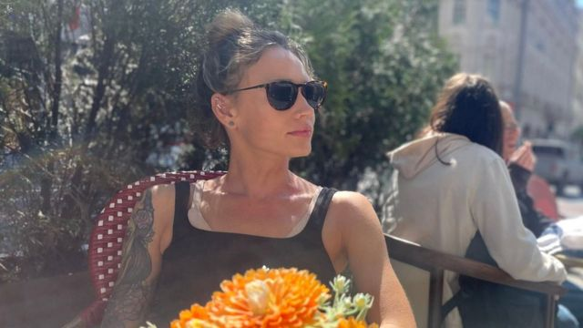
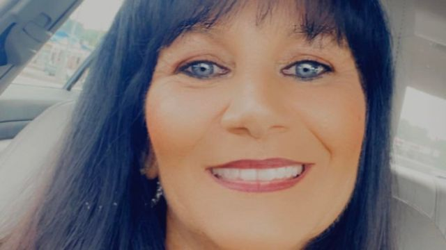

# [World] 2022 美国中期选举：政治立场越来越成为恋爱中的绊脚石

#  2022 美国中期选举：政治立场越来越成为恋爱中的绊脚石

  * 杰森·阿尔梅斯托（Jason Armesto） 
  * BBC记者，发自华盛顿 

> 图像来源，  Getty Images
>
> 图像加注文字，“好在我们把票投给了同一个党”

**55岁的安吉拉·哈蒙特里（Angela Hammontree）认为自己是非常保守的——“支持拥有枪枝，支持《圣经》传统，支持特朗普。”**

不过，在谈恋爱时，这些都有可能成为她的绊脚石。

“我离婚后约会的第一个人看起来是个好男人，”哈蒙特里回忆说，“然后我就发现，他是个该死的民主党！”

他们约会了三个月，但是在2020年11月的总统选举前一个月分手了。

“我受不了了，”她说，“我真的很喜欢这个人，但是我觉得一段关系如果（政治）观点不一致，很难走得很远。”

现在，她会在约会前在谷歌（Google）上查一下选民登记档案——只是为了确保她不会在和一个民主党人吃饭。

事实上，研究显示，哈蒙特里的这种恋爱观并非她独有。网络调查公司YouGov和《经济学人》（Economist）杂志在2020年的民调发现，86%的美国人认为，与一个支持对立党派的人约会已经变得更加困难。

专家指，你给谁投票这件事，已经成为爱情里最重要的事情之一。

> 图像来源，  John McEntee
>
> 图像加注文字，麦肯提（左）是共和党人专属约会应用程式“The Right Stuff”的联合创始人。

对于在居住地身为政治少数派的单身人士来说，挑战是尤其尖锐的，而且跨越了不同世代。

比如众所周知的，在特朗普在职时为白宫工作过的年轻人，就会发现在自由派主导的华盛顿谈恋爱很困难。

特朗普的前白宫顾问丹尼尔·赫夫（Daniel Huff）有一次去约会，点了鸡尾酒之后，酒还没上就已经被一个人甩下了。在那么短的时间窗口里，赫夫的约会对象知道了他在哪里工作。她很快就走开了。

那一次经历启发了他，与同为特朗普前员工的约翰·麦肯提（John McEntee）在这个月较早前一起开发了一个约会应用程序“The Right Stuff”，只允许保守派人士加入。

“在自由派地盘的保守派完全是受到歧视的，”麦肯提抱怨说，“他们被迫感到自己独自一人，完全与他人疏离。”

用户在登记时必须透露像身高和性别等常规信息。不过在个人档案中添加一些个性信息时，他们可以从一些提示中选填，比如：“随便说一个我为何爱美国的事实”；“（我）最喜欢的民主党谎言”；“我最喜欢的保守派评论员”和“1月6日是……”

用户必须受到邀请才能加入。在理论上，这能阻挡自由派进入这个应用程序，不让他们影响严肃用家的体验。

> 图像来源，  Nora Murphy
>
> 图像加注文字，作为生活在保守派州份的自由派，诺拉·默菲很难找到与自己政治价值观一致的伴侣

自由派的女性在这个国家的保守派地盘也同样发现，约会很困难。

32岁的诺拉·默菲（Nora Murphy）用了数年时间在深红的爱达荷州探寻约会体验。在承认自己在那里是政治少数派的同时，默菲也想要给那个地方的保守派男性一个机会。

“我们会相处得很好，然后一谈到政治，就很明白，恋情是不会成事的，”她说。

最终，她与一个罗马尼亚人结了婚。

约会中的这种分歧，只是极端分裂的美国其中一个症状。据皮尤研究中心（Pew Research Center）指：“如今的民主党人和共和党人在意识形态上的差异比过去50年的任何时候都更大。”

上个月，哥伦比亚广播公司（CBS）的民调发现，很多民主党和共和党人不是把对面的人看作政治反对派，而是“敌人”。

生活在俄亥俄州坎顿的哈蒙特里承认，她的政见和约会观是相对较新的发展。虽然有生以来就一直是共和党支持者，但是她不记得自己年轻一点的时候有这么在意过这一点。

“我觉得在当时我不会这么强烈地认为这是破局的事情，”她说。

> 图像来源，  Angela Hammontree
>
> 图像加注文字，安吉拉·哈蒙特里以为自己找到了一个合适伴侣，直至发现对方是个民主党人

研究者认为，随着更多单身人士与政见一致的人成为伴侣，同样的政见会传承给他们的子女。“这有可能会通过制造出同质化的社会网络和家庭，而扩大两极对立，”2017年研究报告这样说道。

康奈尔大学的政治心理学家露丝·麦克德莫特（Rose McDermott）认为，自由派和保守派与各自的政见阵营抱团生活，在近年确实已经越发明显。

麦克德莫特博士说，一个深度分裂的当代美国叙事，无论在恋爱方面还是更广大的社会领域，都有其真实性。

“我不认为这是在夸大，”她说，“我认为情况正变得更加严重。”

