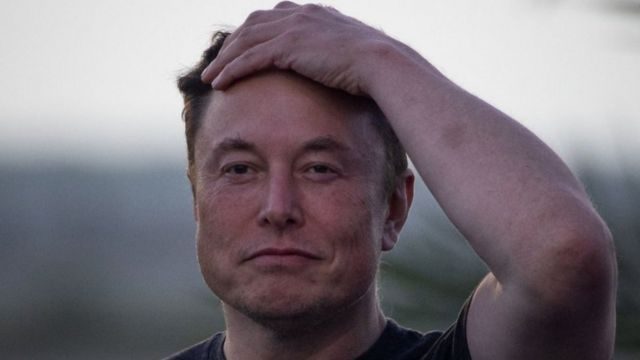
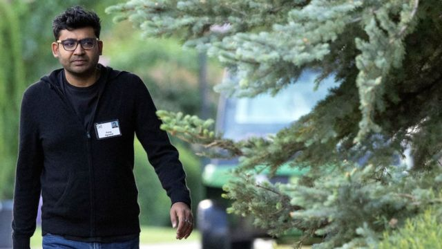

# [World] 全球首富马斯克收购推特的前前后后

#  全球首富马斯克收购推特的前前后后

  * 詹姆斯·克雷顿（James Clayton） 
  * BBC 北美科技记者，旧金山 

> 图像来源，  Reuters
>
> 图像加注文字，《福布斯》富豪榜上占据头号位置的伊隆·马斯克（Elon Musk）

**加利福尼亚州，圣何塞，三月下旬一个凉爽的夜晚。**

一次匆忙安排的会议，就在一家爱彼迎 （Airbnb），应邀与会的是世界首富。

这次会议对推特（Twitter）公司来说是一次重要的会议。伊隆·马斯克（Elon Musk，又译埃隆·马斯克）最近成了推特的最大股东。现在有传言说他想加入公司的董事会。

当推特董事长布雷特·泰勒（Bret Taylor）到达会场时，发现情况并不完全是他所期望的。

据称他给马斯克发了条短信，说这个会址可以“赢得‘我最近到过的最奇怪会址’奖”。

“我觉得他们在机场附近找了一个Airbnb，那里有拖拉机和驴，”他告诉马斯克。

不过，会议进行得很顺利。

几天后，马斯克宣布将加入推特董事会。

这仅仅是个开始。接下来的六个月将见证一场一波三折、时断时续的交易——硅谷历史上最疯狂的交易之一。

四月初的时候，马斯克对自己在推特董事会的位置似乎挺满意，经常发推特谈论公司可能会出现的变化。

然而，他与推特首席执行官帕拉格·阿格拉瓦尔（Parag Agrawal）之间私下的会面却并不顺利。两人在如何修复这个社交平台问题上意见有分歧。 马斯克感到沮丧。

据称他曾给泰勒发短信抱怨说，"单靠跟帕拉格交谈来修复推特是行不通的。需要采取猛烈的行动。“

> 图像来源，  Getty Images
>
> 图像加注文字，推特首席执行官阿格拉瓦尔跟马斯克在经营理念上意见不一

4月14日，这位亿万富翁公开表示，他想收购推特——里里外外的全部家当。

他开价 440 亿美元（ 380 亿英镑）。推特董事会最初拒绝了这一邀约，甚至制定了”毒丸“条款，试图阻止马斯克强行收购。

然后，又一次改变主意（那已经不是这个故事中第一次）。推特董事会经过深思熟虑后决定接受这笔交易，并于4月25日宣布接受收购提案。

“Yessssss”马斯克在推特上写道。

马斯克认为，推特已经迷失了方向。他说，推特经常限制言论，而作为世界的“市政厅”，它需要将言论自由放在首位。

他在加拿大温哥华举行的 TED 2022 大会上接受采访时表示，他“根本不关心经济学”。

也许这是他的福气，因为在交易后的几周和几个月里，科技股大跌，推特的市值下降。很快，许多分析师开始质疑马斯克是否为推特多付了钱。

他开始在公开场合提出一个不相干的问题——推特上有多少个真实账户？

这位亿万富翁 —— 被福布斯和彭博社评为全球首富，个人净资产约为 2500 亿美元（ 2160 亿英镑） —— 多年来一直抱怨平台上的机器人数量太多。

推特接受他的收购提案后，他一再要求公司提供有关其拥有多少真实用户的数据。

推特高管分享了他们的数据。根据随机抽样账户数估计，只有不到 5% 的每日活跃用户是机器人。这似乎激怒了马斯克。

阿格拉瓦尔在推特上发了个很长的帖子，解释公司是如何得到这个数字，然后马斯克用粪便表情符回应。

> 图像来源，  Getty Images

收购交易面临破裂。7月8日，马斯克宣布他想退出这笔交易，并不令人意外。

不过，他是想争取更好的价格，还是真的要罢手？很难说。

推特不干了。它声称马斯克收购该公司的协议具有法律约束力，不能取消这笔交易。

双方的律师都非常昂贵。特拉华州法庭定于10月17日开庭，就马斯克是否会被迫收购该公司做出裁决。

在法庭文件中，推特申辩说已经向马斯克提供了有关真实用户数量的充分信息。

马斯克认为，推特拥有的机器人数量可能是其公开声称的数倍，甚至指责该公司欺诈。

公众的批评纷沓至来，对推特造成了伤害。Twitter的绝大部分收入来自广告，广告商开始怀疑有多少广告被展示给真实的人。

这个过程令推特总部员工人心涣散。一些员工对马斯克成为首席执行官的想法津津乐道。有些人公开、许多人私下表示，马斯克的收购对内容审核和公司更广泛的目标将是灾难。

马斯克、推特、法官和记者都在为看似不可避免的法庭案件做准备之际，事态又出现了一个引人注目的转折。

令人莫名其妙的是，在对推特提出各种指控之后，马斯克突然宣布这笔交易将继续。

“收购推特是创建 X 的加速剂，X 是全能应用程序，”他说。

是什么让他改变了想法？也许他认为自己打不赢官司。在宣布撤销交易的前几天，他将面临推特律师的取证。也许他想避免一场艰难且可能刨根问底的盘问。

不管是什么原因，你都可以理解为什么这一转折没有令推特开香槟祝贺。一朝被蛇咬，十年怕井绳。推特保持沉默。泰勒在推特上表示，该公司“致力于按照与马斯克商定的价格和条款完成交易”。

另外，推特还要求推迟法庭讼案，而不是取消。马斯克的律师反驳说，推特就是“无法接受肯定的答案”。

马斯克必须在10月28日英国夏令时 17:00 之前拿出这笔巨款。

他的富豪朋友和银行将分摊数十亿美元，其余款项由马斯克出，这笔钱将来自出售他手中的部分特斯拉股份。

这宗一会儿看似不可能成功，一会儿又看似不可能破裂的收购案，总算看到了结尾。

