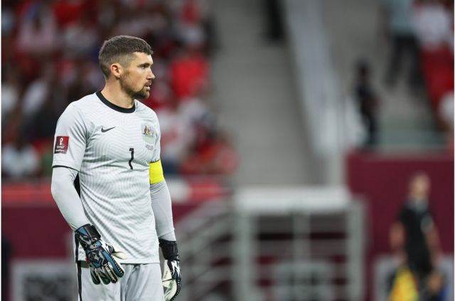
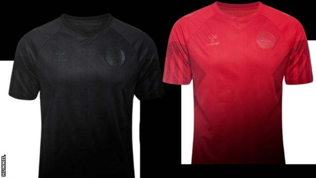
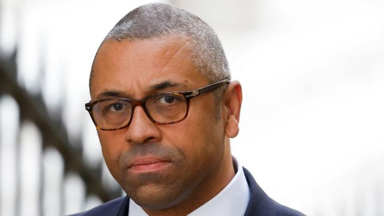
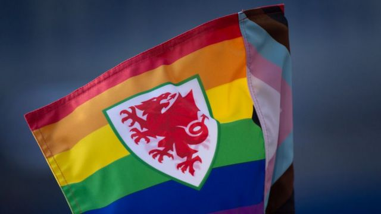

# [World] 2022世界杯：澳大利亚球员发视像声明，集体声讨卡塔尔人权状况

#  2022世界杯：澳大利亚球员发视像声明，集体声讨卡塔尔人权状况

> 图像来源，  Getty Images
>
> 图像加注文字，澳大利亚国家队队长麦特·莱恩亦出现在相关的视像声明中。

**澳大利亚国家足球队发布一段视像形式的集体声明，批评世界杯主办国卡塔尔的人权纪录，是目前第一支参赛队伍以这种形式抗议。**

视频当中，澳大利亚球员批评世界杯主办国对待移民劳工和LGBTQ+（同性恋、双性恋及跨性别）人士的方式。

澳大利亚足协（Football Australia）也发表了声明，称工人和他们的家庭承受的“痛苦”因这次赛事而起，这些“不能被漠视”。

澳大利亚是卡塔尔世界杯的参赛队伍之一，本届赛事于11月20日开幕。

该 视频  当中出现的16名球员呼吁为移民劳工和同性恋合法化进程作“有效的补偿”。

##  “我们没有所有的答案”

参与视频声明的16名澳大利亚国脚包括队长麦特·莱恩（Mat Ryan）、桑德兰队（Sunderland，新特兰）后卫拜利·赖特（Bailey Wright，贝利·胡礼）、哈茨队（Hearts，赫斯）球员凯·罗尔斯（Kye Rowles）和工会组织澳洲职业球员协会（Professional Footballers Australia）的会长、2015年最后一次代表国家队的亚历克斯·威尔金森（Alex Wilkinson，亚历斯·韦坚逊）。

> 图像来源，  AMA/Getty Images

“解决这些问题并不容易，而我们没有所有的答案，”球员们在视频中说。

“我们与国际职业球员联合会（FIFPro）、国际建筑工人及木工联合会（Building and Wood Workers International）和国际工会联合会（International Trade Union Confederation）一致，寻求在卡塔尔促成改革和长久的影响。”

“这必须包括设立移民资源中心，为那些权利被剥夺的人士作有效的补偿，以及所有同性恋关系非刑事化。”

“这些是基本的权利，应当赋予所有人，而且将会保证卡塔尔的持续进步，带来一份能够在2022国际足联世界杯结束后仍长久存在的遗产。”

在声明中，这些球员认可了其中一些改革，比如废除允许雇主没收工人护照并阻止他们离开卡塔尔的所谓“卡法拉”（kafala）制度；但是他们表示，这些变革并没有持续一致地执行，并且力度也不够。

##  “所有人都应该感到安全”

澳洲足协的声明也提到卡塔尔有关LGBTQ+的法律——在这个海湾国家，同性恋行为被列为非法，最严重可被判死刑，以至于英国外交大臣克莱弗利（James Cleverly）呼吁从英国的同性恋球迷在卡塔尔应该“灵活妥协”。

克莱弗利因此在英国国内受到批评，而卡塔尔的相关法律亦遭各国诟病。

澳足协声明指出：“作为我们国家最为文化多元和最包容的运动，我们相信每一个人都应该能够感觉到安全，并且做他们真实的自己。”

“虽然我们知道最高层的卡塔尔埃米尔和国际足联（FIFA）主席保证LGBTI+的球迷在卡塔尔将会得到安全和欢迎，但是我们希望这种开放能够在赛事结束之后持续下去。”

澳大利亚阿德莱德联队（Adelaide United）后卫约书亚·卡瓦洛（Joshua Cavallo，祖舒亚·卡华路）是目前全世界唯一公开出柜的顶级联赛现役球员。他代表澳大利亚20岁以下青年队出场过一次。

##  各国的抗议方式

澳大利亚国家队的视像声明是目前本届世界杯参赛队伍当中抗议姿态最鲜明的行动之一。

澳洲职业球员协会发表声明赞扬这段视像声明，坦言相关立场“可能未必被广泛接受”，但是这一举动在世界日益分裂的情况下“说明了球员的勇气”。

> 图像来源，  Hummel
>
> 图像加注文字，丹麦世界杯球衣：黑色（左）和红色（右）。

澳大利亚在本届世界杯被分在D组，与卫冕冠军法国队，以及丹麦、突尼斯同组。

同组的丹麦队此前已经就卡塔尔的人权问题作出抗议，方式是在世界杯期间身穿“淡化”球队队徽及赞助品牌元素的 球衣  比赛。

此外，还有包括英格兰在内的九个欧洲国家或代表队将佩戴印有“One Love（同一份爱）”字样的彩虹臂章出场，以抗议卡塔尔关于同性恋的法律，即使相关行动可能不受国际足联允许。

国际足联规定，参赛队伍的球衣及基本必要装备不得带有政治、宗教和个人意味的标语、声明或图像。

此前，德国、荷兰以及挪威国家队均曾在预选赛前身穿印在抗议卡塔尔人权状况字样的衣服出场。

德国队球员在去年3月的一场预选赛前身穿印有单一字母、拼起来为英文“人权”字样的T恤列队出场以示抗议，荷兰队则在T恤上印上“足球支持变革”字样，后来未出线世界杯的挪威队则在衣服上印有“人权，球场内外”字样。

##  因人权备受争议的主办国

国际足联在2010年将本届世界杯主办权授予卡塔尔的决定一直备受批评。参赛球员对于赛事东道主的选择和运作方式也没有发言权。

人权组织批评卡塔尔对待外国劳工的方式，并指有大量工人在建设世界杯设施期间死亡。

2021年2月，《卫报》报道指，自卡塔尔获得世界杯主办权以来，有6500名来自印度、巴基斯坦、尼泊尔、孟加拉国和斯里兰卡的移民劳工在该国死亡。

统计数字是基于各国驻卡塔尔使领馆提供的数据。

但是，卡塔尔政府表示，相关的统计具有误导性，因为并非所有记录在案的死者都死于与世界杯相关项目。

卡塔尔政府指，其事故记录显示，在2014至2020年间，有37名劳工死于世界杯场馆工地，当中只有三起是“与工作有关”。

##  英外相建议LGBT球迷在卡塔尔“妥协”遭批

> 图像来源，  Getty Images
>
> 图像加注文字，詹姆斯·克莱弗利于9月6日被英国前首相特拉斯任命为外交大臣，新首相苏纳克上台后保留了他的外相职位。

英国外交大臣詹姆斯·克莱弗利（James Cleverly）在媒体上建议，从英国前往卡塔尔观赛的同性恋球迷为保障自身安全应当“灵活妥协”，他的言论受到批评。

他在接受伦敦广播公司（LBC）访问时表示，从英国前往卡塔尔为球队助威的球迷，应当“尊重主办国”，英国有英格兰和威尔士两支代表队参加本届赛事。

克莱弗利的言论随即引来首相发言人的回应，后者指，LGBT球迷不应该被要求委曲自己的真实身份。

工党也强烈批评克莱弗利的言论。

> 图像来源，  Getty Images
>
> 图像加注文字，图为支持LGBT球迷和球员的威尔士足球旗。

影子文化大臣露西·鲍威尔（Lucy Powell）指责克莱弗利的言论“脱节到令人震惊”。她说，“体育应对所有人开放”，而很多球迷却因为卡塔尔糟糕的人权纪录和同志权益保障而觉得自己无法去看比赛。

她表示，英国政府应该反对相关做法，而不是维护歧视性的法律。

之后在天空新闻台（Sky News）的另一个访问中，克莱弗利重申自己的观点：“这些是穆斯林国家，它们的文化出发点与我们非常不一样。”

他表示，当你到访一个国家时，应当尊重东道主的文化。

同性恋行为在卡塔尔属非法，惩罚措施包括罚款，最高七年监禁甚至死刑。在这个海湾国家，LGBT人士并没有法律保障。

包括英格兰在内的九个欧洲国家或代表队计划将佩戴印有“One Love（同一份爱）”字样的彩虹臂章出场，以示抗议，即使相关行动可能不受国际足联允许。

克莱弗利称自己将会到场观看卡塔尔世界杯，还表示英国“在中东有非常重要的合作伙伴”。

英国外交部长期向前往各国旅游的国民提供出行建议。关于卡塔尔，英外交部有提示民众，同性恋在该国属非法，建议出行前参考英国政府的相关信息。

