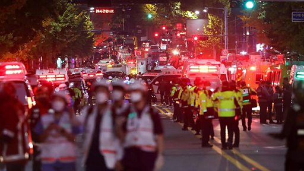

# [World] 梨泰院踩踏：首尔万圣节活动事故过百人死亡

#  梨泰院踩踏：首尔万圣节活动事故过百人死亡

**梨泰院踩踏：首尔万圣节活动事故过百人死亡**

最近更新： 2022年10月30日

韩国首尔知名商圈梨泰院发生踩踏事故，紧急服务部门表示至少153人死亡，其中包括20名外国人。

当地官员说，目前已知有82人受伤，死亡人数仍有可能上升。

据韩联社报道，外籍遇难者人数已增至20人，其中有中国、伊朗、乌兹别克斯坦和挪威公民。

消防人员表示，事发于星期六（10月29日）首尔时间22:22（格林尼治标准时间13:22）。据报道，约10万人当时聚集在商圈周边，庆祝新冠病毒病（COVID-19）疫情以来，首个不用戴口罩的万圣节。

来自现场的影片显示，急救人员对倒下的人施行心肺复苏术。BBC首尔摄像记者李浩硕 （Hosu Lee）看到多具遗体被抬走。

踩踏原因目前有待调查。韩国总统尹锡悦为此召集紧急会议。

美国总统拜登已就首尔万圣节悲剧向韩国“失去亲人的家人致以最深切的哀悼”。他说：“我们与大韩民国人民一起悲痛，并向所有受伤的人致以最良好的祝愿，祝他们早日康复。”

拜登表示，“在这个悲惨的时刻，美国与大韩民国站在一起。”

加拿大总理特鲁多也向韩国表示“最深切的哀悼”。

