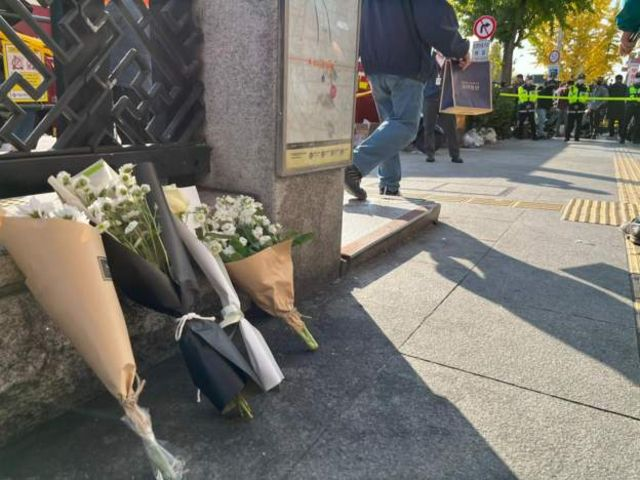
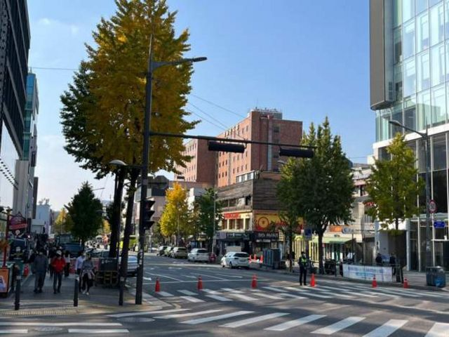
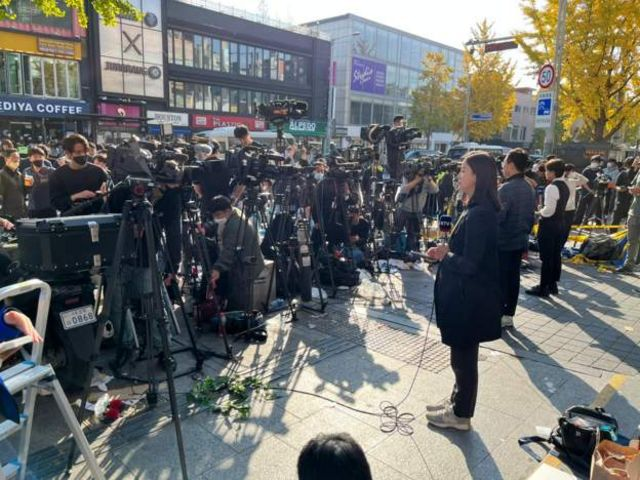
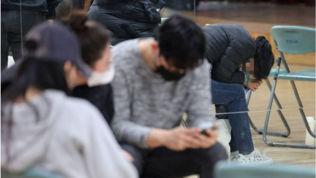
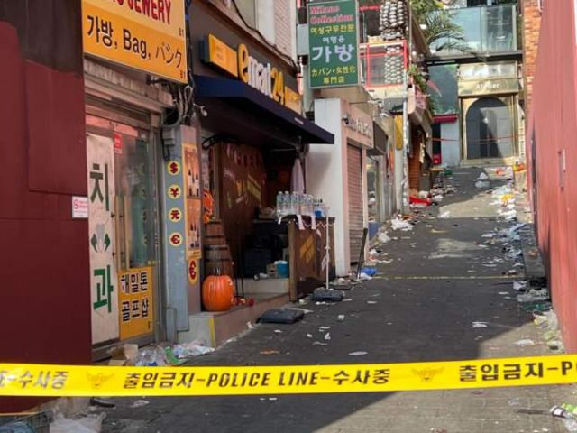
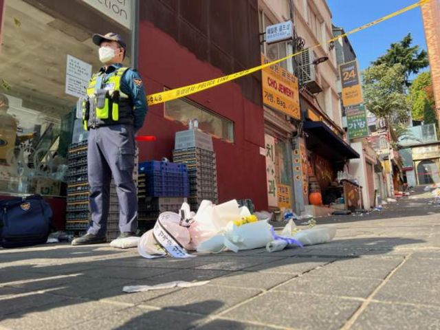
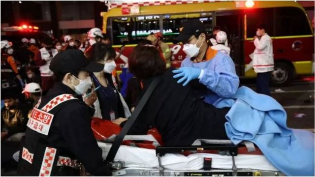
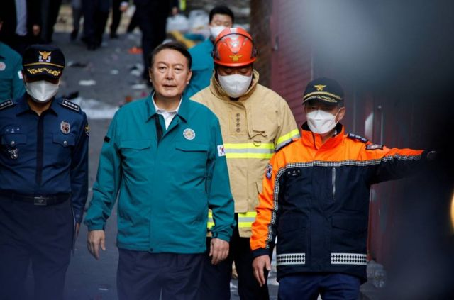

# [World] 韩国首尔梨泰院踩踏事件：150多人死亡，四名中国人遇难

#  韩国首尔梨泰院踩踏事件：150多人死亡，四名中国人遇难

最近更新： 4 小时前

**韩国首尔知名商圈梨泰院发生踩踏事故，紧急服务部门表示至少154人死亡。遇难外国人增加至26人，其中包括4名中国公民。**

首尔当地官员说，目前已知有133人受伤，死亡人数仍有可能上升。

中国驻韩国大使馆领侨处星期日（10月30日）证实，据韩国警方通报，目前已确认4名中国公民在首尔市龙山区梨泰院洞一带29日晚间发生的踩踏事故中死亡，两名中国公民受轻伤。

据中国央视报道，10月30日，中国国家主席习近平就韩国首尔发生踩踏事故，造成重大人员伤亡向韩国总统尹锡悦致慰问电。

习近平表示：“惊悉韩国首都首尔发生踩踏事故，造成重大人员伤亡。我代表中国政府和中国人民，对遇难者表示深切的哀悼，向遇难者家属和伤者致以诚挚的慰问。”

习近平还说，“此次事故造成数名中国公民不幸伤亡，希望韩方尽一切努力予以救治并做好善后。”

中国驻韩国大使馆领侨处表示，使馆已要求韩方做好中国籍死者相关善后，并同死者家属取得联系，向其表示慰问并将提供积极协助。

> 图像加注文字，人们事发现场留下鲜花悼念遇难者。

> 图像加注文字，首尔知名商圈梨泰院附近的街道

> 图像来源，  Reuters
>
> 图像加注文字，失踪者家属在首尔社区中心等待消息。

据韩联社报道，外籍遇难者人数已增至20人，其中包括中国、伊朗、乌兹别克斯坦和挪威公民。

泰国驻首尔大使馆表示，死者中有一名泰国公民。澳大利亚大使馆亦证实，其中一名公民也在事故中丧生。

这是自2014年造成304人遇难的“世越”号沉船事故以来韩国丧生人数最多的一起事故。

首尔汉南洞社区服务中心对BBC表示，踩踏事件后找不到子女的家长目前已向当局提交了2900份失踪报告。许多焦虑的亲属也一直在该中心等待亲人的消息。

> 图像来源，  Reuters
>
> 图像加注文字，踩踏事故发生后，一名男子在现场接受救援队成员的医疗救助。

> 图像加注文字，星期六晚上发生踩踏事件的小巷现场已被警方封锁。

踩踏事故发生在梨泰院世界美食街上哈密尔顿酒店附近路宽约4米的陡坡窄巷里。踩踏原因目前有待调查。

这条陡坡窄巷当晚挤满了人。社交媒体上的图片和视频显示，这条小巷人满为患，人们无法动弹。一段视频显示人们呼吸困难。在另一段录像中，紧急救援人员试图将人们从踩踏跌倒的人堆中拉出来。录像中可以听到人们痛苦的喊叫声。

因踩踏受伤的市民呼吸困难而倒在路上，被救援人员分别转移到大路上。救援人员拼命对那些昏迷不醒的人进行心肺复苏术。有些人被抬上救护车。

一些抢救无效者已被衣服或蓝色的毯子覆盖，沿着街道排成一排。

但目前遇难者遗体已从街上搬到体育馆，供家人前去辨认。

> 图像来源，  Getty Images
>
> 图像加注文字，韩国政府表示将“启动一切可用的应急医疗体系，为伤员及时提供医疗救助”。

据韩国消防部门统计，截至星期日（10月30日）上午9点，踩踏事故已经造成151人死亡，82人受伤。死者中97人为女性，54人为男性。

消防人员表示，事发于星期六（10月29日）首尔时间22:22（格林尼治标准时间13:22）。据报道，约10万人当时聚集在商圈周边，庆祝新冠病毒病（COVID-19）疫情以来，首个不用戴口罩的万圣节。

> 图像来源，  Reuters
>
> 图像加注文字，践踏事故发生梨泰院世界美食街上哈密尔顿酒店附近路宽4米的陡坡窄巷里。踩踏原因目前有待调查。

来自现场的影片显示，急救人员对踩踏事故中倒下的人施行心肺复苏术。BBC首尔摄像记者李浩硕 （Hosu Lee）看到多具遗体被抬走。

首尔大学附属医院急诊医学科教授洪基正对韩联社表示，由于是大规模人群踩踏事故，开始救人的时候已有许多人窒息而死，心肺复苏无效。

首尔大学医学院宋庆准教授则表示，救护人员赶到时，大多数伤员已经停止心跳，说明被压在人堆下胸廓受压，肺部无法膨胀，呼吸衰竭而死。

> 图像来源，  Reuters
>
> 图像加注文字，梨泰院踩踏事故发生后，韩国总统尹锡悦发表全国讲话并前往事故现场。

韩国总统尹锡悦就梨泰院踩踏事故召集紧急会议并发表全国讲话，宣布星期日起到11月5日为全国哀悼期。在哀悼期间，所有的公共机关和驻外外交机构降半旗。

尹锡悦表示政府将彻查事故原因，并指示有关部门对各地活动实施紧急检查。

韩联社引述尹锡悦说，此次惨痛事故令他“心情沉重，无比悲伤”。他表示“为遇难者祈求冥福，祝愿伤者早日康复，向失去亲人的遗属表达深切慰问”。

美国总统拜登已就首尔万圣节悲剧向韩国“失去亲人的家人致以最深切的哀悼”。他说：“我们与大韩民国人民一起悲痛，并向所有受伤的人致以最良好的祝愿，祝他们早日康复。”

拜登表示，“在这个悲惨的时刻，美国与大韩民国站在一起。”

加拿大总理特鲁多也向韩国表示“最深切的哀悼”。

##  世界各地的踩踏事件

过去十年，世界各地多次发生致命的大规模人群踩踏事件。

**沙特阿拉伯** ：2015年，在麦加朝觐期间，据报有超过2000人死于大规模的踩踏事件。

**印度尼西亚** ：2022年10月1日晚，印度尼西亚东爪哇省玛琅市的一场甲级足球联赛发生赛后踩踏事故，130多人死亡。

**印度** ：2013年，在中央邦举行的印度教节日上发生踩踏事故，有115人丧生，有些人被踩踏身亡，有些人从桥上跳下后淹死。

**科特迪瓦** ：2013年，在阿比让的新年庆祝活动中发生踩踏事件，至少60人死亡。

