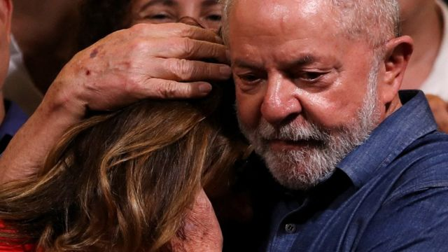
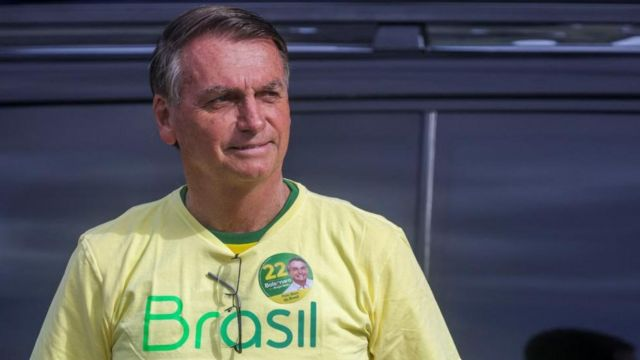

# [World] 巴西大选：卢拉卷土重来，大选击败现任总统博尔索纳罗

#  巴西大选：卢拉卷土重来，大选击败现任总统博尔索纳罗

  * 凡妮莎·布什斯克鲁特（Vanessa Buschschlüter） 
  * BBC新闻网站拉丁美洲编辑，发自里约热内卢 

> 图像来源，  Reuters
>
> 图像加注文字，得知胜选后，卢拉拥抱夫人罗桑吉拉

**巴西政坛再度回归左翼路线。前总统路易斯·因纳乔·卢拉·达席尔瓦（Luiz Inácio Lula da Silva）在总统大选中击败现任总统雅伊尔·博尔索纳罗（Jair Bolsonaro）。**

在这场两极分化的选举中，两个在政治光谱上处于对立两端的竞争对手正面交锋，卢拉最终赢得50.9%的选票。

这一得票率足以击败博尔索纳罗，而后者的支持者此前还很有信心会获胜。

只不过，这场选举所凸显的撕裂状况似乎并不会消失。

这是一场令人震惊的回归，卢拉未能参加2018年的上一届总统选举，因为他当时在监狱里，被禁止参选。

他当时被控收受一家巴西建筑公司的贿赂，并以巴西国家石油公司（Petrobras）的合约作利益交换，被判有罪。

卢拉在监狱里度过了580天，之后他的裁决被判无效，他又回到了这场政治斗争中。

“他们想要将我活埋，但现在我又回来了，”他在胜选的演讲开头这样说道。

##  关于卢拉

  * 77岁 
  * 左翼政治立场 
  * 过去曾是金属制造工人 
  * 2003-2010年任总统 
  * 2018年被判入狱，但裁决之后被撤销 

选举之初的民意调查显示他会胜出，但是当他在首轮投票的领先优势远低于预期时，很多巴西人开始怀疑民调的准确性。

雅伊尔·博尔索纳罗则指控“建制派”和传媒反对他，并因此而对他的支持度轻描淡写。他的支持者受他的说法鼓舞，对他的胜利有十足信心。

左翼领导人的胜利可能会令博尔索纳罗的这些拥趸怨恨不已，他们常常将卢拉标签为“盗贼”，而且声称他的裁决被撤销，并不意味着他是无辜，只不过是没有遵循恰当的法律程序而已。

而虽然博尔索纳罗落败，但与他关系紧密的议员却在国会赢得了多数议席，意味着卢拉的政策将会在立法机构面临坚定的反对。

但是在2003年1月至2010年12月曾执掌两届政府大权的卢拉，在政界建立同盟方面是老手。

他选择的副总统竞选伙伴就是过去的对手杰拉尔多·阿尔克明（Geraldo Alckmin），后者在过往的选举中曾是卢拉的竞选对手。

他打“团结”牌的策略似乎奏效，也令那些原本没有考虑过这么做的人将票投给了他的劳工党。

在他的胜选演说中，他使用了一种和解的语调，声称他将会为所有的巴西人施政，而不仅仅是那些投票给他的人。

“这个国家需要和平与团结。这个国家的人已经不想再斗了，”他说。

博尔索纳罗尚未承认落败。这场选战如此激烈，一部分是因为极右翼的总统对巴西电子投票系统的可靠性提出质疑——但未有提供任何证据。

这使得人们担心，一旦结果不利于他，他可能不会接受。

不过，在第二轮之前一天，他曾表示：“没有半点怀疑。谁得票多，谁就赢。这就是民主的意义。”

##  关于博尔索纳罗

> 图像来源，  Reuters

  * 67岁 
  * 极右派政治立场 
  * 过去曾是陆军军官 
  * 此次选举是争取连任 
  * 他对巴西的电子投票系统提出没有根据的质疑 

选举日当天，载着选民前往票站的巴士被警方截停，卢拉阵营称这是在意图阻止他们投票。

选举法院院长亚历山德雷·莫莱斯（Alexandre de Moraes）下令高速公路警察解除所有的路障和检查点。

他说，虽然有些选民被阻延了，但没有人因此而无法投票。然而，这些事件令紧张情绪升级不少。

现在，很多人在等着看博尔索纳罗何时正式承认他的得票不及卢拉，以及届时他会说什么。

这场选举不仅在巴西国内受到密切关注，在国外也是。特别是环保活动人士，他们担心博尔索纳罗政府再执政四年会导致亚马逊雨林进一步被砍伐。

卢拉在胜选演讲中提到了这种恐惧，表示他“对于国际合作保护亚马逊持开放态度”。

“今天我们告诉全世界，巴西回来了。它这么大，不能被贬为全球贱民那样的悲哀角色，”他说道，并顺便挖苦了对手。

不过，他演讲的重心是承诺对抗饥饿，这个问题在巴西越来越严重，影响着超过3300万人。

卢拉在以前两个执政任期内之所以受欢迎，关键是帮助了数以百万计的巴西人脱贫。

但是在后疫情经济下，找到财政资源复制那样的政绩将不会是易事，特别是在受阻于一个敌对国会的情形下。

