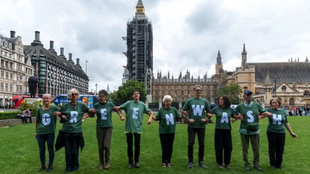
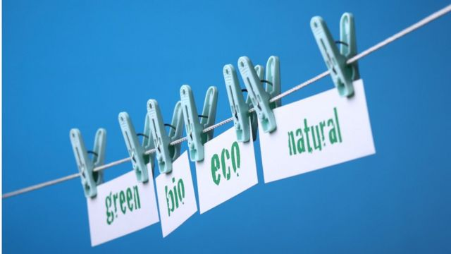
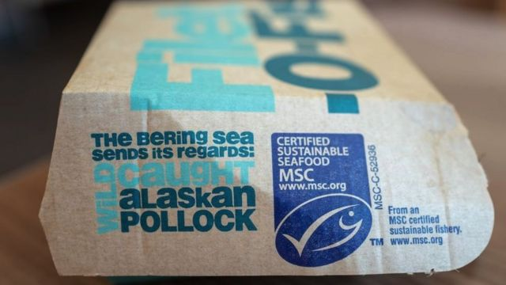

# [World] 联合国气候变化大会：什么是“漂绿”？怎样才能识别它？

#  联合国气候变化大会：什么是“漂绿”？怎样才能识别它？

> 图像来源，  Getty Images

**气候活动人士格蕾塔·桑伯格（Greta Thunberg）表示，她将不会出席11月6日至18日在埃及举行的联合国气候变化大会（COP 27）。**

这名19岁的女孩说，她做出这个决定的原因之一是，这将是“当权者……（使用）‘漂绿’、撒谎和欺骗”的一次机会。

她在伦敦的新书发布会上发表了上述言论，并表示，此前的COP大会都有“各种各样的漂绿”。

但什么是“漂绿”（greenwashing）?最重要的是，我们如何识别它?

##  都是为了说说而已

简单来说，“漂绿”是指对政府或公司行为对环境造成的影响进行误导或营造错误印象。

> 图像来源，  Getty Images
>
> 图像加注文字，格蕾塔·桑伯格

随着消费者越来越关注他们购买的产品是否合乎道德或“环保”，企业也做了相当大努力来展示自己的环保资质。

过去，一些企业被指控在他们的广告中有虚假的环境声明。

“如今，监管更加严格，企业很难‘编造’自己的绿色资质。”哥本哈根商学院研究“漂绿”的教授安德烈亚斯·拉施（Andreas Rasch）在接受BBC采访时表示。

“漂绿的性质已经改变了：例如，在20世纪90年代，他们可以公然撒谎。现在，他们探利用灰色地带，”拉施说。

> 图像来源，  Getty Images
>
> 图像加注文字，企业在强调其环保资质方面做了相当大的努力。

##  毛巾的问题

“漂绿”一词最早是由美国环保主义者杰伊·韦斯特维尔德（ Jay Westerveld）在1986年的一篇文章中提出。他在文中批评了酒店要求客人重复使用毛巾的做法，这被认为这是一种环保措施。

韦斯特维尔德称，酒店老板更感兴趣的是降低洗衣成本，而不是减轻其业务对环境的影响。

但这只是如何让产品或服务对关心环境的人更有吸引力的一个例子。

“漂绿”的其他例子还包括，做出未经证实的减排声明，或将食品描述为“天然”或“对生态环境友好”，但实际上只有部分成分属于这类。

这些说法可能很普遍，而且难以核实。在2021年对500家公司网站的审查中，国际消费者保护执行网络（International Consumer Protection and Enforcement Network）发现，40%的公司网站发布了有误导的环保声明。国际消费者保护执行网络是一个全球消费者保护机构网络。

> 图像来源，  Getty Images
>
> 图像加注文字，像"可持续"和"天然"这样的标签上的词通常没有科学证据支持。

然而，有很多方法可以检查一家公司的环保资质。一个很好的起点是看看官方的可持续性认证，如碳信托（Carbon Trust）、公平贸易基金会（Fairtrade Foundation）和共益企业运动发布的认证。

苏·戴维斯（Sue Davies）是一家消费者组织负责人。戴维斯对BBC表示，消费者应该尽量找到另一个权威的信息来源，来验证制造商的声明。

“想想大局。例如，能把一次性塑料水瓶的环保声明当真吗?”

另一个方法是将公司作为一个整体来看待。例如，时装品牌可能会推广用“可持续”面料制成的服装，即使他们的其他服装系列会对环境造成破坏。

戴维斯说，缺乏透明度是一个重要指标， 说明一家公司没有积极应对给环境带来的影响。

> 图像来源，  Getty Images
>
> 图像加注文字，独立的可持续性认证是检查产品环保资质的好方法。

“如果你很难找到一个产品、品牌或服务的环保信息，就把它当作一个警示信号吧。”

“那些有所隐瞒的公司，或者没有好故事可讲的公司，往往会让消费者更难核实它们的环保资质，”她说。

##  科技的一点帮助

科技在推动获取更多信息的过程中发挥了作用。智能手机用户可以依靠“品牌透明度”应用程序来查看一家公司在从动物福利到工作伦理等一系列问题上的承诺。

“应用程序让人们更容易获得有关消费可持续性的信息，这对试图漂绿的企业来说是个坏消息，”拉施说。

“社会期望提高了，企业不能只是做出我们无法衡量的大承诺。”

> 图像来源，  Getty Images
>
> 图像加注文字，手机应用程序可以帮助人们验证一系列公司的可持续发展资质。

他还说，这种意识的提高也将各国政府放在聚光灯下。

“我理解格蕾塔·桑伯格的意思。她指的是政府如何做出不一定会落实的承诺。”

“漂绿基本上是指你说话不算数，这不仅仅发生在商界，”拉施说。

