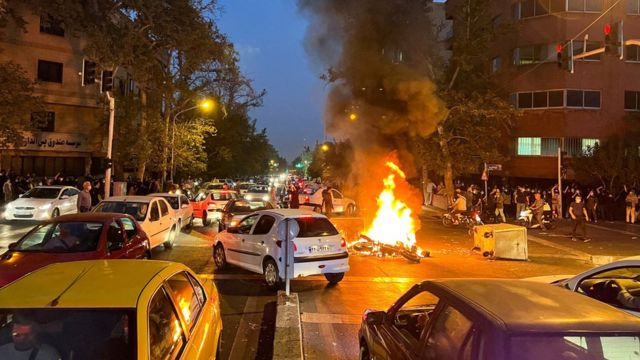
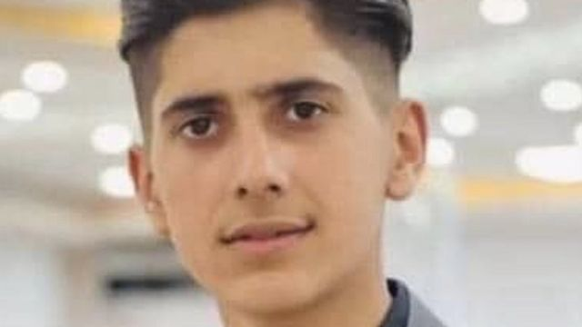
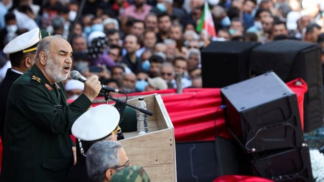

# [World] 伊朗宣布公审千名抗议人士，面临西方进一步制裁

#  伊朗宣布公审千名抗议人士，面临西方进一步制裁

> 图像来源，  Reuters
>
> 图像加注文字，德黑兰宗教政权形容反政府示威是外人煽动的“暴动”。

**伊朗检察官员宣布将于本周公审约1000名与近日反政府示威有关人员。他们被指控“破坏活动”罪名，包括“谋杀保安部队人员”和纵火。**

公审将由专门处理政治案件的革命法庭负责。德黑兰当局并未说明抓捕了多少人，但人权活动人士称，伊朗全国有1.4万人因示威活动被捕。

连串示威源于一名被道德警察指控佩戴头巾“不当”的女子在拘留期间死亡。加拿大外交部长拉妮·乔利（Mélanie Joly；赵美兰）星期一（10月31日）宣布进一步制裁伊朗警察与司法机关官员。德国总理肖尔茨（Olaf Scholz）也表示，欧盟正考虑进一步制裁德黑兰当局。

伊朗则宣布制裁美国中央情报局（CIA）、美国空军第九航空队、美国国民警卫队等机关与个人，指责华府在其境内“煽动恐怖活动”，又要求世界各国不要参加美国要求在星期三（11月2日）召开，专门讨论伊朗示威形势的一次联合国安全理事会非正式会议。
 BBC波斯语网介绍  ，伊朗革命法庭是1979年伊斯兰革命的产物，用以将反革命人员集体判罪。来自英国与荷兰海牙的伊朗人活动团体数据称，法庭设立的前一个10年里，超过1.6万人被革命法庭处死。

观察人士指出，革命法庭的法律约束比正规法庭随意，判决偏向强硬，且难以预测。

德黑兰当局星期一宣布将公审示威人士之际，两名怀疑被政府保安部队夺命的示威青年在该国东北部出殡下葬。
 总部设在挪威的伊朗库尔德族人人权团体Hengaw称  ，16岁的库马尔·达罗法塔（Kumar Daroftateh）星期天（10月30日）在帕里沙哈尔市（Piranshahr）遭近距离枪击，至晚间于医院不治死亡。在星期一的葬礼上，吊唁宾客纷纷叫喊反政府口号。

> 图像来源，  Kurdistan Human Rights Network
>
> 图像加注文字，伊朗库尔德族人活动人士称，16岁的库马尔·达罗法塔（Kumar Daroftateh）在示威中遭保安部队人员开枪击中。

位于帕里沙哈尔市南面的萨南达杰市（Sanandaj），群众聚集在16岁少女萨里娜·赛义德（Sarina Saedi）墓前。BBC波斯语记者卡斯拉·纳吉（Kasra Naji）报道说，目击者看到赛义德在几天前的示威中倒地，在此之前，武装部队曾向天开枪。但其父亲被迫在电视上宣称女儿自杀身亡，从而为武装部队开脱。

“伊朗人权活动者通讯社”（HRANA）称，示威爆发至今，全国有284人在保安部队镇压示威期间被杀，包括45名儿童。保安部队一方则有35人死亡。

德黑兰当局形容示威是伊朗外敌煽动的“暴动”，誓言严惩参与者。伊朗司法总监格拉姆—侯赛因·穆塞尼—艾杰耶（Gholam-Hossein Mohseni- Ejei）星期一称，法官将“准确、迅速地处理与近期暴动有关案件”。

伊朗国家通讯社（IRNA）引述穆塞尼—艾杰耶说：“那些试图对抗和颠覆政权，并投靠外人的人将被依法惩处。”

德黑兰一处革命法庭上星期六（10月29日）开始审判五人，其控罪可被判处死刑。法院表示，其中一人开车撞死警员，被起诉“尘世腐败”罪；一人涉嫌持刀袭击警察，并纵火焚烧政府大楼，被起诉“仇恨真主”罪。

> 图像来源，  WANA NEWS AGENCY VIA REUTERS
>
> 图像加注文字，伊斯兰革命卫队总司令萨拉米少将（左）警告群众勿再上街。

伊朗最高军事组织伊斯兰革命卫队总司令侯赛因·萨拉米少将（Maj-Gen Hossein Salami）当天向示威者发出最后通牒。他说：“今天是暴动的最后一天，别再到街上去。”

但示威并未因此平息。视频显示，全国十多所大学学生星期天继续上街，持械便装人员在德黑兰伊斯兰阿扎德大学（Islamic Azad University）其中一所分校以催泪弹和棍棒攻击示威者。
 另有消息称  ，保安部队在萨南达杰市库尔德斯坦大学（Kordestan University）向抗议学生开火。

9月16日，22岁女子马赫萨·阿米尼（Mahsa Amini）在德黑兰被道德警察抓捕后，于拘留期间晕倒，最终死亡。道德警察指控她佩戴希贾布（hijab）头巾“不当”，违反相关法规。

一些报道称，警员以警棍殴打阿米尼头部，并将她的头撞向车身。警察否认暴力对待阿米尼，并声称她心脏病发。

阿米尼出殡后， 示威接连爆发  ，一些女性当众脱下头巾以示团结。示威逐渐演变成德黑兰宗教政权自1979年革命上台以来所面对的严厉挑战之一。

