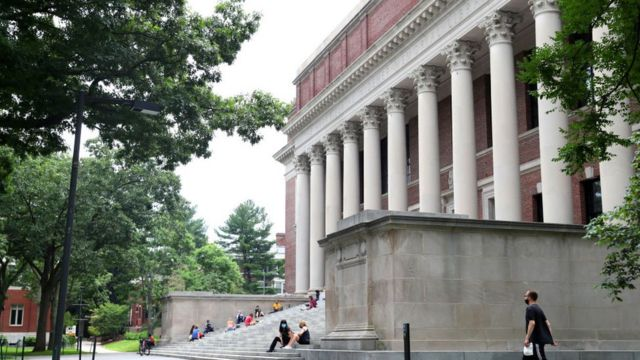
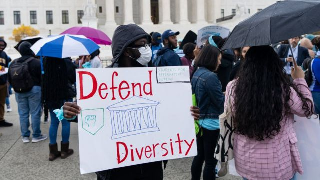

# [World] 哈佛等名校招生能否考虑种族 美国高院有望给出最终答案

#  哈佛等名校招生能否考虑种族 美国高院有望给出最终答案

> 图像来源，  Getty Images
>
> 图像加注文字，近期的法院审理涉及到哈佛和北卡两所大学。

**美国最高法院近期审理了两起案件，其结果可能会极大地改变美国大学在招生过程中的种族考量，即要在多大程度上考虑申请人种族的因素。**

本周一审理的案件涉及哈佛大学和北卡罗来纳大学。法院听取了对其招生政策的质疑，这些政策在评估申请者时考虑了种族等诸多因素。

上述两校考虑招生时的种族比例，最初的目的是提高黑人和西班牙裔学生的数量，确保少数群体在本校学生中有公平体现。

但美国最高法院正在权衡的是，这些政策是否具有歧视性，是否违反了民权法。而其最终决定可能会从根本上影响全美数百所大学的招生计划。

原告是一个名为“大学生公平录取”（Students For Fair Admissions，简称SFFA）的非营利组织，他们指控哈佛大学歧视亚裔申请人，以提高其他群体的代表性。

该案之所以备受瞩目，因为其最终裁决可能会终结几十年来的“平权行动”，并极大地影响大学的招生标准。

"平权行动”（Affirmative Action），又称“积极平权措施”或“平权法案”，是指防止对“肤色、宗教、性别或民族出身”等少数群体或弱势群体歧视的手段。

美国政府自1960年代推动该政策，给予上述群体优待，以纠正历史上与之相关的明显歧视。

但是近年来，对平权措施的质疑声不断高涨。

本次审理中，最高法院中的保守派法官似乎对这些政策持怀疑态度。

在北卡罗来纳大学的案件中，SFFA认为，该大学在招生过程中考量种族的做法，违反美国宪法以及公立大学需要遵守的联邦民权法。

法院的九位法官预计将在2023年7月任期结束时做出决定。

2014年SFFA首次起诉哈佛大学，该案件此后一直在美国法院系统内进行审理。

SFFA背后是由保守派社会活动家布鲁姆（Edward Blum）领导的一群被哈佛大学拒之门外的亚裔美国学生，他们反对“平权行动”。

该组织特别要求最高法院推翻2003年具有里程碑意义的一起判例——Grutter诉Bollinger案。该案支持一所州立大学的平权政策，这一决定为大学在录取学生时将种族作为考量因素铺平了道路。

当前美国最高法院的九位大法官中，有六位属于保守派。经过一天的质询，法庭预计将更倾向于原告SFFA一方。至于他们会针对具体案件做出个案判决，还是做出对美国高等教育有更广泛影响的裁决，还有待观察。

在口头辩论中，保守派大法官就录取期间如何考虑种族问题向各大学提出了质询。其间，首席大法官约翰·罗伯茨（John Roberts）就一个假设情形提问，即大学的录取委员会，对经济背景相似的黑人申请人和白人申请人进行比较。

罗伯茨大法官问，根据哈佛大学的政策，黑人学生是否会因为他的种族而得到好处。“哈佛大学的做法，不是非常具有刻板印象吗？”他问。

哈佛大学的代理律师塞斯·瓦克斯曼（Seth Waxman）回答说，“根本不是每个黑人申请者都能得到好处。”

> 图像来源，  CQ-Roll Call, Inc via Getty Images
>
> 图像加注文字，美国高校的平权运动是否构成歧视，是这些案件中的关注焦点。

在法律文件中，哈佛大学否认歧视 ，并辩称它在法律规定的范围内将种族作为招生的一个因素。哈佛称其政策允许大学为学生提供更全面的教育体验。

哈佛等高校表示，他们把申请人的种族、经济状况和宗教信仰等因素综合考量，以建立准确代表美国种族和民族多样性的班级。

哈佛大学的代理律师在一份法庭文件中写道，“美国人已将多样性视为学习的组成部分，并相信通往领导层的道路向所有人开放。”

他们表示，推翻关于平权法案的判例，“将破坏公众对这些基本原则的信心”。

民意调查显示，人们对平权行动的态度各不相同，往往取决于问题的表述方式。

2021年的一项盖洛普民意调查发现，62%的美国人赞成平权行动。然而，皮尤研究中心今年早些时候发布的另一项民意调查发现，74%的美国人——包括大多数黑人或拉丁裔受访者——认为种族不应该被纳入大学录取的考量。

支持平权行动的人说，平权行动有助于纠正社会、经济和历史上的不平等，这些不平等使一些少数民族群体无法进入美国最精英的教育机构。

但批评者长期以来一直认为，在大学招生中考虑种族因素是歧视性的，这些政策以牺牲其他群体或个别学生为代价。

美国有九个州，包括加利福尼亚、佛罗里达、乔治亚和密歇根等，目前禁止公立学校中将种族作为录取时的考量因素。

