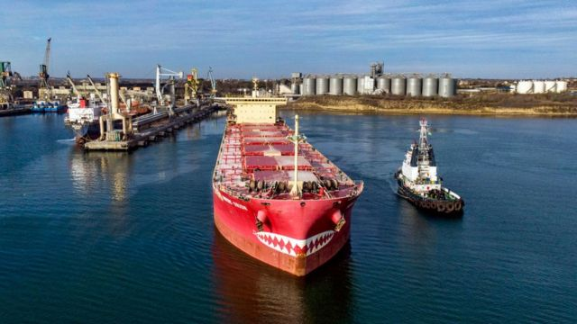
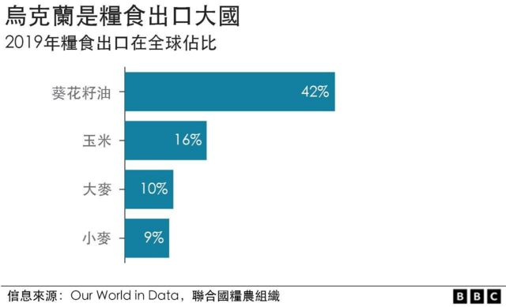
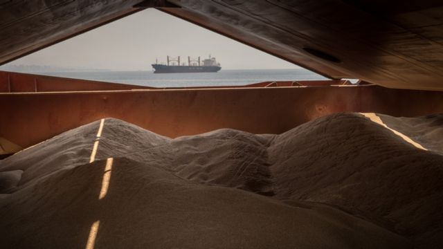
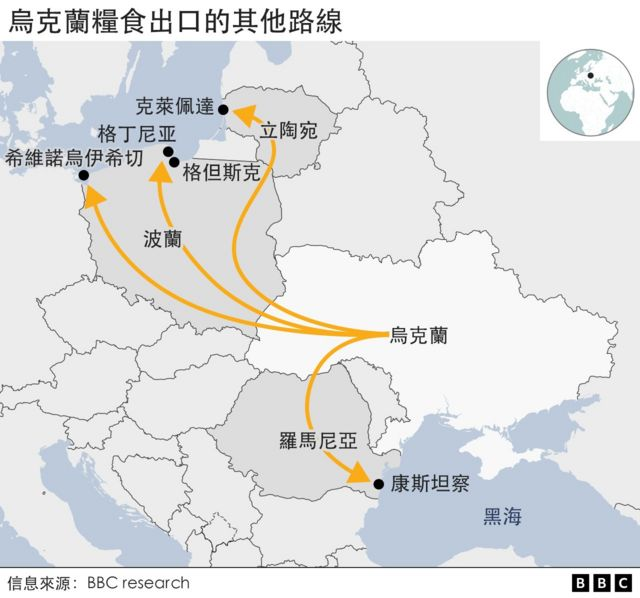
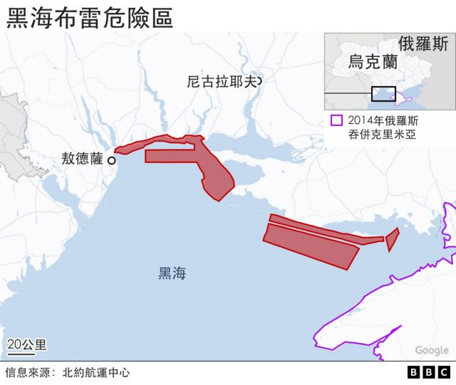

# [World] 俄乌战争：乌克兰出口了多少粮食？

#  俄乌战争：乌克兰出口了多少粮食？

8 小时前

> 图像来源，  Getty Images
>
> 图像加注文字，一艘装载乌克兰粮食的货轮准备从乌克兰港口出发，经过黑海出口。

**俄罗斯表示，它暂停允许乌克兰恢复从其黑海港口出口粮食的一项国际协议。这个决定对世界市场有何影响？**

俄罗斯于 2022年7 月份解除了对乌克兰的海上封锁，允许船只使用穿越黑海的安全走廊。

此后船只一直在使用这条走廊，但对协议破裂的担忧导致世界食品价格上涨。

俄罗斯总统普京11月初表示，俄罗斯正在暂停允许载有乌克兰出口粮食的船只安全通行的协议，但不是终止。

##  从乌克兰运出了多少食物？

俄罗斯入侵乌克兰后，其海军对乌克兰的黑海港口实施封锁，捕获了乌克兰境内多地大约2000万吨用于出口的谷物，以及玉米和葵花籽油等其他食品。

由于乌克兰是世界上最大的粮食出口国之一，这导致全球粮食价格飙升。

然而，双方于7月22日签署了黑海协议，为民事航运提供了安全走廊。

据联合国称，第一艘船于8月1日从乌克兰启航，截至10月28日，已有超过930万吨粮食通过黑海出口。

9月份，乌克兰通过黑海出口了400万吨粮食。

在俄罗斯入侵之前，它每月运送500万吨。

出口没有达到战前水平的一个原因是许多公司拒绝将货船送入黑海。

航运杂志《劳埃德名单》的大卫·奥斯勒说，这些公司仍然害怕他们的船只撞到水雷或被俄罗斯人袭击。

俄罗斯10月底宣布将退出俄国乌克兰黑海港口出口食品协议，乌克兰港口的航运出口暂停。

然而，装载食品的船只周一再次开始航行。

##  粮食送到哪里去了？

根据联合国人道主义救济方案，其中一些粮食直接运往世界上最贫穷的国家，一些粮食被运往人们正面临饥饿风险的国家。

然而，联合国的数据显示，过去3个月（8、9、10月）出口的大部分乌克兰粮食都运往了西班牙、土耳其、意大利、中国和荷兰。

在战前几年，乌克兰小麦的最大进口国是埃及、印度尼西亚和孟加拉国。

联合国在9月份表示，只有不到30%的乌克兰出口粮食送到了低收入国家，而44%的粮食被运往了高收入国家。

然而，从联合国粮农组织的食品价格指数来看，乌克兰恢复全球粮食出口有助于降低7月至10月底的粮食价格。

##  海上安全走廊运作情况如何？

俄罗斯和乌克兰都与土耳其签署了协议，以建立从敖德萨和两个邻近港口到伊斯坦布尔海峡的走廊。

这条走廊长310海里，宽3海里。

乌克兰船只引导粮食船，通过乌克兰军队铺埋的水雷进出港口。

> 图像来源，  Getty Images
>
> 图像加注文字，乌克兰粮船通过一条长310海里，宽3海里的黑海走廊出口粮食。

应俄罗斯人的要求，土耳其人员检查这些粮食船只是否有武器。

该协议原定于120天后（即11月中旬）到期，但人们曾希望延长该协议。

##  为何俄国要暂停协议？

俄罗斯暂时停止黑海走廊协议，称其“将无法保该协议下船只通行安全”。

俄国说，一艘使用该走廊的船只参与了对克里米亚塞瓦斯托波尔的海军基地的袭击（尽管联合国表示袭击发生时走廊内没有船只）。

在乌克兰，土耳其和联合国向航运公司保证走廊仍然安全之后，货船一直在继续使用走廊。

然而，在俄罗斯宣布这一消息后，全球小麦价格在世界商品交易所上涨了5%以上，玉米价格上涨了2%。

据认为，许多贸易商正在购买额外的谷物和玉米库存，以防俄罗斯决定采取进一步行动关闭黑海走廊。

##  不通过黑海乌克兰如何出口粮食？

战前，乌克兰90%以上的粮食出口都是通过海运。

当俄罗斯在 2 月入侵乌克兰后封锁乌克兰港口时，乌克兰试图使用卡车和火车通过陆路出口尽可能多的农产品。

欧盟建立了所谓的“团结通道”，以便乌克兰的粮食可以从波罗的海的港口以及罗马尼亚的康斯坦察港运出。

然而，缺乏公路和铁路运输能力意味着乌克兰最多只能通过陆路出口10%的粮食。

