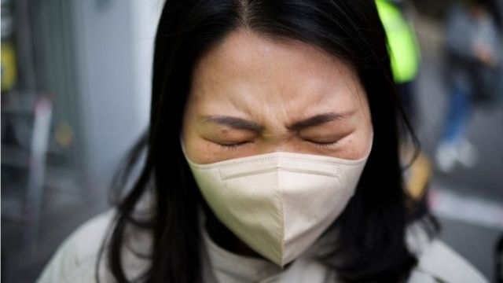
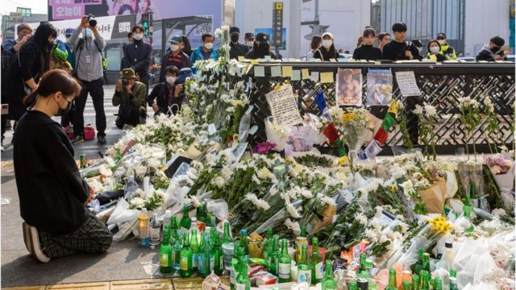
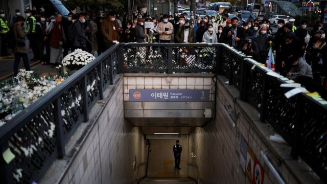

# [World] 韩国首尔梨泰院踩踏事件：惨剧发生前数小时就已有人报警

#  韩国首尔梨泰院踩踏事件：惨剧发生前数小时就已有人报警

> 图像来源，  Reuters
>
> 图像加注文字，这场灾难让人们震惊悲痛。

**从梨泰院打出的第一个报警电话是在当地时间18点34分，距离这起致命踩踏事件发生还有数个小时。**

拨打韩国112紧急电话的人说，他们在通往梨泰院的主干道上，汉米尔顿酒店旁边的一条小巷变得拥挤，很危险。

“那条小巷现在真的很危险，人群一直往上走却不能往下走，会出现挤压的。我好不容易才出来，太挤了。我觉得你应该控制这个情况。”打电话的人说。

警察问打电话的人意思是否是人们不能很好地流动，“他们被压到摔倒，然后就会发生大事故?”

是的，打电话的人回答，“现在真是令人不寒而栗”。

这是周六韩国首尔警方接到的至少10个电话中的第一个。但当地居民说，当晚的警力完全不够。

越来越多的证据、专家和一系列官方道歉都指向了明显的失职。当地官员和警察没有做好准备应对聚集的人群，一旦人们聚集，他们就很难控制住。

周二早些时候，韩国警察局长说，他们的紧急应对“不足”，这是官员们首次承认他们没有采取足够的措施来预防这种情况。

据估计，成千上万的人来到梨泰院庆祝万圣节。梨泰院以夜生活闻名。即使对于通常就很繁忙的这个街区来说，也是一个惊人的数字。

Jeong An- sook住在梨泰院主街后两个街区外的地方，距离事故发生地约300米。她试图在当地时间晚上9点到10点间出门，但她说自己所在街道上的人群非常密集，她无法动弹。她很害怕，于是便回了家。

当地时间22点回家的一名餐馆老板说，因为太拥挤，他甚至无法从梨泰院站下车。于是他去了另一个车站，绕道回家。

另一名女性正在卖鲜花，让人们放在为遇难者搭建的临时纪念点前。她是一名货币兑换商。她说，当时没有看到什么警察。她说，傍晚早些时候，当地志愿者试图组织人群，而不是警察。

她还表示，当地商业协会上周曾向警方请求帮助，控制周末的人群，但没有得到帮助。

据了解，龙山区议会召开了两次会议。第一次是在10月26日，参加者包括当地警察、地铁站站长和当地企业协会。第二天，议会工作人员举行了第二次会议，讨论如何处理周末的万圣节庆祝活动。

据龙山区网站介绍，他们讨论了新冠防疫措施、食品摊贩检查、大型场馆和地铁站安全、垃圾收集、非法停车等。10月27日，区长Park Hee- young说：“这是三年来第一个没有社交距离的万圣节。我们将尽一切努力确保居民的安全，因为我们担心新冠病毒的再次传播、毒品事件和其他事故。”

没有证据表明在这两次会议中有人提出或讨论了人群管控问题。

当地企业告诉BBC，10月初当地曾举办过地球村节，展示梨泰院的国际特色。这次活动由议会组织，准备了人群控制计划。

但事故发生后，区长Park Hee- young告诉当地媒体，龙山区已经尽了一切努力，但万圣节庆祝活动没有单一的组织者，这与其他活动不同。她已经向受害者和他们的家人道歉。

尽管官员们之间的指责游戏还在继续，但事实是，没有人阻止成百上千的人当晚在斜坡巷子里聚集，他们大多是十几岁或20多岁的年轻人。专家们说，一旦这种情况发生，接下来发生的事情几乎无法避免。

狭窄的空间把他们困住了，斜坡意味着当一些人掉下来时，会引发多米诺骨牌效应。人们同时向几个方向移动，推挤，试图逃离拥挤的人群。

> 图像来源，  Getty Images
>
> 图像加注文字，周二早些时候，韩国警察局长说，他们的紧急应对“不足”，这是官员们首次承认他们没有采取足够的措施来预防这种情况。

据称现场有人大喊“推，推”，因此引发了踩踏事件，警方正在对此进行调查，但专家表示，在他们所谓的“不正常人群”中，这是意料之中的。

韩国开放网络大学（Open Cyber University）消防安全教授Baek Seung- joo表示，每平方米超过5人被认为有潜在危险，而该小巷里每平方米至少有10人。他说，他是根据图像和录像做出这一估计的。

“出于本能，在这种情况下，人们不会互相帮助，他们相互竞争，不听从命令……你不能责怪那些在极端压力下推别人的年轻人，”他说，“当局应该对未能提前控制住人群负责。”

> 图像来源，  Reuters

官员和专家现在认为，之所以有这么多人涌向这条小巷，是因为它靠近梨泰院地铁站，那里的人流量很大。

韩国忠北大学灾难安全创新中心负责人Kwon Seol-a认为，官员们本可以保证地铁列车绕过梨泰院站，或阻止车辆进入该地区，为行人腾出更多空间。

但是官员们现在互相指责。韩国警方表示，他们要求首尔市地铁周六禁止列车在梨泰院站停靠，以限制人群。韩国地铁对此予以否认，称他们在这起致命踩踏事故发生一小时后才收到官方要求。

龙山警方还表示，当地企业要求他们在周末不要控制人群，以免减少顾客，当地商业协会否认此事。

但很明显，警方甚至没有采取其他地方所采取的最简单的人群控制措施。

不过，在死亡报告发生数小时前的第一次报警中，情况的严重性显而易见。

“现在没人控制它，”打电话的人说。“警方必须控制这种情况。你应该先让人出去，再让人进来。人们不断涌入，却出不去。”

**发生** **拥挤时的安全小贴士**

以下建议来自美国疾病控制与预防中心。

  * 把你的手放在胸前，“就像一名拳击手” 
  * 试着站稳 
  * 试着站起来 
  * 不要抗拒人群的力量 
  * 移动间歇时，你要朝对角线方向走到人群边缘 
  * 如果你摔倒了，蜷成一团保护自己 
  * 保持冷静，尽快站起来 

通常来说，人群控制专家还建议人们尽量保持站立，储存能量。

  * 集中精力呼吸空气，节省呼吸。在人群中，压在你身上的热量和重量会让你呼吸困难。节省你的氧气，不要浪费在尖叫上，除非是必须的。 

