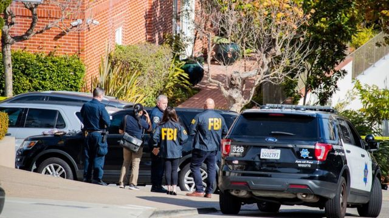
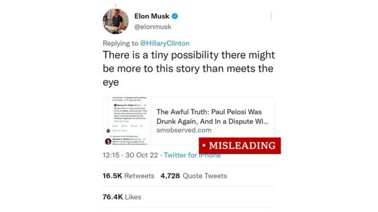
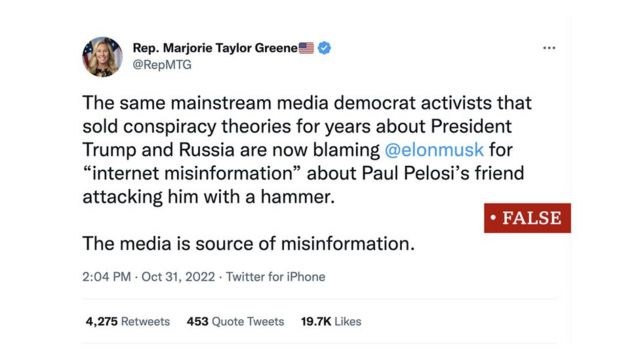
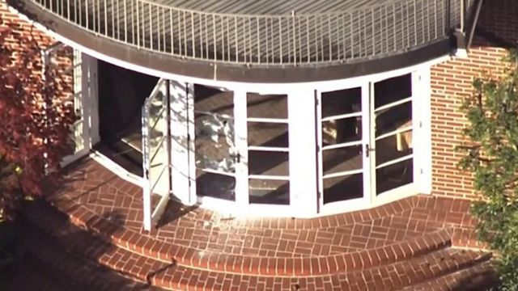
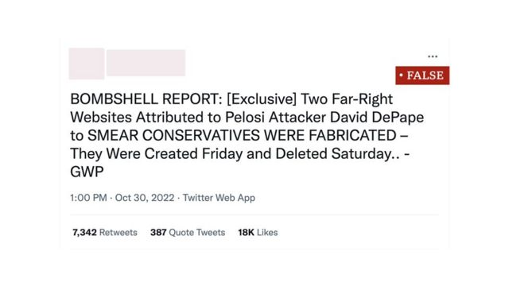

# [World] 佩洛西丈夫遇袭：盘点围绕美国众议院议长住所案件的网上虚假信息

#  佩洛西丈夫遇袭：盘点围绕美国众议院议长住所案件的网上虚假信息

> 图像来源，  EPA
>
> 图像加注文字，旧金山警察与美国联邦调查局同时参与调查佩洛西住家遇袭案，并分别起诉嫌疑人。

**美国中期选举临近之际，联邦众议院议长南希·佩洛西（Nancy Pelosi；裴洛西、波洛西）位于旧金山（三藩市）的住所** 10  月  28  日清晨遇袭  **，佩洛西当时身处首都华盛顿，其82岁丈夫保罗·佩洛西（Paul Pelosi）被手持铁锤的凶嫌打伤。**

42岁嫌疑人大卫·德帕普（David DePape）被警察在州法院控以企图谋杀罪和“以可致命武器伤人”等罪名， 星期二（11月1日）在加利福尼亚州高等法院旧金山县分院提讯  ，他不认罪，法官裁定收押候审。

他同时面对联邦调查局（FBI）另行起诉“袭击联邦官员直系亲属”罪与“意图绑架联邦官员”罪。

案发后数小时，边缘右翼圈子涌现一系列与警察官方公布案情相左，毫无根据的宣称，经 Twitter新掌舵人伊隆·马斯克（Elon Musk）  与多名保守派网红转发之后，迅速扩散。BBC国际媒体观察部（BBC Monitoring）记者莎伊安·萨达里扎德赫（Shayan Sardarizadeh）检视部分传言的背景与真伪。

##  “同性恋婚外情”宣称

一项颇为流行的失实宣称指出，佩洛西先生与袭击者德帕普是同性恋关系，两人当时醉酒打架。连串毫无根据，与官方案情不符的假设被用来支撑这叙述。

马斯克星期天（10月30日）向其1.12亿Twitter账号关注者转发某网站谈论近似宣称的文章后，这理论登上了美国热搜榜。他在数小时之后删除推文，但没有给出任何解释。

马斯克回应前民主党总统参选人希拉里·克林顿（Hillary Clinton）的一条推文说：“这故事有一点点机会大有文章。”

> 图像来源，  TWITTER

被马斯克转发链接的网站有多次发表不实报道的往绩， 包括在2016年发文宣称希拉里·克林顿死亡  。

网络上流传的其中一种宣称，是警察赶到现场时，德帕普与佩洛西先生当都只穿着内衣裤。
 但FBI对德帕普的刑事控告书（criminal complaint）中引述一名证人说  ，他身穿“全身黑色”衣服，且背有一个大型黑色背包。

另一个抓紧机会支持这论述的宣称是，两人在袭击发生前已互相认识，是朋友关系。共和党联邦众议员马乔里·泰勒·格林（Marjorie Taylor Greene） 星期一（10月31日）发推文重复了这宣称  。

> 图像来源，  TWITTER

据FBI诉状，保罗·佩洛西并不认识德帕普。佩洛西先生从浴室拨打911，以暗号报警。一名资深接线员解读出内容，知悉对方家中都在发生什么事情。

另一个支持两人彼此认识之说的传闻是，宅邸玻璃门的玻璃是从内向外爆开，说明是佩洛西先生或第三者让德帕普进门。

FBI诉状引述德帕普称，他“从一面玻璃门闯入宅邸，那很麻烦，得用上锤子”；警察笔录中没有任何证据显示宅邸内有第三者，或有第三者参与袭击。

> 图像来源，  Reuters
>
> 图像加注文字，有人宣称佩洛西宅邸的玻璃门是从内向外被破开，但该指控毫无证据。

##  针对美国第三号人物的“自杀任务”

> 图像来源，  Reuters
>
> 图像加注文字，佩洛西议长（左）有权代理美国总统职务。

作为联邦参议院议长，佩洛西夫人是美国总统第二顺位继承人。她与同龄的丈夫自1963年结为连理至今。佩洛西先生从事创业投资（风险投资）工作。

袭击发生后， 美国总统拜登（Joe Biden）批评行凶者行为“卑劣”  。

法庭文件显示，被告人向警察表示当天要施行“自杀任务”，劫持南希·佩洛西，只要她对自己“撒谎”便砸断“她的膝盖骨”。

美国司法部透露，德帕普闯入佩洛西宅邸后，曾大叫：“南希在哪里？”

被告人若被州法院定罪，将面临13年监禁；若联邦控罪被法院裁定有罪，将面临最高50年监禁。

袭击案发生后数小时，美国政府通告全国执法部门，警告地方暴力极端分子针对候选人与选举工作人员施袭“威胁增加”，这些潜在袭击者或许受“意识形态上的怨愤”影响而犯案。

##  宣称有人捏造德帕普的博客文章

警察在袭击发生后公布嫌疑人姓名，之后带有其名字的两个个人博客与一个Facebook账户先后被发现。这些账号之后相继被删除。

BBC曾阅览其文章，显示他被极右翼阴谋论熏陶而极端化。

他的帖文主题包罗万有，包括2020年大选被窃的无端理论， 2021年1月6日国会山庄暴动  ，新冠病毒病（COVID-19）疫苗有害，支持“匿名者Q”（QAnon）阴谋论，以及种族主义和反犹太主义帖文。

一些网民发帖宣称，这些博客都是假的，都是在袭击发生当天才制造出来，用以支持他相信极右翼阴谋论的说法。

> 图像来源，  TWITTER
 但BBC找到了博客截屏  ，说明他起码从8月开始就在发帖，这是案发前好几个星期。

也有人宣称，袭击不存在政治动机，跟德帕普的思想也没有关系。
 保守派评论人士马特·沃尔什（Matt Walsh）说  ，将袭击者描绘成“右翼好战分子”是“荒唐”，得克萨斯州联邦参议员参议员泰德·克鲁兹（Ted Cruz）也赞同沃尔什的说法， 他在Twitter上只回了一个词：“真相”  。

然而，警察诉状澄清，这并非一场随机袭击。据旧金山地方检察官布鲁克·詹金斯（Brooke Jenkins；谢安宜）所称，这场袭击有可能“受政治动机驱使”。

德帕普接受警察侦讯时形容南希·佩洛西为“领导民主党发表满口谎言的人”，并称他想要“砸破她的膝盖骨”。

近年曾遭政敌施以暴力袭击的保守派人物还包括 联邦众议员史蒂夫·斯卡莱斯（Steve Scalise）  和 最高法院大法官布雷特·卡瓦诺（Brett Kavanaugh）  。

##  针对马乔里·泰勒·格林毫无证据的指控

这起袭击发生后所涌现的无端指控并非只针对右翼阵营。

一些自由派网红盯上了联邦众议员马乔里·泰勒·格林在案发前一天发布的一条推文，内容是：“等到明天就好。”

多个有大量自由派关注的Twitter账户声称，泰勒·格林女士的推文 也许提示着她与袭击佩洛西先生有关  。这个理论并无任何证据支持。

**BBC** **国际媒体观察部（** **BBC Monitoring** **，前称** **BBC** **监听部）报告与分析来自世界各地电视、广播、网络和印刷媒体的新闻。欢迎到** Twitter  **与** LinkedIn  **点赞关注** **BBC** **媒体观察部。**

