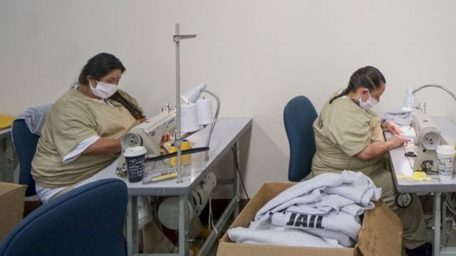
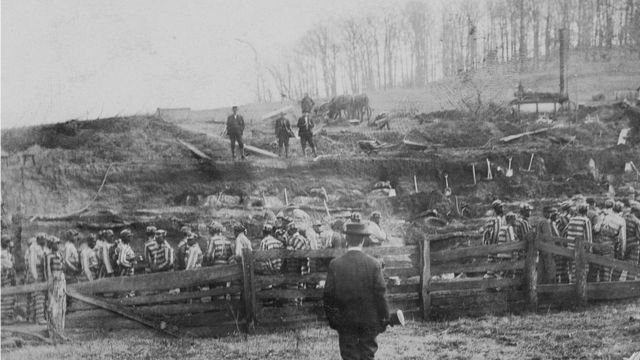
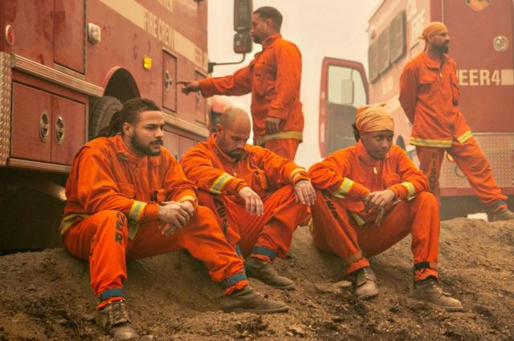

# [World] 美国中期选举2022：奴隶制存废为何仍然成为五个州的投票议题

#  美国中期选举2022：奴隶制存废为何仍然成为五个州的投票议题

> 图像来源，  Getty Images
>
> 图像加注文字，2020年4月美国的监狱囚犯缝制防新冠病毒的口罩

**1787年美国制宪会议通过宪法并在其后多年间增添了20多项修正案，涵盖对民众信仰、言论、集会等权力的保护和对政府公权力的限制。**

其中1865年通过的第13修正案全面废除奴隶制及强制劳役，但却留下了一个例外。

根据美国宪法第13修正案：“法律面前人人平等，没有人能够将他人当作自己的奴隶，也没有人可以强迫劳役他人，除了罪犯以外。”

这个例外延续至今100多年，在本次的美国中期选举中成为几个州的公投议题。BBC 记者麦克斯·马查（Max Matza）从美国西雅图发来以下报道：

1865年美国在宪法中废止了奴隶制度，即某人属于另一个人合法财产的制度，但是157年之后的今天，宪法仍然对罪犯沦为奴隶留下了漏洞。

这就使得美国大部分地区，奴隶制作为对犯罪的惩罚仍然是合法的。

11月8日，阿拉巴马州、路易斯安那州、俄勒冈州、田纳西州和佛蒙特州这五个州的选民将决定是否从各州宪法中删除这一措辞，争取全面废止奴隶制。

如果得以删除，结果可能使囚犯对强制劳动提出抗辩。目前，美国约有80万名囚犯虽然被强制劳动却只获得微不足道的的报酬，甚至完全没有报酬。在美国共有有七个州囚犯从事的大多数工作都得不到任何报酬。

支持修改宪法的人说，这是造成剥削的法律漏洞，必须加以删除。

但批评者认为，修宪代价太大，并可能导致刑事司法系统出现意想不到的后果。

##  “我辛苦劳动了25年，只赚了124美元”

人权研究人员说，这一现代制度根源于几个世纪以来对非洲裔美国人的奴役。

在奴隶制被取缔后的数年里，美国通过了旨在压制黑人社区、迫使黑人入狱并在狱中按照要求工作的法律。

现在，一些在监狱服刑的美国黑人仍然被迫在南方种植园里采摘棉花和其他作物，而这些种植园正是在他们的祖先被锁链锁住的地方。

> 图像来源，  Getty Images
>
> 图像加注文字，1909年拍摄的照片中，被服苦役的劳工们

柯蒂斯·雷·戴维斯因为被误判谋杀罪在路易斯安那州的监狱中服了25年多的苦役，直到2019年才被赦免，他说，美国一直都有奴隶制度存在。

路易斯安那州立监狱，又被称为安哥拉种植园。当年这个州的许多非洲奴隶正是来自安哥拉。戴维斯在这个臭名昭著的监狱里做过各种工作。

戴维斯说：“我在里面劳动了25年，被释放回家时口袋里只有124美元。” 他在那里工作的报酬每小时都不超过20美分，而且那些工作都是“我不愿意做，在枪口下被逼无奈做的”。

以帮助误判犯人为宗旨的团体无罪项目（Innocence Project）称，这所监狱约75%的囚犯是黑人。

他们认为，本质上来说，像这种被称为安哥拉种植园的监狱是美国一个从未废除过奴隶制的地方。

废除奴隶制全国网络的萨瓦纳·埃尔德里奇（Savannah Eldrige）说：“虽然奴隶制被废除了，但它只是把奴隶所有权从私人蓄奴制度转移到国家认可的奴隶制。”

她所在的组织一直在努力争取更多州禁止奴隶制，不允许有任何例外情况出现并试图说服国会议员们通过类似的法律修改美国宪法。

科罗拉多州、内布拉斯加州和犹他州自2018年以来已经通过法律采取措施禁止一切形式的奴隶制。埃尔德里奇指出，这一修宪运动吸引了美国共和、民主两党的支持。正是因为犹他州和内布拉斯加州由共和党主导才使得修宪得以通过。

她预测，在2023年，将有18个州的立法机构将对全面废止奴隶制的立法进行投票。

##  警方告诫有“意想不到的后果”

各州删除宪法中涉及奴隶的修宪努力并没有多少人公开表示反对，但这一修宪运动遇到了一些批评者的抵触情绪，他们说向服刑中的囚犯支付适当的工资成本太高，获释的囚犯不应该得到同样的补偿；还有人说，宪法条文的变化可能对囚犯并不利。

今年夏天，在包括州长在内的民主党人警告说，向囚犯支付该州每小时15美元的最低工资将花费超过15亿美元之后，加州立法机构从宪法条文中删除奴隶制的投票未能获得通过。

俄勒冈州的警长协会也反对修宪措施，说会导致“意想不到的后果”和失去“改造计划”，其中包括在图书馆、厨房和洗衣房的低工资工作。

警长协会说，这些工作让囚犯有事可做， “很好地起到了激励犯人表现良好的作用”，而这正是在犯争取假释的法庭聆讯时的一个关键因素。

警长协会说修宪措施有两个问题，它只适用于那些被定罪的人，而不包括审前拘留的人，而且它可能意味着结束任何没有得到法院判决具体授权的收监计划。

该协会在给选民的小册子中表示：“俄勒冈州警长不接受或支持任何形式的奴役和/或非自愿劳役”，并且补充表示修宪通过“将导致所有改造计划的取消和当地监狱运营成本的增加”。

美国的囚犯为供应链和经济做贡献的方式有很多种，其中一些方式令人惊讶。

他们被委托制作的产品多种多样，从眼镜、汽车牌照到城市公园长椅。他们还加工牛肉、牛奶和奶酪，并在政府机构和大公司的客服中心工作。

要追踪哪些企业使用了监狱劳工很难，因为这些工作通常外包给分包商完成。分包商然后将产品和服务卖给大公司，而大公司有时并不知道产品或服务的来源。

> 图像来源，  Getty Images
>
> 图像加注文字，夏天森林火灾频发时，监狱囚犯被招募参加扑灭山火。

根据美国公民自由联盟（ACLU）6月的一份报告，仅在犹他州，曾经从监狱劳工中受益的公司就包括美国运通、苹果、百事可乐和联邦快递。

至少有30个州将监狱劳动力纳入其应对自然灾害和其他民事应急行动计划。根据美国公民自由联盟的报告，他们至少在14个州参加扑灭山火的救灾行动。

然而，如果即将投票的五个州真的支持改变宪法，囚犯的生活仍然不太可能一夜之间发生改变。

美国公民自由联盟的人权研究员珍妮弗·特纳（Jennifer Turner）说：“这些公民投票是必要的，但不足以结束奴役制。法院仍然需要对监狱犯人有哪些工作权利做出解释，以及他们是否会像普通工人一样享受法律赋予的诸如病假之类的福利。”

即便在那些已经成功修宪删除了犯人可以作为例外受到奴役的州，最后的结果也不尽相同。

在科罗拉多州，一名囚犯起诉州政府违宪奴役囚犯。但法院在8月以选民并不打算废除所有的监狱劳动为由驳回了此案。

据《纽约时报》报道，内布拉斯加州成功修宪后，一所监狱已经开始每周向囚犯支付20至30美元。

随着囚犯继续争取权利和保护，预计会有更多的法律案件出现。

被错判入狱的戴维斯说，宪法删除囚犯可以被奴役的例外之后，他家乡所在的路易斯安那州将不再有把公民监禁起来的“动力”。

他向BBC新闻表示：“我相信任何有良知的人，任何了解财产法的人都明白：人不应该成为其他人的财产。”

“他们也不应该成为路易斯安那州的财产。”

