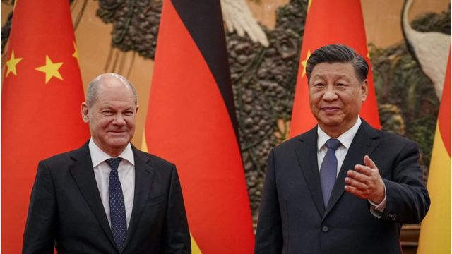
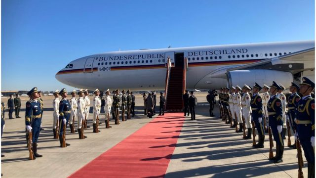
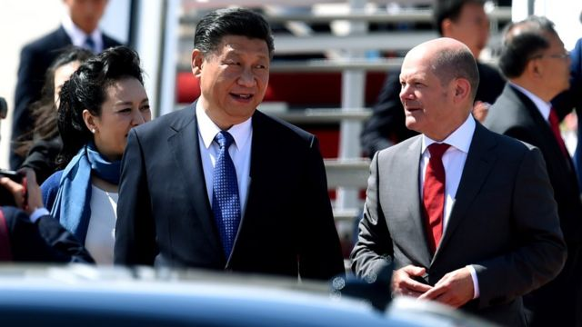
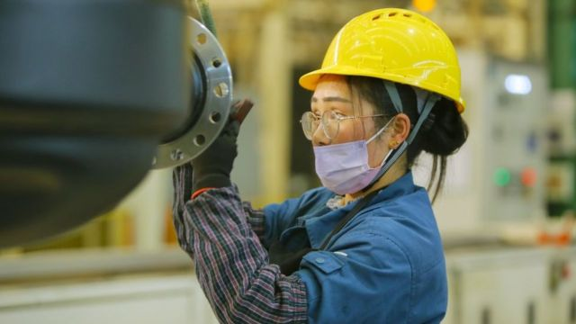

# [World] 德国总理肖尔茨访华 称“反对脱钩”谋求与中国深化经贸合作

#  德国总理肖尔茨访华 称“反对脱钩”谋求与中国深化经贸合作

最近更新： 9 小时前

> 图像来源，  Getty Images
>
> 图像加注文字，德国总理肖尔茨周五（11月4日）访问中国，与中国领导人习近平会面。

**德国总理肖尔茨（Olaf Scholz）周五（11月4日）抵达中国进行一天的闪电访问，与中国领导人习近平会面。他成为新冠疫情发生后首个访问中国的G7国家领导人。**

此次访华前，肖尔茨面临来自国内外的批评和担忧。国际关系学者对BBC表示，德国的经济震荡迫使肖尔茨政府面对中国时采取“政经分离”的手段。

##  访问行程

周五上午，中国领导人习近平在北京人民大会堂与肖尔茨会面。根据新华社报道，习近平对肖尔茨表示，今年恰逢中德建交50周年，只要秉持相互尊重、求同存异、交流互鉴、合作共赢原则，两国关系的大方向就不会偏。

习近平还称，当前，国际形势复杂多变。中德作为有影响力的大国，在变局、乱局中更应该携手合作，为世界和平与发展作出更多贡献。

据新华社，肖尔茨还称，中国是德国和欧洲的重要经贸伙伴，德方坚定支持贸易自由化，支持经济全球化，反对“脱钩”，愿同中方继续深化经贸合作，支持两国企业相互赴对方开展投资合作。德方也愿同中方就双方立场不一致的问题交换意见，增进了解和互信，努力稳定、巩固和发展德中关系。

路透社报道称，肖尔茨对习近平表示，在俄罗斯入侵乌克兰给全球秩序带来问题之时，两国领导人在紧张时期面对面会晤是件好事。

肖尔茨还表示，双方将讨论有关中欧关系、对抗气候变化和全球饥饿、如何发展中德经济关系等问题，以及两国观点不同的问题。

路透社引述肖尔茨说，他在访华期间重申，德国奉行一个中国政策。

他在与中国总理李克强的记者会上说：“我明确表示，对台湾现状的任何改变都必须是和平的，或者经过双方同意”。

路透社报道还透露，肖尔茨和一个由德国商界领袖组成的代表团于周五上午抵达北京后接受了新冠病毒检测，中国医护人员穿着防护服进入飞机进行检测。

在红地毯和仪仗队的欢迎之后，代表团从机场被转移到钓鱼台国宾馆，等待他们的新冠病毒检测结果。据肖尔茨的新闻团队称，结果为阴性。

##  批评声音

在访问前，肖尔茨面对德国内外的批评。但德国政府发言人在肖尔茨出发之前表示，他会在访问北京期间敦促中国向欧洲企业开放经济市场，讨论人权问题。

最近，德国政府最高层爆发了一场不同寻常的激烈争吵，因为一家中国企业准备收购汉堡港大量股权。

> 图像来源，  Getty Images
>
> 图像加注文字，德国总理肖尔茨周五（11月4日）访问中国。

至少六名政府部长对此反应激烈。他们认为，该协议将让中国对德国重要基础设施产生重大影响力。德国安全部门也要求谨慎行事。

但德国总理似乎坚持该协议应继续推进。据报道，他促成了一项协议，尽管该协议仅给了24.9%的股份，限制了规模和影响力。

没有人能确切地知道为什么他看起来如此坚定。曾任汉堡市长的肖尔茨仍与该市当局关系密切，后者认为这笔交易代表着非常重要的投资。

但许多其他评论员怀疑这是别有用心的，肖尔茨不想在没有给习近平“礼物”的情况下出现在北京。

另外，世界维吾尔大会等70个人权组织发表公开信，要求肖尔茨重新考虑北京之行。

公开信称，此次访问的时间正值习近平开启中共中央总书记第三次任期，而在习近平的前两个任期中，中国境内严重和广泛侵犯人权的行为呈指数级增长。

“邀请一个德国贸易代表团加入您的访问，将被视为德国愿意以牺牲人权和国际法来深化贸易和经济联系。”公开信指出。

公开信还表示，肖尔茨此时的访问将发出一个让人担忧的信号，即面对中国在世界范围内日益增长的威权行为，民主国家不团结。

> 图像来源，  AFP
>
> 图像加注文字，超过100名中国海外活动人士发出公开信，列出五大原因，要求肖尔茨不要访问中国。

超过100名中国海外活动人士也发出公开信，列出五大原因，要求肖尔茨不要访问中国。公开信签署者包括六四学运领袖王丹、吾尔开希等。

公开信列出的原因包括新冠疫情溯源、中共二十大后习近平第三次执政、新疆维吾尔族问题、香港问题和台湾问题。

“作为政治家，您考虑和衡量过，今天的中国不仅仅是集权国家，而且正在逐步成为新型纳粹式的独裁国家吗？您的中国之行是否会存在着经济和政治上的风险呢？”公开信写道，“现在的习近平政权内外交困，内斗和民怨层出不穷。您作为全世界自由民主国家中，第一个即将访问中国的自由世界领导人，准备向中国表达什么观点？”

##  重回中国大市场

台湾辅仁大学意大利文系副教授张孟仁对BBC中文表示，新冠疫情与俄乌战争及后续引发的通货膨胀与能源危机，重创德国这个出口大国，罕见地出现经济衰退。能源危机所酿成的经济震荡迫使总理肖尔茨重回中国大市场寻求金主。

张孟仁指出，肖尔茨此次访华有三点意义有三点，“第一，抱着与中国对话的心态前往二十大之后的中国，试图扮演G7与中国的桥梁；第二，以前述桥梁方式换取中国的订单；第三，身为二十大之后第一个去北京的西方大国可以进行摸底，利用习近平对德国的好感。”

张孟仁认为，德国经过整体评估后，发现难舍中国市场，可预见德国不会断舍中国市场，但不会放弃参与印太地区的安全部署，甚至进行更常态性的部署，对内也会警觉关键设施的外资，及对外分散依赖。

> 图像来源，  Getty Images
>
> 图像加注文字，张孟仁认为，能源所酿成的经济震荡迫使总理肖尔茨重回到中国大市场寻求金主。

“对中政经分离将是肖尔茨政府的手段。”张孟仁说。

台湾东华大学助理教授冯儒莎（Zsuzsa Anna Ferenczy）则认为，此时德国为了自己的利益派出如此高调的商业代表团损害了德国的信誉，也损害了欧盟面对中国问题的坚定和团结。

“这次访问会损害欧洲对中国正在形成的但脆弱的共识，这只符合北京的利益。”冯儒莎说。

冯儒莎还表示，肖尔茨率领一个由高度依赖中国市场的企业组成的商业代表团访华，向北京方面传递了这样一个信息：它可以期待继续从与一个分裂而非团结的欧盟合作中获益，而德国方面希望恢复到"一切如常"。

“很难想象这样的访问怎么会允许就人权或台湾海峡安全等问题进行讨论，而鉴于德国对台湾半导体的依赖，这确实符合德国和欧洲的利益。”冯儒莎指出。

