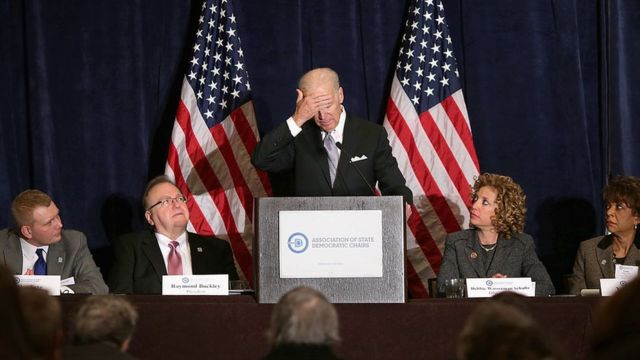

# [World] 美国中期选举2022：从民调看谁将赢得国会控制权

#  美国中期选举2022：从民调看谁将赢得国会控制权

  * 安东尼·泽克尔（Anthony Zurcher） 
  * BBC记者，发自华盛顿 

> 图像来源，  Getty Images

**美国中期选举的最后阶段民调已经公布，它们能帮助我们解答一些每个人都想问的问题——谁会赢？民主党人还是共和党人？**

迹象显示共和党即将要四年来首次重夺美国众议院的控制权。

国会上院，即参议院，则仍然势均力敌难以预测。共和党在国会取胜的途径比民主党人多，后者在近两年占有大多数议席。

了解上下两院选举结果的可能性，只是一个数学问题。

在众议院，共和党人只需要在435个议席当中夺回五席，就能拥有大多数。

依据民调数据和选举潜在态势分析各方竞争力的《库克政治报告》（ According to the Cook Political Report  ）指，共和党人在212席当中占优势。他们在35场被看作势均力敌的竞争当中只需要赢得六席，就能取得多数优势。这些议席当中有10席目前由共和党人占据。

100席的参议院在某程度上理解起来比较简单。今年只有35个议席要进行改选，当中又只有一小部分是形势相当的选战。

共和党人只需要比对手多占据一席，就能将上院控制在手中。

由于民主党人想要保住的议席比共和党人更多，于是民主党人就有更多方式输掉参议院。这使得共和党人占得先手，尽管只是很微弱的优势。

似乎在本届中期选举尘埃落定时，共和党很有可能会至少控制国会参众两院的其中一个。

在民主党控制参众两院两年之后，这个国家的权力对比有可能发生改变。以下是未来两年里美国政治四个非常真实的潜在影响。

> 图像来源，  Chip Somodevilla
>
> 图像加注文字，拜登将不得不寻求单方面推行政策的方法，而国会内的共和党人将会在边缘上运作。

##  拜登的立法议程将终结

尽管过程断断续续，但是在上任两年后，拜登和民主党人已经能够制定比较实在的立法议程。包括在环境、医保和其他社会项目上的巨额支出。

一旦周二共和党人取胜，这些都将结束。

在某些议题上有机会进行两党合作。比如，共和党人和民主党人今年的确一起通过了控制枪械和技术投资法案，去年又通过了基础设施支出。然而，堕胎、教育和投票权等一类自由派的重大议题，就将全然无望。

共和党人有自己的立法议程，特别聚焦于边境安全、执法开支、预算裁减和化石燃料开采等。即使他们控制了参众两院，民主党人仍然能够在参议院通过“拉布”规则或者在白宫动用拜登的否决权，来阻截立法。

在未来两年，主要的剧情将会是立法僵局。

拜登将只能寻求单方面实施一些政策，而共和党人在国会中将会在边缘上运作。他们会将任何彻底的改变留待至2024年，届时他们希望赢回总统宝座，并扩大在国会的优势。

> 图像来源，  John Moore
>
> 图像加注文字，在美国寻求庇护的移民在接近美国边境巡逻队的检查。

##  共和党将有权力进行调查

两年来，一直都是民主党作主——包括能够将巨大的国会监督权集中在关乎他们利益的问题上。这包括扩大调查2021年1月6日的冲击国会事件，还有对堕胎、医保和投票权等议题进行听证。

如果共和党取得国会委员会的控制权，这些优先项就会迅速转移。

众议员的保守派已经承诺，会就乔·拜登的儿子亨特与中国的商业来往进行听证。他们还想调查拜登政府的移民政策，美国从阿富汗撤军和新冠疫情大流行在中国的起源等。

参议院司法委员会（The Senate Judiciary Committee）处理总统向联邦法院递交的名单复核。过去两年，民主党人已经创下当代终身任命新法官数量的纪录。

如果共和党人同时控制美国参议院，可以期待拜登提名法官的程序会遇到停顿。而如果最高法院出现空缺，就有很大机会一直空置到下一届总统大选。

##  政府停摆的风险

在民主党控制国会时，美国有两年时间暂且避免了立法程序上出现导致政府停摆的“斗鸡博弈”，以及接近国债违约的情况。

这即将要结束了。

法律要求国会授权发行新的政府债券来支付已经通过的支出。包括议员凯文·麦卡锡（Kevin McCarthy）——共和党取得众议院他就肯定会成为议长——在内的一些共和党人，正威胁要利用这一点来迫使民主党同意全面削减预算。

美国从未拖欠过国债。

但是，因为国会未能通过年度预算立法而导致政府部分停摆则成为了更常见的事。在特朗普执政时间出现过两次，奥巴马执政时也出现过一次。

如果共和党人和民主党人不能在政府支出问题上制定一个有共识的框架，明年年底前就似乎很有可能再次出现政府停摆。

##  拜登的凶险前途

共和党控制国会，对拜登来说将会是难以咽下的结果。他竞选时将自己塑造成一个能够在特朗普当政的动荡四年后团结美国人的人物。

但是，他却会面对一个与过去一样撕裂的国家，一个对他有敌意、想要清算他的政府和家人的国会，还要面对特朗普本人可能寻求重新入主白宫的可能。

大多数总统在第一任期的中段都会经受选举的挫折。虽然有些会卷土重来赢得连任，但是对拜登来说，这样的结果却是显示了他的政治弱点。在2024年总统选举周期开始时，它可能会重新唤起那些要求他让位给另一个民主党人的呼声。

总统和他的顾问都坚称他将寻求连任。白宫已经宣布，拜登会在周三进行公开演讲，谈论选举。

他如何处理这一场演讲，以及他如何处理未来多个月里到来的逆境，仍需拭目以待。对于他在自己党内会得到多大支持再做四年，这将影响巨大。

##  更多美国中期选举相关报道：

