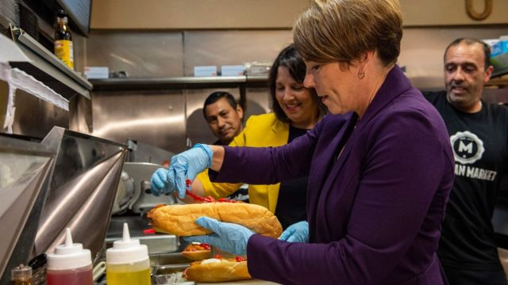
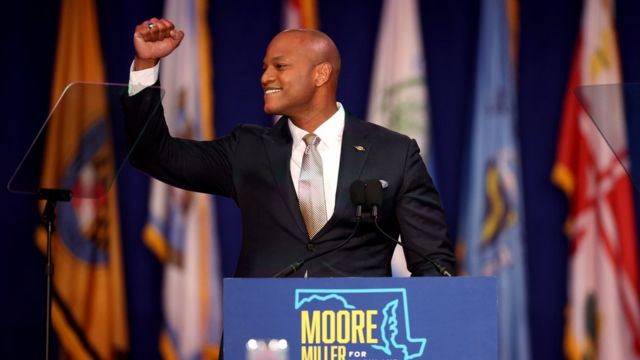
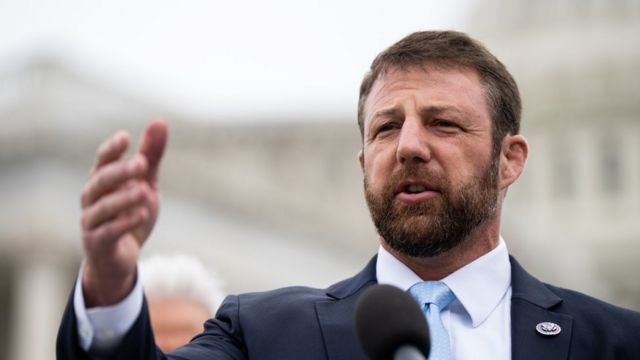
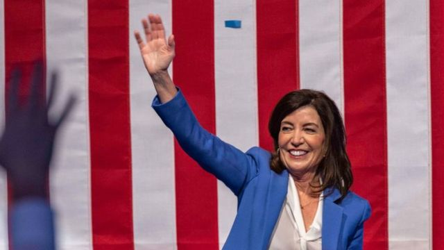

# [World] 2022美国中期选举：创造历史的当选者和没有兑现的共和党大胜

#  2022美国中期选举：创造历史的当选者和没有兑现的共和党大胜

> 图像来源，  Getty Images
>
> 图像加注文字，凯蒂·布里特当选成为阿拉巴马州的第一个女性参议员。

**美国中期选举的推算结果陆续出炉。虽说每一场选举胜利都值得庆贺，但是其中有一些还是有历史性的特殊意义。以下是BBC记者杰西卡·舍伍德（Jessica Sherwood）整理出的截至目前2022美国中期选举那些写下历史新篇章的当选人。**

##  凯蒂·布里特：阿拉巴马州首位女性参议员

根据BBC的美国合作方哥伦比亚广播公司新闻网（CBS News）的推算，40岁的共和党参选人凯蒂·布里特（Katie Britt）成功当选阿拉巴马州的第一位女性参议员。

布里特击败民主党对手威尔·博伊德（Will Boyd）夺得席位，将取代在参议院任职36年后退休的里查德·舍尔比（Richard Shelby）。

她向支持者表示：“我为此感到谦卑，荣幸和感恩。”

自1932年首次参议员选举以来，美国共有过58名女性参议员——而参议院的席位是100个。

布里特还表示，她将是参议院中第一个有学龄子女的共和党人，因此她承诺为年轻人构建更好的未来。

**麦克斯威尔·弗罗斯特：25岁，首位Z世代众议** **员**

> 图像来源，  Getty Images

25岁的民主党人麦克斯威尔·弗罗斯特（Maxwell Frost）根据推算将赢得佛罗里达州的第十国会选区。1997年出生的他是第一个当选的Z世代（Gen，千禧年前后出生的一代）美国联邦众议员。

他的胜选并不算令人意外，因为他的选战宣传焦点是在枪支暴力、气候变化、堕胎权和拓宽医保等吸引年轻选民的议题上。

他可能不是2022年唯一当选众议员的Z世代人士。共和党人卡罗琳·莱维特（Karoline Leavitt）也在新罕布什尔的第一国会选区参选。

##  莫拉·希利：第一个当选州长的女同

> 图像来源，  Getty Images

51岁的民主党人莫拉·希利（Maura Healey）被推算将在马萨诸塞州的州长选举中胜出。而她将是第一个当选州长的女同性恋者。

希利击败了特朗普支持的共和党人杰夫·迪尔（Geoff Diehl）。上一任州长查理·贝克（Charlie Baker）选择不争取连任，于是希利的胜利终结了该州长达八年的共和党掌权。

希利还是今年竞逐州长的两个公开女同性恋者之一。另一个是蒂娜·柯特克（Tina Kotek），在竞逐俄勒冈州州长。

希利是马萨诸塞州第二个女性州长——共和党人简·斯威夫特（Jane Swift）在2001年当选。

在选战中，希利承诺要让育儿成本更可负担，扩大职业培训项目，也对6月美国最高法院推翻罗诉韦德案（Roe v Wade）积极发表自己的看法，声称她希望在她的州有安全和合法的堕胎选择。

##  莎拉·哈克比·桑德斯：特朗普新闻秘书当选州长

40岁的莎拉·哈克比·桑德斯（Sarah Huckabee Sanders）为人所熟知是因为她曾是特朗普在任总统时的新闻秘书。推算显示她将赢得阿肯色州州长的选举，成为该州第一个女州长。

她在这个共和党占据优势的州份面对民主党对手克里斯·琼斯（Chris Jones），最终胜出。

虽然她是阿肯色州第一个女性州长，但她对州长办公室并不陌生，因为她的父亲迈克·哈克比在1996年至2007年就是该州州长。

##  韦斯·摩尔：马里兰州首位黑人州长

> 图像来源，  Getty Images

44岁的民主党人韦斯·摩尔（Wes Moore）也创造历史，成为马里兰州的首位黑人州长。他仅仅是这个国家246年历史里的第三个黑人州长，另外两人是马萨诸塞州的德瓦尔·帕特里克（Deval Patrick）和弗吉尼亚州的道格拉斯·怀尔德（Douglas Wilder）。

摩尔是畅销书作者，也是安贫困组织罗宾汉（Robin Hood）的前领头人。

他在周二向支持者表示：“我没有忘记我今晚在这里创造了历史，但我也知道，我也不是第一个作出尝试的。”

“对我们来说最重要的历史，是我们和本州人民在未来四年将会创造的历史。”

##  马奎恩·穆林：原住民参议员

> 图像来源，  Getty Images

35岁的共和党人马奎恩·穆林（Markwayne Mullin）被推算当选，成为奥克拉荷马州近100年来第一个美国原住民参议员。

这个席位自1987年起就一直由共和党人占据。

作为切罗基部落的一员，穆林先是在2012年当选众议院成员，成为国会议员核心小组（Congressional Native American Caucus）的一员。

美国上一个原住民参议员是北夏安部落（Northern Cheyenne Tribe）的本·奈特霍斯·坎贝尔（Ben "Nighthorse" Campbell）。他在做过两届参议员和三届众议员之后，于2005年退休。

##  詹姆斯·罗森内尔：首位跨性别男性众议员

26岁的民主党人罗森内尔（James Roesener）当选，成为美国历史上第一个公开的跨性别男性众议员。

今年参选的跨性别人士创历史新高，罗森内尔是其中一员。

他在新罕布什尔州为女性争取堕胎权、薪酬平等，还支持保障同性恋权益的立法，包括保障认可同性婚姻。

##  凯西·霍赫尔：纽约州首位女州长

> 图像来源，  Getty Images

民主党人凯西·霍赫尔（Kathy Hochul）被推算当选纽约州州长，是该州第一个当选州长的女性。

推算显示，她在这场20年来形势最接近的州长选举中击败共和党人李·泽尔丁（Lee Zeldin）。

霍赫尔此前已在2021年8月前州长安德鲁·科莫（Andrew Cuomo）因性骚扰指控辞职后接任。

她承诺在她的第一个完整任期中将聚焦住房问题，减少枪枝暴力和建立经济发展契机，以及保障堕胎权。

##  迪丽娅·拉米雷兹：拉丁裔国会议员

> 图像来源，  Getty Images

推算显示39岁的民主党州代表迪丽娅·拉米雷兹（Delia Ramirez）将成为伊利诺州第一个当选的拉丁裔国会议员。

这意味着她在该州第三国会选区击败共和党人贾斯汀·布罗（Justin Burau）。

“我们今晚创造了历史，”拉米雷兹在竞选当晚向支持者表示，“我们打破了玻璃屋顶。”

2018年，拉米雷兹成为伊利诺州众议院第一个当选的危地马拉裔美国人。她曾致力于争取廉租住房和保障该州堕胎权。

##  更多美国中期选举报道：

##  未能兑现的共和党“风暴”

> 图像来源，  Reuters
>
> 图像加注文字，前总统特朗普曾经预测此次选举中会出现“红色风暴”。

随着美国通胀达8%，以及民主党总统拜登的支持率走低，共和党曾希望在本届中期选举大踏步夺回国会控制权，但是结果为什么却未如预期？BBC记者小伯恩德·德布斯曼（Bernd Debusmann Jr）和娜塔莉·舍尔曼（Natalie Sherman）分析，有以下一些原因。

**1\. 经济问题不是一切。** 虽然这是选民最关心的首要议题，但事实证明它对民主党的影响没有此前担心的那么大。有专家表示，虽然经济增长缓慢，生活成本增加，但是经济基本保持着健康，失业率也保持在低位。经济问题也反映了这个国家的两极分化，而民主党人表现出的观念普遍仍然比共和党人正面和独立——将对经济问题的担忧放在气候变化、种族和堕胎等议题之后，特朗普的“冤魂不散”也促使更多选民有动力出来投票。

**2\. 民主党阵营保持活力** 。初始的数据显示，本次中期选举在美国很多地方的投票率都处在历史高位，这一定程度上是来自于被年轻选民驱动的民主党阵营——他们为保障生育选择权等议题而投票。得克萨斯大学圣安东尼奥分校的政治学教授乔恩·泰勒（Jon Taylor）向BBC表示，假如最高法院没有推翻罗诉韦德案，民主党就不会如此卖力地激励民众投票，“这实际上帮助了民主党抵挡红色风暴。”

**3\. 突破中期选举惯例。** 历史上，在任总统所属的政党往往都会在中期选举中惨败。加州大学圣巴巴拉分校的数据指，从1934年至2018年，在任总统的政党平均在每次中期选举中会失掉28个众议院议席和4个参议院议席。俄亥俄州凯斯西储大学（Case Western Reserve University）的政治学教授贾斯汀·布克勒（Justin Buchler）指，中期选举的往绩可能在人们头脑中制造了一个共和党会在本次选举中大胜的预设期待：“我想很多人都被预测蒙蔽了。”他表示，很多人会因此而说出一些没有数据支持的陈述，这是近几次选举中的教训，而人们却没有汲取。

**4\. 变相对特朗普进行公投。** 本次选举也被很多人看作是对特朗普及他对共和党影响力的一次测试。得州大学的乔恩·泰勒说，很多摇摆选民可能因此而决定投票，削弱前总统对共和党的影响力：“你看看那些他支持的候选人，特别是否定总统选举结果的一派，他们竞选州长、参议员和州务卿等，很多都输了。就算有一两个赢，也没有让共和党扩大势力或者占得多数。”

