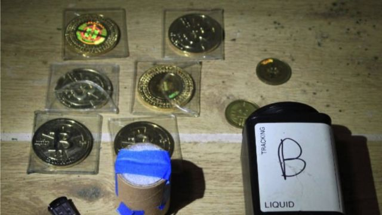
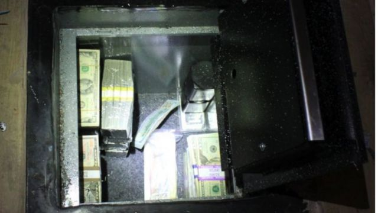

# [World] 比特币“黑吃黑”案：黑客在丝绸之路暗网盗取34亿美元后藏入爆米花罐

#  比特币“黑吃黑”案：黑客在丝绸之路暗网盗取34亿美元后藏入爆米花罐

> 图像来源，  US DoJ
>
> 图像加注文字，执法人员查获储存在记忆棒的比特币，也有实体比特币。

**美国司法部披露去年查获的总值33.6亿美元的比特币案更多细节，这些比特币盗取自恶名昭著的暗网。**

执法人员在一位黑客家中找到这50676枚比特币，它们被装载于多台电子设备中，再收藏进地下保险箱和一个爆米花罐中。

黑客詹姆斯·钟（James Zhong）承认于2012年黑入非法网络市集“丝绸之路”，盗取这笔资金。

美国当局表示，此案涉及数字资产总额属历来第二大。

警察一年前突击搜查钟氏位于乔治亚州的住所，但有关内容至今才获得公开。

案发时正值比特币价格顶峰。被查获的比特币目前市值约为11亿美元。
 美国司法部表示  ，这些比特币被散布于多台电脑硬盘与其他储存装置，然后藏于一个埋在地下的保险箱，和一台被收藏在爆米花罐内的微型电脑中。

> 图像来源，  US DoJ
>
> 图像加注文字，警察除了查获比特币，也在埋藏于地下的保险箱中发现了60万美元现金。

警察表示，钟氏利用对方支付系统的一处漏洞，从丝绸之路暗网盗取这笔款项。

2012年9月，他在这暗网市集上建立数个账户，把少量比特币存入其数字钱包，然后找到办法迅速提取远超该数目的款项，而不会引起他人怀疑。

丝绸之路是首个暗网市集，约自2011年起运作至2013年。毒贩等非法买卖操办人利用该场所，向众多客户批量分销非法毒品，与各式各样的非法商品与服务。

暗网是互联网上只能透过特定软件浏览的部分。
 2015年  ，陪审团一致裁定丝绸之路创办人罗斯·乌布利希（Ross Ulbricht）非法运营该网站，并判处其终身监禁。

钟氏于今年11月4日在法庭承认入侵该网站，将其比特币等资产上缴警察，目前正等待判刑。

他将面临最高20年监禁。

联邦检察官达米安·威廉姆斯（Damian Williams）表示，警察利用加密货币追踪技术找出了这些比特币。

他说：“在将近10年时间里，这笔数量庞大的比特币，其去向一直是个谜，其价值一度膨胀至33亿美元。”

“这起案件说明，无论收藏的手法有多专业，即使是藏在一个爆米花罐底的一块电路板上，我们都会追踪资金，决不罢休。”

案发时这是美国历史上查获的最大一笔加密货币，但这纪录在 今年2月  被2016年 Bitfinex黑客案  查获的40亿美元比特币刷新。

