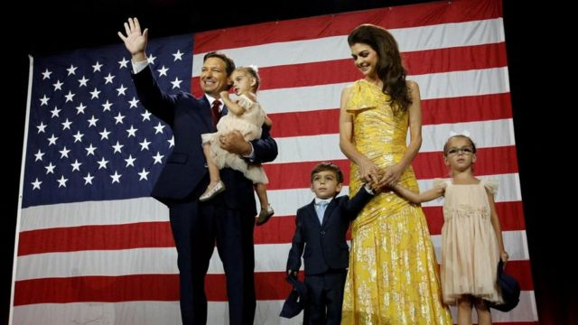
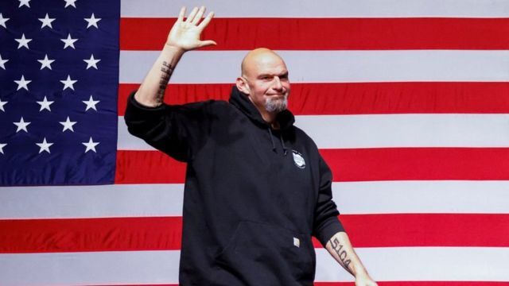
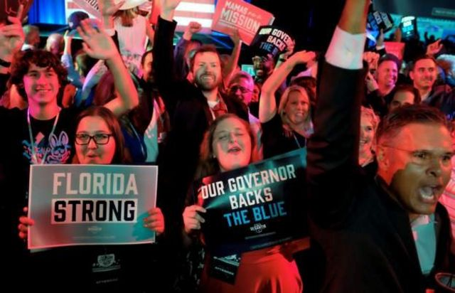
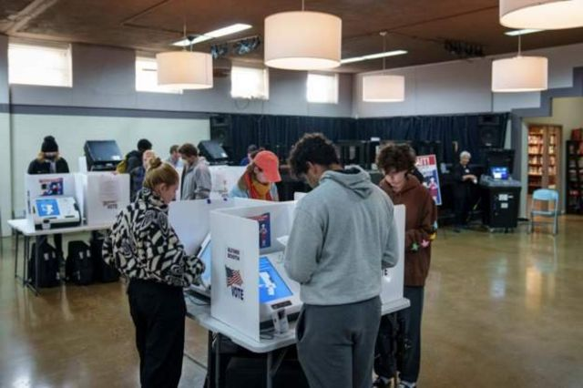
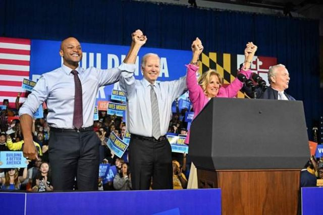

# [World] 2022美国中期选举：开票接近尾声，众议院共和党明显领先参议院仍势均力敌

#  2022美国中期选举：开票接近尾声，众议院共和党明显领先参议院仍势均力敌

最近更新： 8 小时前

> 图像来源，  Reuters

**2022年美国中期选举于当地时间周二（11月8日）进行。初步形势显示共和党似乎将在这场关键选举中取得众议院控制权。**

根据预测，共和党人有可能控制众议院，但参议院的争夺则仍然非常激烈。

截至美国时间周三（11月9日）早晨，共和党人在众议院夺得199席，领先民主党的173席——任何一党赢得218席就将成为众议院多数党。

参议院席位民主党占据48席共和党47席，共和党和民主党谁将取得大多数席位尚难预测。

如果民主党失去对国会参、众两院任何一个的控制，共和党将能够阻止总统拜登的议程。

5月中风的民主党人约翰·费特曼(JohnFetterman)击败了他的共和党席位对手穆罕默德·奥兹(MehmetOz)，逆转了宾夕法尼亚州一个关键参议院席位的结果。

> 图像来源，  Reuters
>
> 图像加注文字，佛罗里达州共和党州长罗恩·德桑蒂斯以大比分获胜。

其他关键州份乔治亚、亚利桑那和内华达等形势则仍然非常接近，悬念或保持到最后一刻。

佐治亚州可能会在12月初进行另一次投票，可能对最终结果至关重要。

前总统特朗普预计将宣布他将在2024年再次竞选总统，但他支持的一些候选人已经落败。

同时，佛罗里达州共和党州长罗恩·德桑蒂斯以大比分获胜，为他可能在2024年竞选总统成功铺路。

**决定参议** **院** **掌控权的最后几** **场关键选战** **：**

  * 在乔治亚州，共和党人沃克和民主党人诺克之间的胜负尚难预测； 
  * 假如民主党人在乔治亚州败选，就需要同时赢得内华达和亚利桑那两个州，才能控制参议院； 
  * 内华达州目前在民主党的凯瑟琳·玛丽·科尔特斯·马斯托（Catherine Marie Cortez Masto）和共和党的亚当·拉克萨尔特（Adam Laxalt）之间形势相当； 
  * 亚利桑那州则是民主党人马克·凯利（Mark Kelly）和共和党人布莱克·马斯特斯之争； 
  * 如果民主党在内华达和亚利桑那中间错失其中一席，就需要在威斯康辛州翻盘，那里将是民主党人曼德拉·巴恩斯（Mandela Barnes）和共和党人罗恩·约翰逊（Ron Johnson）之争。 

在佛罗里达、奥克拉荷马、阿拉巴马、南卡罗莱纳和印地安那等几个州份，共和党人都守住了他们的参议院席位。

> 图像来源，  Reuters
>
> 图像加注文字，宾夕法尼亚州选举中，民主党人约翰·费特曼(JohnFetterman)击败了共和党对手穆罕默德·奥兹(MehmetOz)，让选情出现逆转。

在佛罗里达州，选举推算显示共和党人罗恩·德桑蒂斯（Ron DeSantis）将保住自己的州长席位；马尔科·鲁比奥（Marco Rubio）亦将保住他的参议员席位。

玛吉·哈桑（Maggie Hassan）在新罕布什尔的激烈选战中成功为民主党守住一个参议员席位，J·D·凡斯（JD Vance）则为共和党在俄亥俄赢得一席。

美国媒体分析，在乔治亚州的参议员一场关键选举，民主党人拉斐尔·沃诺克（Raphael Warnock）与共和党人赫歇尔·沃克（Herschel Walker）之间的竞争形势非常接近，最终结果难以预测。

另一方面，25岁的民主党人麦克斯威尔·弗罗斯特（Maxwell Frost）在众议院当选，成为美国国会第一个“Z世代”议员。

参议员的选举总体形势非常接近，可能需要几天才能得出结果。

外界预期共和党籍的前总统特朗普会在本次中期选举期间宣布参选2024年总统大选，但是目前有一些他支持的参选人已经在选举中宣告落败。

德桑蒂斯在推算显示他将当选后，在坦帕进行了胜选演说。

他表示自己的胜利来自于将这个州变成了“自由的堡垒”，并形容自己以40年来佛州州长取得最大优势当选的结果，是“划时代的胜利”。

外界极度关注他是否会宣布参选2024年总统大选，但是德桑蒂斯在本次胜选演讲中未有提及此事，仅表示自己“奋斗还没结束”。

BBC记者纳达·陶菲克（Nada Tawfik）在佛罗里达州迈阿密报道指，德桑蒂斯的胜利会引起更多关于他是否会参选总统的讨论。

在乔治亚州，推算显示现任众议员马乔丽·泰勒·葛林（Marjorie Taylor Greene）将保住共和党人在这一州的席位。

民主党人查克·舒默（Chuck Schumer）按推算将保住纽约州参议员席位，这一结果一如外界预期；但是他是否能继续作为多数派领袖则尚待揭晓，因为共和党人有可能在参议院中取得控制权。

根据哥伦比亚广播公司新闻（CBS News）报道，亚利桑那和威斯康辛两个州的参议员投票形势非常接近，未能提前推算结果。

这两个州的票站现已关闭，另外8个西部州份也已经关闭票站。

此前，有报道指亚利桑那一些投票点有投票机出现问题，导致共和党人要求加长投票时间，随后这一消息被当地法官否认。

> 图像来源，  Getty Images
>
> 图像加注文字，民主党人玛姬·哈桑在新罕布什尔州参议员竞选中获胜，支持者欢呼拥抱。

> 图像来源，  Reuters
>
> 图像加注文字，在佛罗里达州，选举推算显示共和党人罗恩·德桑蒂斯将保住自己的州长席位。

> 图像来源，  Getty Images
>
> 图像加注文字，俄亥俄州的民主党参议员参选人蒂姆和儿子出现在大学校园。

> 图像来源，  Getty Images
>
> 图像加注文字，选民在俄亥俄州哥伦布教堂内投票。

##  众议院掌控权或将易主

BBC驻北美记者安东尼·泽克尔（Anthony Zurcher）分析指，随着共和党人大有机会取得众议院控制权，关注点渐渐落在他们会以多大优势取胜——而即使共和党人最终只以微弱优势取得众议院大多数，仍然意味着可以在未来两年对拜登的立法议程关上大门，并对拜登政府进行更有攻击性的国会监督。

据周三的推算，宾夕法尼亚州参议院席位由红转蓝，左翼民主党人费特曼将这个过去四年由共和党控制的席位抢到了民主党手中。

这个身高两米的哈佛毕业生曾一度遥遥领先对手默梅特·奥兹（Mehmet Oz），直到几个月前突然中风，被迫离开公众视野一段时间。他在冲刺阶段的辩论当中表现失色，也令双方差距大大缩小，但最终结果显示他保持住了所需的优势。

他在胜选演讲中表示：“我们守住了这条线。”

奥兹是前总统特朗普支持的一个候选人，但是他的落败宣告共和党失去了原有的一个席位。此外，另外两个获前总统支持的候选人——乔治亚州的沃克和亚利桑那州的布莱克·马斯特斯（Blake Masters）——也在各自的州份落后。

在宾夕法尼亚州，出口民调显示这个州份的参议员选举投票者男女比例差异相当大——据称，男性选民主要支持共和党候选人梅默特·奥兹（Mehmet Oz），女性选民则主要支持民主党人约翰·费特曼（John Fetterman）。推动男性选民的议题是通胀，而女性选民则主要关注堕胎议题。

事实上，美国在本次选举中的全国出口民调初步数据显示，物价上涨和堕胎政策是选民在本届中期选举投票时重点考虑的两个首要议题。

艾迪生研究机构（Edison research）数据指，每10个选民当中大约有三个认为通胀是最主要的议题，而认为堕胎问题是首要议题的同样在10个人当中有3个。

> 图像来源，  Getty Images
>
> 图像加注文字，前美国总统、共和党人特朗普在自己的海湖庄园举行选举日派对。

> 图像来源，  AFP
>
> 图像加注文字，现任总统、民主党人拜登在马里兰州拉票。

民主党人麦克斯威尔·弗罗斯特按推算将在佛罗里达州众议员选举中击败共和党人卡尔文·瓦姆比什（Calvin Wimbish），令该州继续保持在民主党人手中。

25岁的弗罗斯特是2022年中期选举中的两个“Z世代”（千禧年前后出生的一代）候选人之一，另一个是新罕布什尔州的卡罗琳·莱维特（Karoline Leavitt）。

在2018年中期选举和2020年总统选举中，年轻选民的投票率均非常高。

